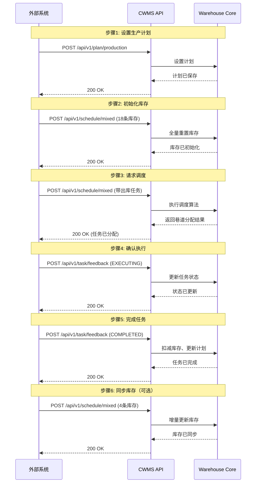
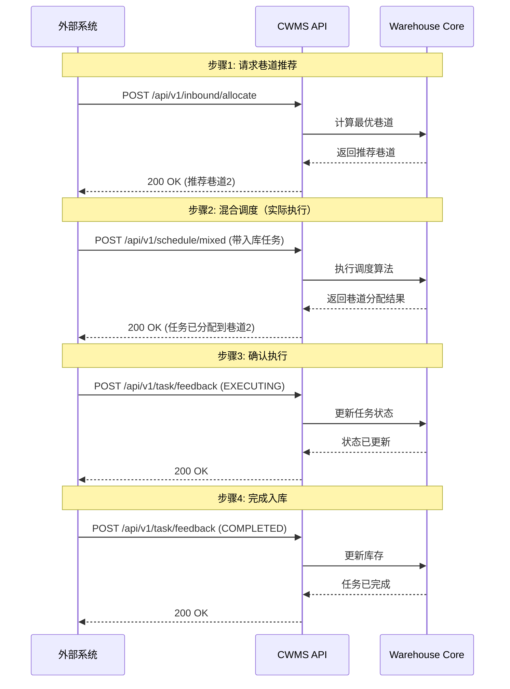

# 车身立体库管理系统 API 文档

**版本**: v1
**最后更新**: 2026-03-21

---

## 快速开始

### 启动 API 服务

```bash
# 默认启动（监听所有网络接口）
python run_api.py
```

### 访问服务

**本机访问**:

- API 文档: `http://localhost:8000/docs`
- API 服务: `http://localhost:8000`

**局域网访问**（让其他人访问）:

1. **查看本机 IP 地址**:

   ```bash
   # macOS/Linux
   ifconfig | grep "inet "

   # Windows
   ipconfig
   ```
2. **其他人访问地址**（假设您的 IP 是 `192.168.1.100`）:

   - API 文档: `http://192.168.1.100:8000/docs`
   - API 服务: `http://192.168.1.100:8000`
3. **注意事项**:

   - 默认配置 `host=0.0.0.0` 已支持外部访问
   - 如无法连接，请检查防火墙设置并允许 8000 端口
   - 确保在同一局域网内

---

## 目录

- [一、系统概述](#一系统概述)
- [二、通用规范](#二通用规范)
- [三、API 接口详细说明](#三api-接口详细说明)
- [四、典型业务流程](#四典型业务流程)
- [五、数据模型与约束](#五数据模型与约束)
- [六、最佳实践与注意事项](#六最佳实践与注意事项)
- [七、完整示例](#七完整示例)
- [八、常见问题排查](#八常见问题排查)
- [九、版本兼容性](#九版本兼容性)

---

## 一、系统概述

### 1.1 功能简介

车身立体库管理系统（Car Warehouse Management System, CWMS）是一个智能化的车身仓储调度系统，主要功能包括：

- **生产计划管理**：设置和管理各产线的出库任务序列
- **库存管理**：实时同步和维护车身仓库库存状态
- **混合调度**：统一调度入库和出库任务，优化资源利用
- **任务反馈**：接收外部系统的任务执行状态反馈
- **入库分配**：为新到车身推荐最优存储位置

### 1.2 系统架构

系统采用 **Controller-Service-Model** 分层架构：

```
┌─────────────────────────────────────────────────┐
│              API Layer (FastAPI)                │
│  ┌──────────────────────────────────────────┐   │
│  │  Routes (Controllers)                    │   │
│  │  - plan.py      - schedule.py            │   │
│  │  - feedback.py  - inbound.py             │   │
│  └──────────────────────────────────────────┘   │
│                      ↓                          │
│  ┌──────────────────────────────────────────┐   │
│  │  Services (Business Logic)               │   │
│  │  - warehouse_service.py                  │   │
│  │  - state.py (TaskStateManager)           │   │
│  └──────────────────────────────────────────┘   │
│                      ↓                          │
│  ┌──────────────────────────────────────────┐   │
│  │  Models (Data Validation)                │   │
│  │  - models.py (Pydantic)                  │   │
│  └──────────────────────────────────────────┘   │
└─────────────────────────────────────────────────┘
                      ↓
┌─────────────────────────────────────────────────┐
│         Simulation Core (Warehouse Core)        │
│  - warehouse_core.py                            │
│  - inventory.py                                 │
│  - schedule/optimizer.py, heuristic.py          │
└─────────────────────────────────────────────────┘
```

### 1.3 关键概念

#### 巷道（Aisle）

- 车身立体仓库中的车身存取通道
- 每个巷道有独立的堆垛机（Stacker Crane）
- 系统支持多巷道并行作业

#### 货位（Position）

- 库存的最小存储单元
- 标识格式：`{aisleId}-{row}-{column}-{level}`
- **注意**：车身立体库配置为单层货位（`use_double_layer: false`），每个货位只存储一个SKU

#### 生产计划（Production Plan）

- 定义各产线的出库任务序列
- 分组管理：每个产线的计划分为多个组（Group）
- 顺序约束：同一产线必须按组顺序执行任务

#### 任务组（Task Group）

- 生产计划中的基本执行单元
- 一个组内可包含多个任务（车身立体库中一般只有一个任务）
- 组内任务可并行，组间任务串行

#### 任务 ID 命名规范

- **出库任务**：`OUTBOUND_{custom_suffix}`

  - 示例：`OUTBOUND-R1-001`
- **入库任务**：`INBOUND_{custom_suffix}`

  - 示例：`INBOUND-TEST-001`
- **入库分配推荐**：`INBOUND_A_{custom_suffix}`

  - 示例：`INBOUND_A-TEST-001`

---

## 二、通用规范

### 2.1 基础信息

- **协议**: HTTP/HTTPS
- **基础 URL**: `http://{host}:{port}/api/v1`
- **默认端口**: 8000
- **数据格式**: JSON
- **字符编码**: UTF-8

### 2.2 请求头

```http
Content-Type: application/json
Accept: application/json
```

### 2.3 响应格式

所有接口均返回统一的三键格式：

| 字段    | 类型        | 说明                            |
| ------- | ----------- | ------------------------------- |
| status  | String      | 操作状态："SUCCESS", "PARTIAL_SUCCESS"或"FAILED" |
| message | String      | 操作描述信息                    |
| data    | Object/null | 业务数据，无数据时为 null       |

#### 成功响应示例 （HTTP 200）

```json
{
  "status": "SUCCESS",
  "message": "操作成功",
  "data": {
    "scheduleId": "SCH-A1B2C3D4",
    "timestamp": "2026-01-21T10:00:00Z"
  }
}
```

#### 部分成功响应示例（HTTP 200）

```json
{
  "status": "PARTIAL_SUCCESS",
  "message": "存在违反 aisle_forbidden 规则的分配结果",
  "data": {
    "checks": {
      "aisle_forbidden": {
        "passed": false,
        "violations": []
      }
    }
  }
}
```

#### 错误响应示例（HTTP 4xx / 5xx）

```json
{
  "status": "FAILED",
  "message": "错误信息",
  "data": null
}
```

#### 参数校验失败响应示例（HTTP 422）

```json
{
  "status": "FAILED",
  "message": "请求参数验证失败",
  "data": {
    "errors": [
      "body -> tasks: field required",
      "body -> aisleStatus -> 0 -> bank: value is not a valid enumeration member"
    ]
  }
}
```

**注意**：

- **所有** HTTP 状态码的响应（包括 200、400、409、422、500）都包含 `status`、`message`、`data` 三个字段。
- 422 参数校验错误时，`data.errors` 包含各字段的详细错误信息。
- 混合调度在 409 冲突时 `data` 会包含 `unconfirmed_tasks` 等附加信息。

### 2.4 HTTP 状态码

| 状态码                    | 说明           | 触发场景                                            |
| ------------------------- | -------------- | --------------------------------------------------- |
| 200 OK                    | 请求成功       | 所有正常请求                                        |
| 400 Bad Request           | 请求参数错误   | 缺少必填参数、参数类型错误                          |
| 409 Conflict              | 资源冲突       | 存在未确认任务时发起新的调度请求                    |
| 422 Unprocessable Entity  | 数据验证失败   | Pydantic 模型验证失败（如枚举值错误、数值超出范围） |
| 500 Internal Server Error | 服务器内部错误 | 调度算法异常、系统内部错误                          |

---

## 三、API 接口详细说明

### 3.1 生产计划管理

#### 3.1.1 设置生产计划

**接口**: `POST /api/v1/plan/production`

**说明**: 设置或更新各产线的生产计划。

**请求参数**:

| 字段                                          | 类型    | 必填 | 说明                                          |
| --------------------------------------------- | ------- | ---- | --------------------------------------------- |
| operationType                                 | String  | 是   | 操作类型：ADD（新增）或 UPDATE（更新）        |
| planDate                                      | String  | 是   | 计划日期，格式：YYYY-MM-DD HH:mm:ss           |
| plans                                         | Array   | 是   | 生产计划列表                                  |
| plans[].planId                                | String  | 是   | 计划唯一标识符                                |
| plans[].lineId                                | String  | 是   | 产线唯一标识符（如 "1", "2", "3"）            |
| plans[].planIndex                             | Array   | 是   | 计划组列表，每个元素代表一组任务              |
| plans[].planIndex[].requiredSkus              | Array   | 是   | 该组的任务列表，每个元素是一个任务的 SKU 列表 |
| plans[].planIndex[].requiredSkus[][]          | Array   | 是   | 单个任务的 SKU 列表                           |
| plans[].planIndex[].requiredSkus[][].skuId    | String  | 是   | SKU 唯一标识符                                |
| plans[].planIndex[].requiredSkus[][].quantity | Integer | 是   | 需求数量                                      |
| plans[].planIndex[].requiredSkus[][].features | Object  | 否   | SKU 特征                                      |

**重要说明**: 
- `planIndex[].requiredSkus` 是三层结构：组 -> 任务 -> SKU列表
- 车身立体库中，每个出库任务只包含一个SKU，因为系统配置为单层货位（`use_double_layer: false`）。因此，[plans[].planIndex[].requiredSkus[][]]数组中每个子数组通常只有一个SKU对象。
- `plans[].lineId` 支持 "1" 和 "LINE-1" 两种格式（2/3 同理）


**库存同步机制**:

系统根据 `inventory` 数组的长度自动判断同步模式：

- **全量重置**（inventory 数组长度 >= 15）：

  - 清空所有货位库存
  - 清空所有任务队列（running_tasks, pending_*, completed_tasks）
  - 清空待执行任务缓存
  - 重置巷道当前位置
  - 重新设置提供的库存数据
- **增量更新**（inventory 数组长度为 1-14）：

  - 只更新提供的货位
  - 不影响其他货位和任务队列
- **保持不变**（inventory 数组为空，长度 = 0）：

  - 不进行任何库存更新
  - 保持原有库存状态
  - 通常用于仅调度任务而不同步库存的场景

**aisleStatus 字段（巷道状态）**:

| 字段                         | 类型    | 必填 | 说明                       |
| ---------------------------- | ------- | ---- | -------------------------- |
| aisleId                      | String  | 是   | 巷道ID                     |
| isAvailable                  | Boolean | 是   | 巷道是否可用               |
| unavailableReason            | String  | 否   | 不可用原因（如维护、故障） |
| bank                         | String  | 是   | 货位面："LEFT" 或 "RIGHT"  |
| exitCongestion               | Array   | 是   | 各产线的出口拥堵状态       |
| exitCongestion[].lineId      | String  | 是   | 产线ID                     |
| exitCongestion[].isCongested | Boolean | 是   | 是否拥堵                   |

**tasks 字段（待调度任务）**:

| 字段 | 类型 | 必填 | 说明 |
|------|------|------|------|
| taskId | String | 是 | 任务唯一标识符（遵循命名规范） |
| taskType | String | 是 | 任务类型："OUTBOUND" 或 "INBOUND" |
| targetAisle | String | 入库必填 | 目标巷道ID（入库任务必须指定） |
| planId | String | 出库必填 | 所属生产计划ID |
| planIndex | Integer | 出库必填 | 所属组号（从 1 开始） |
| skus | Array | 是 | 任务包含的 SKU 列表（出库任务只包含1个SKU） |
| skus[].skuId | String | 是 | SKU ID |
| skus[].quantity | Integer | 是 | 数量 |
| inboundUrgent | Boolean | 否 | 是否紧急入库 |

#### 3.1.2 请求与响应示例

**请求示例**:

```json
{
  "operationType": "ADD",
  "planDate": "2026-01-21 09:00:00",
  "plans": [
    {
      "planId": "PLAN-LINE1-20260121",
      "lineId": "LINE-1",
      "planIndex": [
        {
          "requiredSkus": [
            [
              {
                "skuId": "1RAT000001",
                "quantity": 1,
                "features": {
                  "color": "W1",
                  "skid_type": "0",
                  "skid_state": "1"
                }
              }
            ],
            [
              {
                "skuId": "1RAT000002",
                "quantity": 1,
                "features": {
                  "color": "W1",
                  "skid_type": "0",
                  "skid_state": "1"
                }
              }
            ]
          ]
        },
        {
          "requiredSkus": [
            [
              {
                "skuId": "1RAT000003",
                "quantity": 1,
                "features": {
                  "color": "W1",
                  "skid_type": "0",
                  "skid_state": "1"
                }
              }
            ]
          ]
        }
      ]
    },
    {
      "planId": "PLAN-LINE2-20260121",
      "lineId": "2",
      "planIndex": [
        {
          "requiredSkus": [
            [
              {
                "skuId": "1RAK000005",
                "quantity": 1,
                "features": {
                  "color": "W1",
                  "skid_type": "0",
                  "skid_state": "1"
                }
              }
            ]
          ]
        }
      ]
    }
  ]
}
```

**响应示例**:

```
{
  "status": "SUCCESS",
  "message": "生产计划设置成功",
  "data": {
    "success": true
  }
}

```

或失败时：

```
{
  "status": "FAILED",
  "message": "生产计划设置失败",
  "data": {
    "detail": "..."
  }
}

```

**响应字段说明**:

- `status`: 操作结果状态（SUCCESS / FAILED）
- `message`: 操作描述信息
- `data.success`: 是否设置成功（成功时返回）
- `data.detail`: 失败详情（失败时返回）

**planIndex 结构说明**:

```
planIndex: [                     // 组列表
  {
    requiredSkus: [              // 任务列表（车身库当前通常每组1个任务）
      [                          // 该组唯一任务的SKU列表（当前通常只有1个SKU）
        { skuId: "...", quantity: 1, features: {...} }
      ]
    ]
  },
  {
    requiredSkus: [
      [
        { skuId: "...", quantity: 1, features: {...} }
      ]
    ]
  }
]

```

#### 3.1.2 获取生产计划

**接口**: `GET /api/v1/plan/production`

**说明**: 获取当前所有产线的生产计划。

**响应示例**:

```
{
  "status": "SUCCESS",
  "message": "获取生产计划成功",
  "data": {
    "production_plan": {
      "1": [
        [
          ["1RAT000001"],
          ["1RAT000002"]
        ],
        [
          ["1RAT000003"]
        ]
      ],
      "2": [
        [
          ["1RAK000005"]
        ]
      ]
    }
  }
}
```

**响应字段说明**:

- `status`: 操作状态（"SUCCESS" 或 "FAILED"）
- `message`: 操作描述信息
- `data.production_plan`: 各产线的计划，格式为 `{产线ID: [组1[任务1[SKU列表], 任务2[...]], 组2[...]]}`
  - 产线ID为数字字符串（"1", "2", "3", ...）
  - 组索引从 0 开始计数
  - 每个任务是一个 SKU ID 列表（车身库中通常只包含1个SKU）

**注意**: 此接口不返回 `currentGroups`（当前执行进度），如需查询进度请使用系统状态接口。

---

### 3.2 混合调度

#### 3.2.1 混合调度接口

**接口**: `POST /api/v1/schedule/mixed`

**说明**: 统一处理库存同步、巷道状态同步与入/出库任务调度，并返回每条巷道本轮分配结果。

**重要**: 若存在未确认任务（已派发但未收到 EXECUTING 反馈），接口返回 HTTP 409，拒绝新的调度请求，并在 `data.unconfirmed_tasks` 返回未确认任务列表。

**生产计划输入模式（当前推荐）**:

- `productionPlan` 推荐随 `POST /api/v1/schedule/mixed` 一起内联传入，调度服务会将其视为本次请求的最新计划约束。
- `productionPlan` 结构与 `/api/v1/plan/production` 一致，支持一次传入多个产线的计划。
- `currentGroups` 推荐使用对外 public 1-based 组号，例如 `{"LINE-1": 1}` 表示 LINE-1 当前可执行第 1 组。
- `currentGroups` 也支持数组形式：`[{"lineId": "LINE-1", "currentGroup": 1}]`。
- 旧客户端可继续传 `productionLineCurrentGroup`，其值直接使用 core 0-based 索引，例如 `{"LINE-1": 0}`。
- 若 `currentGroups` 与 `productionLineCurrentGroup` 同时传入，以 `currentGroups` 为准。
- 出库任务请求和响应中的 `planIndex` 保持 public 1-based；API 内部会转换为 core 0-based 后执行顺序约束。

**补充请求参数（生产计划相关）**:

| 字段 | 类型 | 必填 | 说明 |
| --- | --- | --- | --- |
| currentTime | String | 否 | 当前时间，格式 `YYYY-MM-DD HH:mm:ss` |
| productionPlan | Object | 否 | 内联生产计划；推荐在每次调度请求中传入当前有效的 future plan |
| currentGroups | Object / Array | 否 | 当前产线执行组号；推荐使用 public 1-based 组号 |
| productionLineCurrentGroup | Object | 否 | 旧版当前组索引；直接使用 core 0-based 索引 |

**请求参数**:

| 字段        | 类型  | 必填 | 说明                                     |
| ----------- | ----- | ---- | ---------------------------------------- |
| inventory   | Array | 是   | 库存列表，用于同步库存状态（可为空数组） |
| aisleStatus | Array | 是   | 巷道状态列表                             |
| tasks       | Array | 是   | 待调度的任务列表（可为空数组）           |

**inventory 字段（库存同步）**:

| 字段                 | 类型    | 必填 | 说明                                                     |
| -------------------- | ------- | ---- | -------------------------------------------------------- |
| aisleId              | String  | 是   | 巷道ID                                     |
| row                  | Integer | 是   | 行号（对应左/右侧）                        |
| column               | Integer | 是   | 列号                                        |
| level                | Integer | 是   | 层号                                      |
| shelf                | String  | 否   | 货架位置："UPPER" 或 "LOWER"（单层货位系统此字段可忽略） |
| positions            | Array   | 是   | 该货位的库存信息                                 |
| positions[].skuId    | String  | 是   | SKU ID（空字符串表示空货位）                     |
| positions[].quantity | Integer | 是   | 数量（只能是 1 或 0）                         |
| positions[].features | Object  | 否   | 附加属性（如 color、skid_type、skid_state等）        |

**aisleStatus 字段（巷道状态）**:

| 字段                         | 类型    | 必填 | 说明                       |
| ---------------------------- | ------- | ---- | -------------------------- |
| aisleId                      | String  | 是   | 巷道ID                     |
| isAvailable                  | Boolean | 是   | 巷道是否可用               |
| unavailableReason            | String  | 否   | 不可用原因（如维护、故障） |
| bank                         | String  | 是   | 货位面："LEFT" 或 "RIGHT"  |
| dockAvailability            | Array  | 否   | 入/出库口可用性（按巷道配置）   |
| dockAvailability[].direction | String  | 否   | 入/出库口方向：INBOUND 或 OUTBOUND" |
| dockAvailability[].lineRef | String/Integer | 是 | 口标识，推荐 LxCy（如 L2C17）|
| dockAvailability[].isAvailable | Boolean | 否   | 入/出库口是否可用           |
| dockAvailability[].reason | String | 否   | 入/出库口不可用原因（如维护、故障） |
| exitCongestion               | Array   | 是   | 各产线的出口拥堵状态       |
| exitCongestion[].lineId      | String  | 是   | 产线ID                     |
| exitCongestion[].isCongested | Boolean | 是   | 是否拥堵                   |

**tasks 字段（待调度任务）**:

| 字段            | 类型    | 必填     | 说明                                        |
| --------------- | ------- | -------- | ------------------------------------------- |
| taskId          | String  | 是       | 任务唯一标识符（遵循命名规范）              |
| taskType        | String  | 是       | 任务类型："OUTBOUND" 或 "INBOUND"           |
| targetAisle     | String  | 入库必填 | 目标巷道ID（入库任务必须指定）              |
| planId          | String  | 出库必填 | 所属生产计划ID                              |
| planIndex       | Integer | 出库必填 | 所属组号（从 1 开始）                       |
| inLine          | Integer/String | 入库必填   | 入库口/入口线，推荐使用 LxCy（如 L4C1，表示level 4，column 1）      |
| outLine         | Integer/String | 是   | 出库口/出口线，推荐使用 LxCy（如 L1C17）     |
| skus            | Array   | 是       | 任务包含的 SKU 列表（出库任务只包含1个SKU） |
| skus[].skuId    | String  | 是       | SKU ID                                      |
| skus[].quantity | Integer | 是       | 数量                                        |
| skus[].features | Object  | 否       | 附加属性（如 color、skid_type、skid_state等） |
| inboundUrgent   | Boolean | 否       | 是否紧急入库                                |

#### 3.2.2 接口注意事项

**附加属性要求**:

- 系统从配置文件 `config/warehouse.json` 中的 `outbound_match_features` 配置项读取匹配特征字段。
- 系统支持按产线配置不同的匹配特征，例如 `{"1": ["rfid"], "2": ["color", "version"]}`。

**关于空滑橇出入库支持**:

- 空滑橇出库触发方式：在 `/api/v1/schedule/mixed` 的 tasks 中提交一条 `taskType="OUTBOUND"` 任务，并在 skus 中设置 `skus[].features.skid_state="0"`，即可触发空滑橇出库流程（`skuId` 可空或非空，触发依据是 `skid_state=0`）。
- 服务端自动生成执行任务：该请求进入服务端后，会先在当前库存中筛选可用空滑橇，并根据巷道可用性、拥堵状态与位置代价选择具体巷道/货位；随后系统将该请求转换为一条可执行的具体出库任务（补齐实际 `skuId`、`positions`、`巷道信息`），并加入待调度队列。
- 调度优先级：空滑橇出库任务按高优先级处理。若命中巷道当前空闲且不阻塞，则优先在本轮调度中执行；若当前忙碌，则保留高优先级并在后续可执行时优先调度。
- 响应体现：`aisleAssignments[].assignedTask` 中会返回该任务最终选定的 `positions` 及对应 `skuId`，用于与请求侧的“空滑橇需求”区分。
- 空滑橇入库说明：空滑橇入库不使用单独接口或单独任务类型，调用方式与普通入库完全一致（仍通过 `taskType="INBOUND" + inLine/outLine/skus` 提交）。系统不对“空滑橇入库”做额外流程分支。

**巷道与口可用性动态控制**：
系统支持在运行过程中通过 `/api/v1/schedule/mixed` 动态修改巷道可用状态，提供两种不同粒度的禁用方式：
方法1：方可在 `aisleStatus` 中将某条巷道设置为不可用（`isAvailable=false`）或恢复可用（`isAvailable=true`）。
处理规则如下：
  - `isAvailable=false` 时，该巷道不再接收新的任务分配。
  - 若切换时该巷道已有正在执行任务，已在执行的任务不会被强制中断，通常按执行流程完成。
  - 该巷道恢复为 `isAvailable=true` 后，从后续调度周期重新参与任务分配。
  - 建议在计划检修、故障隔离等场景下使用该机制，并在 `unavailableReason` 标注原因。

方法2：支持按巷道配置入/出库口可用性（`dockAvailability`）：
  - `dockAvailability` 中可配置多个入/出库口可用性，每个可用性包含 `direction`、`lineRef`、`isAvailable`、`reason` 四个字段。
  - `direction` 可选值为 `INBOUND` 或 `OUTBOUND`;`lineRef` 可使用 LxCy（如 L4C1，表示level 4，column 1）。
  - 禁用后仅阻断对应口任务，不会冻结该巷道所有出库或所有入库。

#### 3.2.3 请求与响应示例

**请求示例（正常调度）**:

```json
{
  "currentTime": "2026-01-21 10:15:00",
  "productionPlan": {
    "operationType": "ADD",
    "planDate": "2026-01-21 09:00:00",
    "plans": [
      {
        "planId": "PLAN-LINE1-20260121",
        "lineId": "LINE-1",
        "planIndex": [
          {
            "requiredSkus": [
              [
                {
                  "skuId": "1RAT000001",
                  "quantity": 1,
                  "features": {
                    "color": "W1",
                    "skid_type": "0",
                    "skid_state": "1"
                  }
                }
              ]
            ]
          }
        ]
      },
      {
        "planId": "PLAN-LINE2-20260121",
        "lineId": "LINE-2",
        "planIndex": [
          {
            "requiredSkus": [
              [
                {
                  "skuId": "1RAK000005",
                  "quantity": 1,
                  "features": {
                    "color": "W1",
                    "skid_type": "0",
                    "skid_state": "1"
                  }
                }
              ]
            ]
          }
        ]
      }
    ]
  },
  "currentGroups": {
    "LINE-1": 1,
    "LINE-2": 1
  },
  "inventory": [],
  "aisleStatus": [
    {
      "aisleId": "1",
      "isAvailable": true,
      "bank": "LEFT",
      "exitCongestion": [
        { "lineId": "LINE-1", "isCongested": false },
        { "lineId": "LINE-2", "isCongested": false }
      ]
    },
    {
      "aisleId": "2",
      "isAvailable": true,
      "bank": "RIGHT",
      "exitCongestion": [
        { "lineId": "LINE-1", "isCongested": false },
        { "lineId": "LINE-2", "isCongested": false }
      ]
    }
  ],
  "tasks": [
    {
      "taskId": "OUTBOUND-PL1-G1-1RAT000001",
      "taskType": "OUTBOUND",
      "planId": "PLAN-LINE1-20260121",
      "planIndex": 1,
      "inLine": "L1C17",
      "outLine": "L1C17",
      "skus": [
        {
          "skuId": "1RAT000001",
          "quantity": 1,
          "features": {
            "color": "W1",
            "skid_type": "0",
            "skid_state": "1"
          }
        }
      ]
    },
    {
      "taskId": "INBOUND-1RAT000012",
      "taskType": "INBOUND",
      "targetAisle": "1",
      "inLine": "L4C1",
      "outLine": "L1C17",
      "skus": [
        {
          "skuId": "1RAT000012",
          "quantity": 1,
          "features": {
            "color": "W1",
            "skid_type": "0",
            "skid_state": "1"
          }
        }
      ]
    }
  ]
}
```

**请求示例（空滑橇出库）**：
```json
{
  "inventory": [],
  "aisleStatus": [
    {
      "aisleId": "1",
      "isAvailable": true,
      "bank": "LEFT",
      "exitCongestion": [
        { "lineId": "LINE-1", "isCongested": false }
      ]
    },
    {
      "aisleId": "2",
      "isAvailable": true,
      "bank": "RIGHT",
      "exitCongestion": [
        { "lineId": "LINE-1", "isCongested": false }
      ]
    }
  ],
  "tasks": [
    {
      "taskId": "OUTBOUND_EMPTY_SKID_REQ_001",
      "taskType": "OUTBOUND",
      "planId": "PLAN-LINE1-20260121",
      "planIndex": 1,
      "inLine": "L1C17",
      "outLine": "L2C17",
      "skus": [
        {
          "skuId": "",
          "quantity": 1,
          "features": {
            "skid_state": "0",
            "skid_type": "0",
            "color": "W1"
          }
        }
      ]
    }
  ]
}
```

**请求示例（按口禁用：禁用某出库口）**：
```json
{
  "inventory": [],
  "tasks": [],
  "aisleStatus": [
    {
      "aisleId": "1",
      "isAvailable": true,
      "bank": "LEFT",
      "exitCongestion": [
        { "lineId": "LINE-1", "isCongested": false }
      ],
      "dockAvailability": [
        { "direction": "OUTBOUND", "lineRef": "L2C17", "isAvailable": false, "reason": "MAINTENANCE" }
      ]
    },
    {
      "aisleId": "2",
      "isAvailable": true,
      "bank": "RIGHT",
      "exitCongestion": [
        { "lineId": "LINE-1", "isCongested": false }
      ],
      "dockAvailability": [
        { "direction": "OUTBOUND", "lineRef": "L2C17", "isAvailable": false, "reason": "MAINTENANCE" }
      ]
    }
  ]
}
```

**请求示例(按巷道禁用：检修停用)**：
```json
{
  "inventory": [],
  "tasks": [],
  "aisleStatus": [
    {
      "aisleId": "1",
      "isAvailable": true,
      "bank": "LEFT",
      "exitCongestion": [
        { "lineId": "LINE-1", "isCongested": false },
        { "lineId": "LINE-2", "isCongested": false }
      ]
    },
    {
      "aisleId": "2",
      "isAvailable": false,
      "unavailableReason": "MAINTENANCE",
      "bank": "RIGHT",
      "exitCongestion": [
        { "lineId": "LINE-1", "isCongested": false },
        { "lineId": "LINE-2", "isCongested": false }
      ]
    }
  ]
}
```

**响应示例1（SUCCESS: 调度成功）**:

```json
{
  "status": "SUCCESS",
  "message": "调度成功",
  "data": {
    "scheduleId": "SCH-A1B2C3D4",
    "timestamp": "2026-01-21T10:15:00Z",
    "aisleAssignments": [
      {
        "aisleId": "1",
        "assignedTask": {
          "taskId": "OUTBOUND-PL1-G1-1RAT000001",
          "taskType": "OUTBOUND",
          "planId": "PLAN-LINE1-20260121",
          "planIndex": 1,
          "inLine": "L1C17",
          "outLine": "L1C17",
          "positions": [
            {
              "row": 1,
              "column": 1,
              "level": 1,
              "skuId": "1RAT000001",
              "quantity": 1
            }
          ]
        }
      },
      {
        "aisleId": "2",
        "assignedTask": null
      }
    ],
    "checks": {
      "aisle_forbidden": {
        "rule": "driven by config/warehouse.json aisle_forbidden",
        "checked_count": 1,
        "passed": true,
        "violations": []
      }
    }
  }
}
```

**响应示例2（SUCCESS：空滑橇请求已落地为具体执行任务）**:
```json
{
  "status": "SUCCESS",
  "message": "调度成功",
  "data": {
    "scheduleId": "SCH-B2194DF4",
    "timestamp": "2026-03-25T03:07:24Z",
    "aisleAssignments": [
      {
        "aisleId": "1",
        "assignedTask": {
          "taskId": "OUTBOUND_EMPTY_SKID_REQ_001",
          "taskType": "OUTBOUND",
          "planId": null,
          "planIndex": null,
          "inLine": "L1C17",
          "outLine": "L2C17",
          "positions": [
            {
              "row": 1,
              "column": 4,
              "level": 1,
              "skuId": "0EMP000001",
              "quantity": 1
            }
          ]
        }
      },
      {
        "aisleId": "2",
        "assignedTask": null
      }
    ],
    "checks": {
      "aisle_forbidden": {
        "rule": "driven by config/warehouse.json aisle_forbidden",
        "checked_count": 0,
        "passed": true,
        "violations": []
      }
    }
  }
}
```

**响应示例3（PARTIAL_SUCCESS）**:

```json
{
  "status": "PARTIAL_SUCCESS",
  "message": "存在违反 aisle_forbidden 规则的分配结果",
  "data": {
    "scheduleId": "SCH-A1B2C3D4",
    "timestamp": "2026-01-21T10:15:00Z",
    "aisleAssignments": [],
    "checks": {
      "aisle_forbidden": {
        "rule": "driven by config/warehouse.json aisle_forbidden",
        "checked_count": 1,
        "passed": false,
        "violations": [
          {
            "taskId": "INBOUND-1RAT000012",
            "aisleId": "1",
            "checked_count": 1,
            "passed": false,
            "violated": [
              {
                "feature": "skid_type",
                "value": "1",
                "blocked_values": [
                  "1"
                ]
              }
            ]
          }
        ]
      }
    }
  }
}
```

**409 冲突示例（存在未确认任务）**:

```json
{
  "status": "FAILED",
  "message": "存在未确认的任务，请等待反馈后再请求调度。",
  "data": {
    "unconfirmed_tasks": [
      "OUTBOUND-PL1-G1-1RAT000001"
    ],
    "timestamp": "2026-01-21T10:15:00Z"
  }
}
```

**响应字段说明**:

- `status`: 调度结果状态（SUCCESS / PARTIAL_SUCCESS / FAILED）
- `message`: 操作描述信息
- `data.scheduleId`: 本次调度的唯一标识符
- `data.timestamp`: 响应时间戳（UTC）
- `data.aisleAssignments`: 各巷道的任务分配结果
- `data.aisleAssignments[].aisleId`: 巷道ID
- `data.aisleAssignments[].assignedTask`: 分配给该巷道的任务（null 表示无任务分配）
- `data.aisleAssignments[].assignedTask.taskId`: 任务ID
- `data.aisleAssignments[].assignedTask.taskType`: 任务类型（OUTBOUND / INBOUND）
- `data.aisleAssignments[].assignedTask.planId`: 出库任务所属计划ID（入库任务为 null）
- `data.aisleAssignments[].assignedTask.planIndex`: 出库任务所属组号（入库任务为 null）
- `data.aisleAssignments[].assignedTask.inLine`: 入库口/入口线（推荐使用 LxCy）
- `data.aisleAssignments[].assignedTask.outLine`: 出库口/出口线（推荐使用 LxCy）
- `data.aisleAssignments[].assignedTask.positions`: 出库任务涉及的货位（入库任务可能为 null）
- `data.checks.aisle_forbidden`: 基于配置规则的禁入校验结果（非阻断型业务告警）

---

### 3.3 入库管理

#### 3.3.1 入库巷道分配

**接口**: `POST /api/v1/inbound/allocate`

**说明**: 为新到车身推荐最优的入库巷道。此接口仅返回推荐结果，不会实际执行入库任务。

**请求参数**:

| 字段                    | 类型    | 必填 | 说明                               |
| ----------------------- | ------- | ---- | ---------------------------------- |
| tasks                   | Array   | 是   | 入库任务列表                       |
| tasks[].inLine          | Integer/String  | 是   | 入库口/入口线，推荐使用 LxCy（如 L4C1）  |
| tasks[].outLine         | Integer/String  | 是   | 出库口/出口线，推荐使用 LxCy（如 L1C17） |
| tasks[].taskId          | String  | 是   | 任务ID（建议使用 INBOUND_A_ 前缀） |
| tasks[].skus            | Array   | 是   | SKU 列表（通常只有1个SKU）         |
| tasks[].skus[].skuId    | String  | 是   | SKU ID                             |
| tasks[].skus[].quantity | Integer | 是   | 数量                               |
| tasks[].skus[].features | Object | 否   | SKU 附加属性                        |


#### 3.3.2 请求与响应示例

**请求示例**:

```json
{
  "tasks": [
    {
      "taskId": "INBOUND-TEST-001",
      "inLine": "L4C1",
      "outLine": "L1C17",
      "skus": [
        {
          "skuId": "1RAT000012",
          "quantity": 1,
          "features": {
            "color": "W1",
            "skid_type": "0",
            "skid_state": "1"
          }
        }
      ]
    }
  ]
}

```

**响应示例1（SUCCESS）**:

```json
{
  "status": "SUCCESS",
  "message": "入库分配成功",
  "data": {
    "allocationId": "ALLOC-12345678",
    "assignments": [
      {
        "taskId": "INBOUND-TEST-001",
        "recommendedAisle": "2"
      }
    ],
    "checks": {
      "aisle_forbidden": {
        "rule": "driven by config/warehouse.json aisle_forbidden",
        "checked_count": 1,
        "passed": true,
        "violations": []
      }
    }
  }
}
```

**响应示例2（PARTIAL_SUCCESS）**:
```json
{
  "status": "PARTIAL_SUCCESS",
  "message": "存在违反 aisle_forbidden 规则的分配结果",
  "data": {
    "allocationId": "ALLOC-12345678",
    "assignments": [
      {
        "taskId": "INBOUND-TEST-001",
        "recommendedAisle": "1"
      }
    ],
    "checks": {
      "aisle_forbidden": {
        "rule": "driven by config/warehouse.json aisle_forbidden",
        "checked_count": 1,
        "passed": false,
        "violations": [
          {
            "taskId": "INBOUND-TEST-001",
            "aisleId": "1",
            "checked_count": 1,
            "passed": false,
            "violated": [
              {
                "feature": "skid_type",
                "value": "1",
                "blocked_values": [
                  "1"
                ]
              }
            ]
          }
        ]
      }
    }
  }
}
```

**响应字段说明**:

`status`: 业务状态（SUCCESS / PARTIAL_SUCCESS / FAILED）
`message`: 结果描述
`data.allocationId`: 本次分配唯一标识
`data.assignments`: 分配结果列表
`data.assignments[].taskId`: 任务ID
`data.assignments[].recommendedAisle`: 推荐巷道ID
`data.checks.aisle_forbidden`: 基于配置规则的禁入校验结果
`data.checks.aisle_forbidden.violations`: 违反规则的任务明细（为空表示无违规）

**推荐算法考虑因素**:

- SKU 类型
- 巷道库存容量
- 历史存储位置
- 巷道负载均衡

---

### 3.4 任务反馈

#### 3.4.1 任务执行状态反馈

**接口**: `POST /api/v1/task/feedback`

**说明**: 外部系统回传任务执行状态，用于推进任务生命周期与保持系统状态一致。

**请求参数**:

| 字段          | 类型   | 必填          | 说明                                     |
| ------------- | ------ | ------------- | ---------------------------------------- |
| taskId        | String | 是            | 任务ID                                   |
| taskType      | String | 是            | 任务类型："OUTBOUND" 或 "INBOUND"        |
| status        | String | 是            | 状态："EXECUTING", "COMPLETED", "FAILED" |
| startTime     | String | 是            | 任务开始时间（ISO 8601 格式）            |
| failureReason | String | FAILED 时必填 | 失败原因                                 |

**任务状态说明**:

1. **EXECUTING（执行中）**:

   - 外部系统收到调度指令并开始执行时发送
   - 系统收到后：
     - 将任务从待确认队列移入运行队列
     - 允许发起下一次调度请求
   - **必须发送**，否则系统会拒绝后续调度请求
2. **COMPLETED（已完成）**:

   - 任务成功完成时发送
   - 系统收到后：
     - 将任务移入已完成队列
     - 自动扣减库存（出库任务）
     - 设置巷道+产线拥堵状态（出库任务，持续 5 秒）
     - 更新生产计划进度
3. **FAILED（失败）**:

   - 任务执行失败时发送
   - 系统收到后：
     - 从所有任务队列中移除该任务
     - 清理该任务导致的拥堵状态
     - 不扣减库存

#### 3.4.2 请求与响应示例

**请求示例 - EXECUTING**:

```
{
  "taskId": "OUTBOUND-R1-001",
  "taskType": "OUTBOUND",
  "status": "EXECUTING",
  "startTime": "2026-01-21T10:16:00Z"
}
```

**请求示例 - COMPLETED**:

```
{
  "taskId": "OUTBOUND-R1-001",
  "taskType": "OUTBOUND",
  "status": "COMPLETED",
  "startTime": "2026-01-21T10:16:00Z"
}
```

**请求示例 - FAILED**:

```
{
  "taskId": "OUTBOUND-R1-001",
  "taskType": "OUTBOUND",
  "status": "FAILED",
  "startTime": "2026-01-21T10:16:00Z",
  "failureReason": "机械故障"
}
```

**响应示例**:

```
{
  "status": "SUCCESS",
  "message": "反馈处理成功",
  "data": null
}
```

**响应字段说明**:

- `status`: 反馈处理结果（SUCCESS / FAILED）
- `message`: 操作描述信息
- `data`: 业务数据（此接口为 null）

---

### 3.5 调试接口

#### 3.5.1 查看未确认任务

**接口**: `GET /api/v1/task/unconfirmed`

**说明**: 获取已发送但尚未收到 EXECUTING 反馈的任务列表（调试用）。

**响应示例**:

```
{
  "status": "SUCCESS",
  "message": "获取未确认任务成功",
  "data": {
    "count": 1,
    "tasks": ["OUTBOUND-R1-001"],
    "can_accept_new_task": false
  }
}
```

**响应字段说明**:

- `data.count`: 未确认任务数量
- `data.tasks`: 未确认任务ID列表
- `data.can_accept_new_task`: 是否允许接受新任务（未确认任务为空时为 true）

---

#### 3.5.2 获取系统状态

**接口**: `GET /api/v1/status`

**说明**: 获取系统运行状态和统计信息（调试用）。

**响应示例**:

```
{
  "status": "SUCCESS",
  "message": "获取系统状态成功",
  "data": {
    "service_status": "running",
    "current_time": 12345.67,
    "running_tasks_count": 2,
    "completed_tasks_count": 5,
    "aisle_status": {
      "1": {
        "is_busy": false,
        "blockage": {
          "1": {"blocked": false, "unblock_time": 0},
          "2": {"blocked": false, "unblock_time": 0},
          "3": {"blocked": false, "unblock_time": 0},
          "4": {"blocked": false, "unblock_time": 0}
        },
        "current_position": "1-1-5-3"
      }
    },
    "inventory_summary": {
      "1": {"1RAT000001": 1, "1RAT000002": 1},
      "2": {}
    },
    "inventory": [
      {
        "aisleId": "1",
        "row": 1,
        "column": 1,
        "level": 1,
        "positions": [{"skuId": "1RAT000001", "quantity": 1, "features": {"color": "W1", "skid_type": "0", "skid_state": "1"}}]
      },
      {
        "aisleId": "1",
        "row": 1,
        "column": 1,
        "level": 2,
        "positions": [{"skuId": "", "quantity": 0}]
      }
    ]
  }
}
```

**响应字段说明**:

- `status`: 操作状态（"SUCCESS" 或 "FAILED"）
- `message`: 操作描述信息
- `data.service_status`: 系统状态（"running" 或 "error"）
- `data.current_time`: 当前仿真时间（秒）
- `data.running_tasks_count`: 正在执行的任务数
- `data.completed_tasks_count`: 已完成的任务数
- `data.aisle_status`: 各巷道状态（以巷道ID为 key 的字典）
- `data.aisle_status[].is_busy`: 巷道当前是否忙碌
- `data.aisle_status[].blockage`: 各产线的拥堵状态（key 为产线编号）
- `data.aisle_status[].blockage[].blocked`: 是否拥堵
- `data.aisle_status[].blockage[].unblock_time`: 预计解除时间（秒；-1 表示无限）
- `data.aisle_status[].current_position`: 当前巷道位置（可能为 null）
- `data.inventory_summary`: 按巷道汇总的 SKU 数量统计（`{aisleId: {skuId: quantity}}`）
- `data.inventory`: 全局库存列表（结构同混合调度请求中的 `inventory` 字段）

---

## 四、典型业务流程

### 4.1 出库流程



### 4.2 入库流程



## 五、数据模型与约束

### 5.1 库存配置参数

根据系统配置文件 `config/warehouse.json`，当前系统参数如下：

| 参数                 | 值    | 说明                           |
| -------------------- | ----- | ------------------------------ |
| num_aisles           | 4     | 巷道数量                       |
| num_production_lines | 4     | 产线数量（接口中对应 lineId / planId 解析出的产线号）    |
| num_rows             | 2     | 行数                           |
| num_columns          | 17    | 列数（最大值，各巷道可能不同） |
| num_levels           | 5     | 层号                           |
| aisle_dimensions     | {"4": { "rows": 2, "columns": 11, "levels": 5 }} | 各巷道独立尺寸（如 1~3 巷道 17 列，4 巷道 11 列，填写后覆盖`num_rows`,`num_columns`,`num_levels`）   |
| use_double_layer     | false | 是否使用双层货位（车身库为 false，即单层）   |
| disabled_positions   | ["1-1-1-1"]     | 禁用的货位（aisleId-row-column-level） |
| aisle_forbidden | {"3": {"skid_type":["1", 1]} }  | 巷道禁入规则（按特征值限制） |  

### 5.2 inventory 字段约束

| 字段                 | 类型    | 取值范围           | 说明                                     |
| -------------------- | ------- | ------------------ | ---------------------------------------- |
| aisleId              | Integer  | 1, 2, 3, ··· | 巷道编号                                 |
| row                  | Integer | 1, 2               | 1=左侧，2=右侧                           |
| column               | Integer | 1, 2, 3，···               | 列号   |
| level                | Integer | 1, 2, 3, ···               | 层号                            |
| shelf                | String  | -                  | 在单层货位系统中不使用                   |
| positions[].skuId    | String  | 任意或空字符串     | 空字符串表示空货位                       |
| positions[].quantity | Integer | 0, 1               | 只能是 0（空）或 1（有货）               |
| positions[].features | Object | -                  | 货位特征值，如：{"skid_type":"1"} |

### 5.3 task_id 命名规范

**建议格式**（非强制，但推荐使用以提高可读性）：

#### 出库任务

格式：`OUTBOUND_PL{pl}_GP{group}_{sku}`

- `pl`: 产线编号（整数，如 1, 2, 3）
- `group`: 组号（整数，如 1, 2, 3）

示例：
```
OUTBOUND_PL1_GP1_1RAT000123
OUTBOUND_PL2_GP3_1RAT000100
```

#### 入库任务（执行）

格式：`INBOUND_{sku}`

示例：
```
INBOUND_1RAT000456
```

#### 入库任务（分配推荐）

格式：`INBOUND_A_{sku}`

示例：
```
INBOUND_A_1RAT000789
```

**注意**: 
- 系统不强制验证 taskId 格式，您可以使用任意唯一标识符
- 推荐使用上述格式以便于日志追踪和问题排查
- taskId 在系统中必须唯一，避免重复使用


### 5.4 时间格式

| 字段 | 格式 | 示例 | 说明 |
|------|------|------|------|
| planDate | YYYY-MM-DD HH:mm:ss | "2026-01-21 09:00:00" | 生产计划日期 |
| currentTime | YYYY-MM-DD HH:mm:ss | "2026-01-21 10:15:00" | 混合调度请求的当前时间 |

**注意**: 
- 请求参数使用 `YYYY-MM-DD HH:mm:ss` 格式（空格分隔）

### 5.5 车身立体库业务特性与SKU匹配规则

车身立体库当前采用单层货位模式（use_double_layer: false），因此每个货位仅存放一个SKU；在任务组织上，出库任务通常表现为单SKU任务。出库匹配规则由 config/warehouse.json 中的 outbound_match_features 配置驱动，并支持按产线配置不同匹配字段。系统在执行阶段会根据产线对应配置选择匹配路径：当配置包含 rfid 时，按 SKU 标识路径进行匹配；当配置不包含 rfid、而是使用 color、skid_type、skid_state 等字段时，按特征匹配，调用方需在 features 中提供对应字段。
此外，接口请求模型中的字段校验与匹配字段配置联动（match_fields），因此建议在所有有货SKU（quantity > 0）中保持特征字段完整一致，以避免校验或匹配失败。示例结构如下：

示例：
```json
{
  "skuId": "1RAT000001",
  "quantity": 1,
  "features": {
    "color": "W1",
    "skid_type": "0",
    "skid_state": "1"
  }
}

```

---

## 六、最佳实践与注意事项

### 6.1 数据流程

```
外部系统                    API服务                    WarehouseCore
    |                          |                           |
    |-- POST /schedule/mixed ->|                           |
    |(含productionPlan+currentGroups)                    |
    |                          |-- set_production_plan() ->|
    |                          |<- 确认 -------------------|
    |<-- 调度响应 --------------|                           |
    |                          |                           |
    |-- POST /inbound/allocate>|                           |
    |                          |-- allocate_inbound_aisle()|
    |                          |<- 推荐巷道 --------------- |
    |<-- 分配结果 -------------|                           |
    |                          |                           |
    |-- POST /schedule/mixed ->|                           |
    |   (含productionPlan+currentGroups+aisleStatus+inventory)
```

### 6.2 任务确认机制

**规则**: 系统每次只能处理一个未确认的任务。

**原因**: 避免任务重复分配和资源冲突。

**最佳实践**:

1. 调用 `/api/v1/schedule/mixed` 获取任务分配
2. 立即发送 `EXECUTING` 反馈（1-2秒内）
3. 任务完成后发送 `COMPLETED` 或 `FAILED` 反馈
4. 再发起下一次调度请求

**错误处理**:
如果收到 409 错误（存在未确认任务），应：

1. 检查是否有遗漏的 `EXECUTING` 反馈
2. 调用 `GET /api/v1/task/unconfirmed` 查看未确认任务
3. 补发 `EXECUTING` 反馈或等待任务超时

### 6.3 生产计划约束

**规则**: 同一产线的任务必须按组顺序执行。

**说明**:

- 第 N 组的所有任务完成后，才能开始第 N+1 组
- 同一组内的任务可以并行执行

**最佳实践**:

1. 设计生产计划时，将紧急任务放在前面的组
2. 组内任务数量不宜过多（建议 2-5 个）
3. 定期检查生产计划进度（`GET /api/v1/plan/production`）

### 6.4 库存同步策略

**场景选择**:

| 场景     | 库存记录数  | 触发条件               | 用途                                 |
| -------- | ----------- | ---------------------- | ------------------------------------ |
| 全量重置 | >= 15       | 系统初始化、跨天重置   | 建立完整的库存基线，清空所有任务队列 |
| 增量更新 | 1-14        | 任务完成后、定期同步   | 保持局部库存准确性，不影响任务队列   |
| 保持不变 | 0（空数组） | 仅调度任务、不更新库存 | 保持原有库存状态，常用于纯调度场景   |

**最佳实践**:

1. **初始化时**: 使用全量重置（>= 15 条记录，建议提供完整的18条）
2. **任务完成后**: 使用增量更新（2-4 条记录）同步已变更的货位
3. **纯调度场景**: 使用空数组（0 条记录），保持原有库存不变
4. **定期全量同步**: 每天开始时进行一次全量重置
5. **异常恢复**: 出现库存不一致时，执行全量重置

**注意事项**:

- 全量重置会清空所有任务队列和待执行任务，请谨慎使用
- 如果只是想调度任务而不改变库存，请传入空数组 `[]`
- 增量更新不会影响任务队列，适合频繁调用

### 6.5 巷道拥堵管理

**拥堵设置时机**:

- 出库任务完成（COMPLETED）时自动设置
- 默认持续时间：5 秒（由配置文件 `config/warehouse.json` 中的 `outbound_congestion_time` 参数控制）
- 拥堵期间该产线不能使用该巷道

**最佳实践**:

1. 在 `aisleStatus` 中准确反映拥堵状态
2. 拥堵解除后再请求下一次调度
3. 如需调整拥堵时间，修改配置文件后重启服务

**配置说明**:

- 配置文件：`config/warehouse.json`
- 参数名：`outbound_congestion_time`
- 单位：秒（浮点数）
- 默认值：5.0
- 示例：设置为 3.0 表示拥堵持续 3 秒

### 6.6 错误处理建议

| 错误类型       | HTTP 状态码 | 处理建议                           |
| -------------- | ----------- | ---------------------------------- |
| 参数验证失败   | 422         | 检查请求参数格式和取值范围         |
| 未确认任务冲突 | 409         | 补发 EXECUTING 反馈或等待超时      |
| 调度失败       | 500         | 检查库存和巷道状态，重试请求       |
| 任务执行失败   | -           | 发送 FAILED 反馈，系统自动清理状态 |

**重试策略**:

- 422 错误：修正参数后立即重试
- 409 错误：等待 1-2 秒后重试，最多 3 次
- 500 错误：等待 5 秒后重试，最多 2 次

---

## 七、完整示例

### 7.1 从零开始的完整流程

以下是一个完整的测试流程，涵盖从设置生产计划到任务完成的全过程。

#### 步骤 0: 设置生产计划

```bash
curl -X POST http://localhost:8000/api/v1/plan/production \
  -H "Content-Type: application/json" \
  -d '{
    "operationType": "ADD",
    "planDate": "2026-01-21 09:00:00",
    "plans": [
      {
        "planId": "PLAN-LINE1",
        "lineId": "1",
        "planIndex": [
          {
            "requiredSkus": [
              [
                {"skuId": "车身总成-001", "quantity": 1, "features": {"color": "W1", "skid_type": "0", "skid_state": "1"}}
              ]
            ]
          }
        ]
      }
    ]
  }'
```

#### 步骤 1: 初始化库存

```bash
curl -X POST http://localhost:8000/api/v1/schedule/mixed \
  -H "Content-Type: application/json" \
  -d '{
    "inventory": [
      {"aisleId": "1", "row": 1, "column": 1, "level": 1, "shelf": "UPPER", "positions": [{"skuId": "1RAT000001", "quantity": 1, "features": {"color": "W1", "skid_type": "0", "skid_state": "1"}}]},
      {"aisleId": "1", "row": 1, "column": 1, "level": 1, "shelf": "LOWER", "positions": [{"skuId": "", "quantity": 0}]},
      ... (共18条)
    ],
    "aisleStatus": [...],
    "tasks": []
  }'
```

#### 步骤 2: 请求出库调度

```bash
curl -X POST http://localhost:8000/api/v1/schedule/mixed \
  -H "Content-Type: application/json" \
  -d '{
    "inventory": [],
    "aisleStatus": [...],
    "tasks": [
      {
        "taskId": "OUTBOUND-R1-001",
        "taskType": "OUTBOUND",
        "planId": "PLAN-LINE1",
        "planIndex": 1,
        "skus": [
          {"skuId": "1RAT000001", "quantity": 1, "features": {"color": "W1", "skid_type": "0", "skid_state": "1"}}
        ]
      }
    ]
  }'
```

响应：

```json
{
  "status": "SUCCESS",
  "message": "调度成功",
  "data": {
    "scheduleId": "SCH-XXXXXXXX",
    "aisleAssignments": [
      {
        "aisleId": "1",
        "assignedTask": {
          "taskId": "OUTBOUND-R1-001",
          ...
        }
      }
    ]
  }
}
```

#### 步骤 3: 确认执行

```bash
curl -X POST http://localhost:8000/api/v1/task/feedback \
  -H "Content-Type: application/json" \
  -d '{
    "taskId": "OUTBOUND-R1-001",
    "taskType": "OUTBOUND",
    "status": "EXECUTING",
    "startTime": "2026-01-21T10:16:00Z"
  }'
```

#### 步骤 4: 完成任务

```bash
curl -X POST http://localhost:8000/api/v1/task/feedback \
  -H "Content-Type: application/json" \
  -d '{
    "taskId": "OUTBOUND-R1-001",
    "taskType": "OUTBOUND",
    "status": "COMPLETED",
    "startTime": "2026-01-21T10:16:00Z"
  }'
```

#### 步骤 5: 同步库存

```bash
curl -X POST http://localhost:8000/api/v1/schedule/mixed \
  -H "Content-Type: application/json" \
  -d '{
    "inventory": [
      {
        "aisleId": "1",
        "row": 1,
        "column": 1,
        "level": 1,
        "positions": [{"skuId": "", "quantity": 0}]
      }
    ],
    "aisleStatus": [...],
    "tasks": []
  }'
```

### 7.2 使用自动化测试脚本

系统提供了 Python 自动化测试脚本 `test_api_flow.py`，可以按顺序执行所有测试场景。

**运行方式**:

```
# 使用默认 URL (http://localhost:8000)
python test_api_flow.py

# 指定自定义 URL
python test_api_flow.py --base-url http://192.168.1.100:8000
```

**脚本功能**:

- 按顺序执行 7 个测试场景
- 打印每个请求和响应
- 自动等待任务确认
- 基本错误处理

---

## 八、常见问题排查

### 8.1 调度请求被拒绝（409 错误）

**错误信息**: "存在未确认的任务，请等待反馈后再请求调度"

**原因**: 上一次调度的任务尚未收到 EXECUTING 反馈。

**解决方案**:

1. 检查是否遗漏发送 EXECUTING 反馈
2. 调用 `GET /api/v1/task/unconfirmed` 查看未确认任务
3. 补发 EXECUTING 反馈
4. 如果任务已失败，发送 FAILED 反馈

### 8.2 参数验证失败（422 错误）

**常见原因**:

| 错误                     | 原因                                   | 解决方案                                                                                                                 |
| ------------------------ | -------------------------------------- | ------------------------------------------------------------------------------------------------------------------------ |
| row 字段类型错误         | 使用了字符串 "A", "B"                  | 改为整数 1, 2                                                                                                            |
| column 超出范围          | 值 > 最大列数                          | 使用有效范围内的值（1-17，某些巷道为1-11）                                                                               |
| level 超出范围           | 值 > 5                                 | 使用 1-5 范围内的值                                                                                                      |
| quantity 不合法          | 值 > 1                                 | 使用 0 或 1                                                                                                              |
| 缺少必填字段             | 如缺少 bank                            | 补充必填字段                                                                                                             |
| 入库任务缺少 targetAisle | 入库任务未指定目标巷道            | 为入库任务添加 targetAisle 字段                     |
| 缺少附加属性             | 当系统配置不包含rfid时，未提供相应特征 | 根据[outbound_match_features]配置提供相应特征字段 |

### 8.3 库存不一致

**症状**: 调度结果与预期不符，找不到所需的 SKU。

**原因**: 库存同步不及时或增量更新遗漏。

**解决方案**:

1. 执行全量库存重置（提供 >= 15 条记录）
2. 检查库存同步的频率
3. 任务完成后及时进行增量更新

### 8.4 任务无法分配

**症状**: 调用 `/api/v1/schedule/mixed` 后，所有巷道的 `assignedTask` 都是 null。

**可能原因**:

1. 库存中没有所需的 SKU
2. 所有巷道都不可用（isAvailable = false）
3. 所有巷道都处于拥堵状态
4. 生产计划顺序约束未满足（前一组未完成）

**解决方案**:

1. 检查库存数据（调用 `GET /api/v1/plan/production` 查看）
2. 检查巷道状态（aisleStatus）
3. 检查生产计划进度（currentGroups）
4. 等待拥堵解除（5 秒）

### 8.5 生产计划设置失败

**症状**: 设置生产计划时返回错误或无效。

**常见问题**:

1. planIndex 结构不正确（需要三层嵌套）
2. SKUID 不存在

**正确的 planIndex 结构**:

```
"planIndex": [           // 第1层：组数组
  {
    "requiredSkus": [    // 第2层：任务数组
      [                  // 第3层：SKU数组（车身库中通常只包含1个）
        {"skuId": "...", "quantity": 1, "features": {"color": "W1", "skid_type": "...", "skid_state": "..."}}
      ]
    ]
  }
]
```

### 8.6 获取帮助

如果以上方法无法解决问题，请：

1. **查看日志**: 检查服务端日志输出
2. **调用调试接口**:
   - `GET /api/v1/task/pending` - 查看待处理任务
   - `GET /api/v1/task/unconfirmed` - 查看未确认任务
   - `GET /api/v1/plan/production` - 查看当前生产计划
   - `GET /api/v1/status` - 查看系统运行状态
3. **联系技术支持**: 提供完整的请求和响应日志

---

## 九、版本兼容性

### 9.1 当前版本

- **版本号**: v1.0
- **API 前缀**: `/api/v1`
- **发布日期**: 2026-03-21
- **状态**: 稳定

---

## 附录

### A. 完整的 API 端点列表

| 方法 | 端点                     | 说明                 | 类型 |
| ---- | ------------------------ | -------------------- | ---- |
| POST | /api/v1/plan/production  | 设置生产计划         | 生产 |
| GET  | /api/v1/plan/production  | 获取生产计划         | 生产 |
| POST | /api/v1/schedule/mixed   | 混合调度（核心接口） | 调度 |
| POST | /api/v1/inbound/allocate | 入库巷道分配         | 入库 |
| POST | /api/v1/task/feedback    | 任务执行状态反馈     | 反馈 |
| GET  | /api/v1/task/unconfirmed | 查看未确认任务       | 调试 |
| GET  | /api/v1/status           | 获取系统状态         | 调试 |
| GET  | /                        | 服务信息             | 基础 |

### B. 快速参考卡片

**库存同步阈值**:

- `>=` 15 条：全量重置（清空任务队列）
- 1-14 条：增量更新
- 0 条：保持不变

**任务 ID 格式**（建议）:

- 出库：`OUTBOUND_{custom_suffix}`
- 入库执行：`INBOUND_{custom_suffix}`
- 入库分配：`INBOUND_A_{custom_suffix}`
- 注意：格式非强制，但推荐使用

**现阶段字段取值范围**:

- aisleId: 1-4
- row: 1-2
- column: 1-17（根据巷道不同）
- level: 1-5
- quantity: 0 或 1

**现阶段系统配置要点**:

- `use_double_layer: false`（单层货位）
- `outbound_match_features: {"1": ["rfid"], "2": ["rfid"], "3": ["rfid"], "4": ["rfid"]}`（使用RFID匹配）
- `num_aisles: 4`（4个巷道）
- `num_production_lines: 4`（4条产线）
- 特征匹配基于RFID（`rfid`字段）

**必须发送的反馈**:

1. EXECUTING（确认执行）
2. COMPLETED 或 FAILED（完成状态）

**拥堵时间**: 出库完成后 5 秒

---

**文档结束**

如有疑问或需要进一步支持，请联系技术团队。
