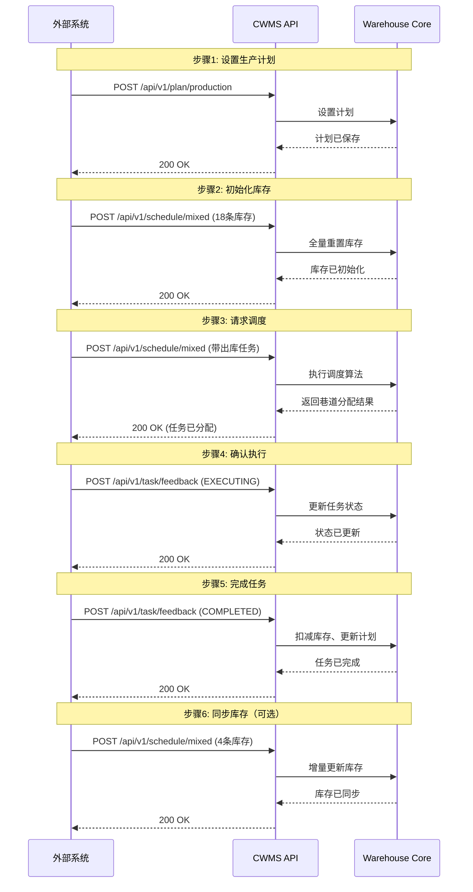
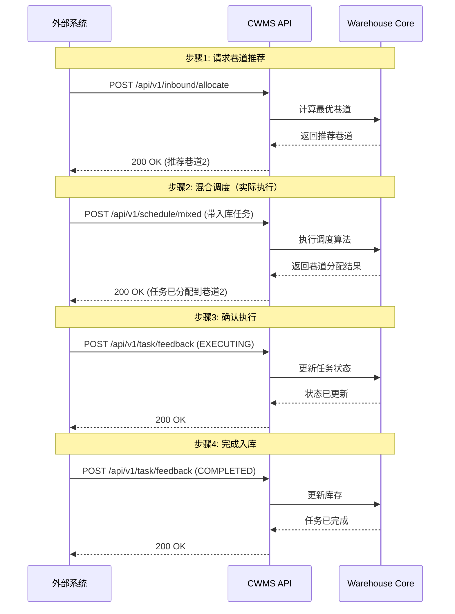

# 车身立体库管理系统 API 文档

---


## 0. 部署与启动说明

### 0.1. 环境要求

- Python 3.8 及以上
- 建议在独立虚拟环境中部署
- 主要依赖见项目根目录 `requirements.txt`

安装依赖示例：

```bash
pip install -r requirements.txt
```

### 0.2. 启动方式

项目默认启动入口为 `run_api.py`。

默认启动：

```bash
python run_api.py
```

开发模式（热重载）：

```bash
python run_api.py --reload
```

指定地址与端口：

```bash
python run_api.py --host 0.0.0.0 --port 8000
```

### 0.3. 默认访问地址

- 服务地址：`http://{host}:{port}`
- Swagger 文档：`http://{host}:{port}/docs`
- ReDoc 文档：`http://{host}:{port}/redoc`
- 根路径状态检查：`GET /`

默认情况下：

- `host = 0.0.0.0`
- `port = 8000`

### 0.4. 启动时初始化行为

服务启动时会自动执行以下初始化：

- 创建仓库货位结构，但不生成仿真初始库存
- 创建空的库存、生产计划、pending、running 和已完成任务状态
- 重置任务状态管理器

库存、生产计划、巷道状态和任务均保存在服务进程内存中，应由调用方通过接口同步。服务重启后，这些运行时状态会清空；仓库布局、匹配规则和调度参数则重新从 `config/warehouse.json` 读取。

### 0.5. 配置与调试说明

- 仓库布局、巷道、货位、匹配规则和评分参数在启动时读取 `config/warehouse.json`；修改该文件后必须重启 API 才能生效。
- 调用方可通过接口同步库存、生产计划、巷道状态和任务；这些运行时数据不写回配置文件。
- 若需要本地测试重置接口，可在启动前设置环境变量 `WMS_ENABLE_DEBUG_RESET=1`，此时会开放 `POST /api/v1/debug/reset` 调试接口。

### 0.6. 日志输出与清理

API 默认同时输出控制台和 `logs/api.log`。日志参数位于发布包外置的 `config/warehouse.json` 中的 `api_logging`：

- `max_file_size_mb`：单个日志文件的最大容量；默认 `10MB`，达到上限后自动滚动为归档文件。
- `max_total_size_mb`：当前日志文件与归档文件的累计上限；默认 `100MB`，超过后自动清理最旧归档。
- `backup_count`：归档文件数上限；默认 `20`。

部署时应修改 `release/carbody-api/config/warehouse.json`，不应修改 `_internal` 下的配置。打包完成后，修改该外置配置文件只需停止并重新启动 `carbody-api.exe`，不需要重新打包；只有修改 Python 源码、依赖或程序内置资源时才需要重新构建部署包。日志目录会在首次启动时自动创建。

PowerShell 的 `Start-Process -RedirectStandardOutput/-RedirectStandardError` 仍可用于将控制台输出另存为指定文件；这是 PowerShell 的进程重定向，与系统内置的容量轮转日志相互独立。

---

## 1、系统概述

### 1.1 功能简介

车身立体库管理系统（Car Warehouse Management System, CWMS）是一个智能化的车身仓储调度系统，主要功能包括：

- **生产计划管理**：设置和管理各产线的出库任务序列
- **库存管理**：实时同步和维护车身仓库库存状态
- **混合调度**：统一调度入库和出库任务，优化资源利用
- **任务反馈**：接收外部系统的任务执行状态反馈
- **入库分配**：为新到车身推荐最优存储位置

### 1.2 系统架构

系统采用 **Controller-Service-Model** 分层架构：

```
┌─────────────────────────────────────────────────┐
│              API Layer (FastAPI)                │
│  ┌──────────────────────────────────────────┐   │
│  │  Routes (Controllers)                    │   │
│  │  - plan.py      - schedule.py            │   │
│  │  - feedback.py  - inbound.py             │   │
│  └──────────────────────────────────────────┘   │
│                      ↓                          │
│  ┌──────────────────────────────────────────┐   │
│  │  Services (Business Logic)               │   │
│  │  - warehouse_service.py                  │   │
│  │  - state.py (TaskStateManager)           │   │
│  └──────────────────────────────────────────┘   │
│                      ↓                          │
│  ┌──────────────────────────────────────────┐   │
│  │  Models (Data Validation)                │   │
│  │  - models.py (Pydantic)                  │   │
│  └──────────────────────────────────────────┘   │
└─────────────────────────────────────────────────┘
                      ↓
┌─────────────────────────────────────────────────┐
│         Simulation Core (Warehouse Core)        │
│  - warehouse_core.py                            │
│  - inventory.py                                 │
│  - schedule/optimizer.py, heuristic.py          │
└─────────────────────────────────────────────────┘
```

### 1.3 关键概念

#### 巷道（Aisle）

- 车身立体仓库中的车身存取通道
- 每个巷道有独立的堆垛机（Stacker Crane）
- 系统支持多巷道并行作业

#### 货位（Position）

- 库存的最小存储单元
- 标识格式：`{aisleId}-{row}-{column}-{level}`
- **注意**：车身立体库配置为单层货位（`use_double_layer: false`），每个货位只存储一个SKU

#### 生产计划（Production Plan）

- 定义各产线的出库任务序列
- 分组管理：每个产线的计划分为多个组（Group）
- 顺序约束：同一产线必须按组顺序执行任务

#### 任务组（Task Group）

- 生产计划中的基本执行单元
- 一个组内可包含多个任务（车身立体库中一般只有一个任务）
- 组内任务可并行，组间任务串行

#### 任务 ID 命名规范

- **出库任务**：`OUTBOUND_{custom_suffix}`

  - 示例：`OUTBOUND-R1-001`
- **入库任务**：`INBOUND_{custom_suffix}`

  - 示例：`INBOUND-TEST-001`
- **入库分配推荐**：`INBOUND_A_{custom_suffix}`

  - 示例：`INBOUND_A-TEST-001`

---

## 2、通用规范

### 2.1 基础信息

- **协议**: HTTP/HTTPS
- **基础 URL**: `http://{host}:{port}/api/v1`
- **默认端口**: 8000
- **数据格式**: JSON
- **字符编码**: UTF-8

### 2.2 请求头

```http
Content-Type: application/json
Accept: application/json
```

### 2.3 响应格式

所有接口均返回统一的三键格式：

| 字段    | 类型        | 说明                                             |
| ------- | ----------- | ------------------------------------------------ |
| status  | String      | 操作状态："SUCCESS" 或 "FAILED" |
| message | String      | 操作描述信息                                     |
| data    | Object/null | 业务数据，无数据时为 null                        |

#### 成功响应示例 （HTTP 200）

```json
{
  "status": "SUCCESS",
  "message": "操作成功",
  "data": {
    "scheduleId": "SCH-A1B2C3D4",
    "timestamp": "2026-01-21T10:00:00Z"
  }
}
```

#### 错误响应示例（HTTP 400）

```json
{
  "status": "FAILED",
  "message": "命中禁配规则，入库分配失败。",
  "data": {
    "checks": {
      "aisle_forbidden": {
        "passed": false,
        "violations": []
      }
    }
  }
}
```

#### 错误响应示例（HTTP 4xx / 5xx）

```json
{
  "status": "FAILED",
  "message": "错误信息",
  "data": null
}
```

#### 参数校验失败响应示例（HTTP 422）

```json
{
  "status": "FAILED",
  "message": "请求参数验证失败",
  "data": {
    "errors": [
      "body -> tasks: field required",
      "body -> aisleStatus -> 0 -> bank: value is not a valid enumeration member"
    ]
  }
}
```

**注意**：

- **所有** HTTP 状态码的响应（包括 200、400、422、500）都包含 `status`、`message`、`data` 三个字段。
- 422 参数校验错误时，`data.errors` 包含各字段的详细错误信息。
- mixed 存在未确认任务时不会返回 409；会在成功响应中返回 `data.unconfirmedTaskIds`。

### 2.4 HTTP 状态码

| 状态码                    | 说明           | 触发场景                                            |
| ------------------------- | -------------- | --------------------------------------------------- |
| 200 OK                    | 请求成功       | 所有正常请求                                        |
| 400 Bad Request           | 请求参数错误   | 缺少必填参数、参数类型错误                          |
| 422 Unprocessable Entity  | 数据验证失败   | Pydantic 模型验证失败（如枚举值错误、数值超出范围） |
| 500 Internal Server Error | 服务器内部错误 | 调度算法异常、系统内部错误                          |

---

## 3、API 接口详细说明

### 3.1 生产计划同步

生产计划可单独通过 `POST /api/v1/plan/production` 写入，也可随 `POST /api/v1/schedule/mixed` 的 `productionPlan` 字段一并提交。两种方式调用同一套计划合并、组号推进和重复 `planId` 处理逻辑。

#### 3.1.1 生产计划写入接口

**接口**: `POST /api/v1/plan/production`

**请求体**: 与下文 `productionPlan` 对象完全相同。

**响应数据**: `data.success` 表示写入是否成功；`data.ignoredPlanIds` 返回本次忽略的重复 `planId`。该接口只更新计划上下文，不会提交入库或出库任务。

#### 3.1.2 内联生产计划

**接口**: `POST /api/v1/schedule/mixed`（字段 `productionPlan`）

**说明**: 生产计划通常随 `mixed` 请求一起上传。系统会先同步计划与组进度，再继续处理巷道状态、库存快照、任务入队和本轮调度结果。

**productionPlan 字段说明**:

| 字段 | 类型 | 必填 | 说明 |
| --- | --- | --- | --- |
| operationType | String | 是 | `ADD` 或 `UPDATE` |
| planDate | String | 是 | 计划时间，格式为 `YYYY-MM-DD HH:mm:ss` |
| resetAssigned | Boolean | 否 | 仅 `UPDATE` 有意义。`false` 时清空未下发 pending；`true` 时额外清空已下发未确认和执行中任务 |
| plans | Array | 是 | 计划列表，可一次提交多条产线计划 |

**plans[i] 字段说明**:

| 字段 | 类型 | 必填 | 说明 |
| --- | --- | --- | --- |
| planId | String | 是 | 计划标识。系统会维护 `planId -> lineId` 映射，后续出库任务可通过 `planId` 自动识别产线 |
| lineId | String/Integer | 是 | 产线编号，支持 `1`、`"1"`、`"LINE-1"` 这类可归一化写法 |
| planIndex | Array | 是 | 按组顺序定义该产线的计划内容，数组第 1 个元素表示第 1 组 |

**planIndex[i] / requiredSkus 说明**:

| 字段 | 类型 | 必填 | 说明 |
| --- | --- | --- | --- |
| requiredSkus | Array | 是 | 该组的任务集合。车身立体库一般每组只配 1 个任务，但结构上允许多个任务 |
| requiredSkus[][] | Array | 是 | 单个任务需要匹配的一组 `sku` 条目 |
| skuId | String | 是 | RFID 模式下填写实际 SKU；特征匹配模式下字段仍需存在，可传空字符串 |
| quantity | Integer | 否 | 默认按 `1` 处理 |
| features | Object | 否 | 特征匹配字段，如 `color`、`skid_type`、`skid_state` |

**与组进度相关的附加字段**:

| 字段 | 类型 | 位置 | 说明 |
| --- | --- | --- | --- |
| currentGroups | Object/Array | mixed 顶层 | 当前组设置，使用对外 1 基口径；例如 `{"1": 2}` 表示产线 1 当前执行第 2 组 |
| productionLineCurrentGroup | Object | mixed 顶层或 productionPlan 内兼容字段 | 历史兼容字段，使用内部 0 基口径；仅建议兼容旧系统时使用 |

**当前规则**:

1. `ADD` 会把新计划组追加到现有计划末尾，不覆盖历史计划。
2. `UPDATE` 会整份替换当前生产计划，并重置计划上下文。
3. `UPDATE` 未显式传 `currentGroups` 时，各产线默认回到第 1 组起点。
4. `UPDATE + resetAssigned=false` 会清空未下发的 pending 入库/出库任务，但保留已下发未确认和执行中任务。
5. `UPDATE + resetAssigned=true` 会额外清空已下发未确认任务和执行中任务。
6. `planId` 重复时不会报错，也不会覆盖已有计划；系统会忽略重复 `planId`，并在响应 `data.ignoredPlanIds` 中返回。
7. `planIndex` 在对外接口中始终按第 1 组、第 2 组这样的 1 基口径表达；系统内部会自动转换为 0 基索引。
8. 出库任务若带 `planId` / `planIndex`，会受对应产线当前组约束控制；当前组之前的历史组任务会被忽略，之后的组进入 `pending`。

#### 3.1.3 请求与响应示例（mixed 内联）

**请求示例**:

```json
{
  "currentTime": "2026-05-24 11:00:00",
  "inventory": [],
  "aisleStatus": [],
  "productionPlan": {
    "operationType": "ADD",
    "planDate": "2026-05-24 11:00:00",
    "plans": [
      {
        "planId": "PLAN-LINE1",
        "lineId": "1",
        "planIndex": [
          {
            "requiredSkus": [[
              {
                "skuId": "",
                "quantity": 1,
                "features": {
                  "color": "W1",
                  "skid_type": "0",
                  "skid_state": "1"
                }
              }
            ]]
          }
        ]
      }
    ]
  },
  "currentGroups": {
    "1": 1
  },
  "tasks": []
}
```

**响应示例**:

```json
{
  "status": "SUCCESS",
  "message": "调度成功。",
  "data": {
    "scheduleId": "SCH-12345678",
    "timestamp": "2026-05-24T03:00:00Z",
    "ignoredPlanIds": [],
    "unconfirmedTaskIds": [],
    "aisleAssignments": [
      {"aisleId": "1", "assignedTask": null, "matchedTasks": []},
      {"aisleId": "2", "assignedTask": null, "matchedTasks": []},
      {"aisleId": "3", "assignedTask": null, "matchedTasks": []},
      {"aisleId": "4", "assignedTask": null, "matchedTasks": []}
    ],
    "unsubmittedOutboundTasks": [],
    "executableTasksByAisle": {
      "1": [],
      "2": [],
      "3": [],
      "4": []
    },
    "checks": {
      "aisle_forbidden": {
        "rule": "driven by config/warehouse.json aisle_forbidden",
        "checked_count": 0,
        "passed": true,
        "violations": []
      }
    }
  }
}
```

**响应字段补充说明**:

- `data.ignoredPlanIds`: 本次计划同步中被忽略的重复 `planId` 列表。
- `data.unconfirmedTaskIds`: 已下发但尚未收到 `EXECUTING` 反馈的任务列表。
- `data.unsubmittedOutboundTasks`: 因库存不足、资源已被已提交出库任务占用、或同产线前序组未成立而未进入系统的出库任务列表。
- `data.executableTasksByAisle`: 当前各巷道可进入 `EXECUTING` 的任务视图。

#### 3.1.4 获取生产计划

**接口**: `GET /api/v1/plan/production`

**说明**: 用于查询当前系统内已经生效的生产计划。该接口主要用于调试、联调和校验当前计划上下文。

**响应示例**:

```json
{
  "status": "SUCCESS",
  "message": "ok",
  "data": {
    "production_plan": {
      "1": [
        [
          [
            {
              "skuId": "",
              "features": {
                "color": "W1",
                "skid_type": "0",
                "skid_state": "1"
              }
            }
          ]
        ]
      ],
      "2": [],
      "3": [],
      "4": []
    }
  }
}
```
### 3.2 混合调度

#### 3.2.1 混合调度接口

**接口**: `POST /api/v1/schedule/mixed`

**说明**: `mixed` 是车身立体库的核心接口。它可以在一次请求中同步生产计划、当前组、巷道状态、库存快照和任务列表，并立即返回本轮调度结果。

**处理顺序**:

1. 同步 `productionPlan` / `currentGroups`
2. 同步 `aisleStatus`
3. 同步 `inventory`
4. 解析并校验 `tasks`
5. 将合法任务写入系统队列
6. 生成本轮 `assignedTask`、`matchedTasks` 和 `executableTasksByAisle`

**当前行为**:

1. 已存在未确认任务时，接口不会全局拒绝；会在响应中返回 `unconfirmedTaskIds`，并冻结已下发资源位。
2. 同一请求中若出现重复 `taskId`，或与系统内 active 任务（pending / 已下发未确认 / running）重复，接口直接失败。
3. 命中 `aisle_forbidden` 时，本次 `mixed` 整体失败，库存、计划、任务入队和调度结果全部回滚。
4. `inventory=[]` 表示保持当前库存不变；`inventory` 非空表示按本次快照重建库存。
5. 库存同步不会清空任务状态；库存与任务状态是解耦的。
6. 出库任务会先做库存与资源占用检查；不能成立的任务不会入队，而是返回到 `unsubmittedOutboundTasks`。
7. `matchedTasks` 表示当前巷道下的可执行任务列表，不是单纯的库存匹配预览。
8. `assignedTask` 表示该巷道本轮实际推荐/下发的任务；若该巷道已有 running 或已下发未确认任务，会优先返回该冻结任务。

**请求字段说明**:

| 字段 | 类型 | 必填 | 说明 |
| --- | --- | --- | --- |
| currentTime | String | 否 | 当前业务时间，建议使用 `YYYY-MM-DD HH:mm:ss` |
| productionPlan | Object | 否 | 内联生产计划，结构见 3.1 |
| currentGroups | Object/Array | 否 | 当前组设置，使用 1 基口径 |
| productionLineCurrentGroup | Object | 否 | 历史兼容字段，使用 0 基口径 |
| inventory | Array | 是 | 库存快照；空数组表示不更新库存 |
| aisleStatus | Array | 是 | 巷道可用状态与出库拥堵状态 |
| tasks | Array | 是 | 本次提交的入库/出库任务 |

**inventory[i] 字段说明**:

| 字段 | 类型 | 必填 | 说明 |
| --- | --- | --- | --- |
| aisleId | String/Integer | 是 | 巷道编号 |
| row | Integer | 是 | 支持两种外部口径：基础行 `1/2`，或巷道展开行；例如 2 巷道允许 `1/2/3/4`，3 巷道允许 `1/2/5/6` |
| column | Integer | 是 | 列号 |
| level | Integer | 是 | 层号 |
| positions | Array | 否 | 该货位上的库存内容；省略或传空数组表示该货位为空 |
| positions[].skuId | String | 否 | RFID 模式下通常必填；特征匹配模式下可为空 |
| positions[].quantity | Integer | 否 | 默认按 `1` 处理 |
| positions[].features | Object | 否 | 库存特征，如 `color`、`skid_type`、`skid_state` |
| positions[].inboundTime | Number/String | 否 | 该 SKU 的实际入库时间；支持 Unix 秒或 ISO 8601 字符串，供非 RFID 产线 FIFO 排序使用 |
| positions[].arrivalTime | Number/String | 否 | `inboundTime` 的兼容别名；两个字段同时存在时以 `inboundTime` 为准 |

**aisleStatus[i] 字段说明**:

| 字段 | 类型 | 必填 | 说明 |
| --- | --- | --- | --- |
| aisleId | String/Integer | 是 | 巷道编号 |
| isAvailable | Boolean | 是 | 巷道是否可用 |
| bank | String | 是 | 巷道侧别，如 `LEFT` / `RIGHT` |
| exitCongestion | Array | 是 | 出库线拥堵状态；可传空数组表示当前无上报的拥堵线 |
| exitCongestion[].lineId | String | 是 | 出库线标识 |
| exitCongestion[].isCongested | Boolean | 是 | 是否拥堵 |
| dockAvailability | Array | 否 | 指定入库口或出库口是否可用；省略或传空数组时沿用服务内存中的上次口位状态 |
| dockAvailability[].direction | String | 是 | `INBOUND` / `OUTBOUND`，兼容 `IN` / `OUT` |
| dockAvailability[].lineRef | String/Integer | 是 | 口位标识，支持数字或 `LxCy` |
| dockAvailability[].isAvailable | Boolean | 是 | 该口位是否可用 |
| dockAvailability[].reason | String | 否 | 不可用原因 |

**tasks[i] 字段说明**:

| 字段 | 类型 | 必填 | 说明 |
| --- | --- | --- | --- |
| taskId | String | 是 | 任务唯一标识 |
| taskType | String | 是 | `INBOUND` 或 `OUTBOUND` |
| targetAisle | String/Integer | 否 | 入库偏好巷道；若不可行，系统可重新选择合法巷道 |
| productionLine | Integer | 否 | 出库任务显式产线；未传时优先通过 `planId -> lineId` 映射识别 |
| planId | String | 否 | 出库任务所属计划 |
| planIndex | Integer | 否 | 出库任务所属组，使用 1 基口径 |
| inLine | String/Integer | 否 | 入库线 |
| outLine | String/Integer | 否 | 出库线 |
| skus | Array | 是 | 任务 SKU 列表 |
| skus[].skuId | String | 否 | RFID 模式下通常必填；特征匹配模式下可为空 |
| skus[].features | Object | 否 | 用于特征匹配和禁配判断 |

`mixed.tasks` 不接收执行货位。入库货位由服务依据目标巷道分配，出库货位由库存匹配产生；调度响应的 `positions` 是已冻结的推荐执行位置。需要调整已推荐入库位置时，使用 `POST /api/v1/task/adjust`。

**出库匹配规则**:

1. RFID 模式下，系统按 `skuId` 匹配库存。
2. 特征匹配模式下，系统按配置的特征字段匹配库存；当前车身立体库中，产线 1 默认按 `color + skid_type + skid_state` 一起匹配。
3. 特征匹配模式下，任务请求里的 `skuId` 可以与真实出库库存 `skuId` 不同，也可以为空；真正命中的库存 `skuId` 会体现在调度响应和反馈结果中。
4. 若同一产线后续组因前一组库存或资源不足而无法成立，该组及其后续组不会入队。

#### 3.2.2 接口注意事项

1. `mixed` 支持分批追加任务；后续请求提交的新任务会进入系统队列，不会因为已有已下发任务而被直接丢弃。
2. 对同一巷道重复调用 `mixed` 时，若该巷道已有已下发未确认或执行中任务，`assignedTask` 会保持原任务，不会被新任务顶掉。
3. `aisle_forbidden`、禁用货位、非法 row、非法位置冲突等都属于阻断错误；出错时本次请求不保留任何状态变化。
4. 出库任务若当前无库存匹配，或可匹配库存已被已提交出库任务占用，会出现在 `unsubmittedOutboundTasks` 中，不进入 pending 队列。
5. `ignoredPlanIds` 仅反映计划去重结果，不影响本次请求里其他合法内容继续处理。
6. 空滑橇出库可通过 `skus[].features.skid_state="0"` 触发；长滑橇等限制仍受巷道禁配与货位可行性约束。

#### 3.2.3 请求与响应示例

**请求示例**:

```json
{
  "currentTime": "2026-05-24 10:01:00",
  "inventory": [
    {
      "aisleId": "1",
      "row": 1,
      "column": 10,
      "level": 1,
      "positions": [
        {
          "skuId": "TB0000001",
          "quantity": 1,
          "features": {
            "color": "W1",
            "skid_type": "0",
            "skid_state": "1"
          }
        }
      ]
    }
  ],
  "aisleStatus": [],
  "tasks": [
    {
      "taskId": "OUT11",
      "taskType": "OUTBOUND",
      "planId": "PLAN-LINE1",
      "planIndex": 1,
      "outLine": "1",
      "skus": [
        {
          "skuId": "",
          "quantity": 1,
          "features": {
            "color": "W1",
            "skid_type": "0",
            "skid_state": "1"
          }
        }
      ]
    }
  ]
}
```

**成功响应示例**:

```json
{
  "status": "SUCCESS",
  "message": "调度成功。",
  "data": {
    "scheduleId": "SCH-4CB4E1EE",
    "timestamp": "2026-06-26T04:54:38Z",
    "ignoredPlanIds": [],
    "unconfirmedTaskIds": [],
    "aisleAssignments": [
      {
        "aisleId": "2",
        "assignedTask": {
          "taskId": "OUT11",
          "taskType": "OUTBOUND",
          "planId": "PLAN-LINE1",
          "planIndex": 1,
          "inLine": "L1C1",
          "outLine": "1",
          "positions": [
            {
              "row": 3,
              "column": 12,
              "level": 1,
              "shelf": null,
              "skuId": "TB0000002",
              "quantity": 1
            }
          ]
        },
        "matchedTasks": [
          {
            "taskId": "OUT11",
            "taskType": "OUTBOUND",
            "planId": "PLAN-LINE1",
            "planIndex": 1,
            "aisleId": "2",
            "inLine": 1,
            "outLine": 1,
            "positions": [
              {
                "aisleId": "2",
                "row": 3,
                "column": 12,
                "level": 1
              }
            ]
          }
        ]
      }
    ],
    "unsubmittedOutboundTasks": [],
    "executableTasksByAisle": {
      "2": [
        {
          "taskId": "OUT11",
          "taskType": "OUTBOUND",
          "planId": "PLAN-LINE1",
          "planIndex": 1,
          "aisleId": "2",
          "inLine": 1,
          "outLine": 1,
          "positions": [
            {
              "aisleId": "2",
              "row": 3,
              "column": 12,
              "level": 1
            }
          ]
        }
      ]
    },
    "checks": {
      "aisle_forbidden": {
        "rule": "driven by config/warehouse.json aisle_forbidden",
        "checked_count": 0,
        "passed": true,
        "violations": []
      }
    }
  }
}
```

**关键字段说明**:

- `aisleAssignments[].assignedTask`: 本轮该巷道实际推荐/下发的任务。
- `aisleAssignments[].matchedTasks`: 当前该巷道的可执行任务视图，推荐任务通常排在最前。
- `executableTasksByAisle`: 与 `matchedTasks` 一致的按巷道聚合视图，便于外部系统直接消费。
- `unsubmittedOutboundTasks[].reason`: 说明出库任务未提交的直接原因。
- `checks.aisle_forbidden`: 本次请求执行过的禁配校验结果；命中违规时接口会直接失败，不会保留本次变更。
### 3.3 入库管理

#### 3.3.1 入库巷道分配

**接口**: `POST /api/v1/inbound/allocate`

**说明**: 为新到车身推荐最优的入库巷道。此接口仅返回推荐结果，不会实际执行入库任务。

**请求参数**:

| 字段                    | 类型           | 必填 | 说明                                     |
| ----------------------- | -------------- | ---- | ---------------------------------------- |
| tasks                   | Array          | 是   | 入库任务列表                             |
| tasks[].inLine          | Integer/String | 是   | 入库口/入口线，推荐使用 LxCy（如 L4C1）  |
| tasks[].outLine         | Integer/String | 否   | 出库口/出口线，推荐使用 LxCy（如 L1C17） |
| tasks[].taskId          | String         | 是   | 任务ID（建议使用 INBOUND_A_ 前缀）       |
| tasks[].skus            | Array          | 是   | SKU 列表（通常只有1个SKU）               |
| tasks[].skus[].skuId    | String         | 是   | SKU ID                                   |
| tasks[].skus[].quantity | Integer        | 是   | 数量                                     |
| tasks[].skus[].features | Object         | 否   | SKU 附加属性                             |

#### 3.3.2 请求与响应示例

**请求示例**:

```json
{
  "tasks": [
    {
      "taskId": "INBOUND-TEST-001",
      "inLine": "L4C1",
      "outLine": "L1C17",
      "skus": [
        {
          "skuId": "1RAT000012",
          "quantity": 1,
          "features": {
            "color": "W1",
            "skid_type": "0",
            "skid_state": "1"
          }
        }
      ]
    }
  ]
}

```

**响应示例1（SUCCESS）**:

```json
{
  "status": "SUCCESS",
  "message": "入库分配成功",
  "data": {
    "allocationId": "ALLOC-12345678",
    "assignments": [
      {
        "taskId": "INBOUND-TEST-001",
        "recommendedAisle": "2"
      }
    ],
    "checks": {
      "aisle_forbidden": {
        "rule": "driven by config/warehouse.json aisle_forbidden",
        "checked_count": 1,
        "passed": true,
        "violations": []
      }
    }
  }
}
```

**响应示例2（命中禁配规则，返回失败）**:

```json
{
  "status": "FAILED",
  "message": "命中禁配规则，入库分配失败。",
  "data": {
    "allocationId": "ALLOC-12345678",
    "reason": "本次请求命中 aisle_forbidden 禁配规则，分配结果未生效。",
    "checks": {
      "aisle_forbidden": {
        "rule": "driven by config/warehouse.json aisle_forbidden",
        "checked_count": 1,
        "passed": false,
        "violations": [
          {
            "taskId": "INBOUND-TEST-001",
            "aisleId": "1",
            "checked_count": 1,
            "passed": false,
            "violated": [
              {
                "feature": "skid_type",
                "value": "1",
                "blocked_values": [
                  "1"
                ]
              }
            ]
          }
        ]
      }
    }
  }
}
```

**响应字段说明**:

`status`: 业务状态（SUCCESS / FAILED）
`message`: 结果描述
`data.allocationId`: 本次分配唯一标识
`data.assignments`: 分配结果列表
`data.assignments[].taskId`: 任务ID
`data.assignments[].recommendedAisle`: 推荐巷道ID
`data.checks.aisle_forbidden`: 基于配置规则的禁入校验结果
`data.checks.aisle_forbidden.violations`: 违反规则的任务明细（为空表示无违规）

**推荐算法考虑因素**:

- SKU 类型
- 巷道库存容量
- 历史存储位置
- 巷道负载均衡

---

### 3.4 任务反馈

#### 3.4.1 任务执行状态反馈

**接口**: `POST /api/v1/task/feedback`

**说明**: 外部系统回传任务执行状态，用于推进任务生命周期与保持系统状态一致。`EXECUTING` 仅用于确认执行状态，不用于修改巷道或位置；任务调整请使用 `POST /api/v1/task/adjust`。

**请求参数**:

| 字段          | 类型   | 必填          | 说明                                                                          |
| ------------- | ------ | ------------- | ----------------------------------------------------------------------------- |
| taskId        | String | 是            | 任务ID                                                                        |
| taskType      | String | 是            | 任务类型："OUTBOUND" 或 "INBOUND"                                             |
| status        | String | 是            | 状态："EXECUTING", "COMPLETED", "FAILED"                                      |
| startTime     | String | 是            | 任务开始时间（ISO 8601 格式）                                                 |
| aisleId       | String | 否            | 仅用于一致性校验；`EXECUTING` 不允许改巷道 |
| positions     | Array  | 否            | 仅用于一致性校验；`EXECUTING` 不允许改位置 |
| failureReason | String | 否 | 失败原因；建议在 `FAILED` 时提供，便于外部追溯                              |

**任务状态说明**:

1. **EXECUTING（执行中）**:

   - 外部系统收到调度指令并开始执行时发送
   - 系统收到后：
     - 将任务从待确认队列移入运行队列
     - 允许发起下一次调度请求
   - 不支持覆盖巷道/位置；若传入值与已固化分配不一致会直接失败
   - 同一任务重复发 `EXECUTING` 幂等成功（返回“任务已处于执行中”）
2. **COMPLETED（已完成）**:

   - 任务成功完成时发送
   - 系统收到后：
     - 将任务移入已完成队列
     - 自动扣减库存（出库任务）
     - 设置巷道+产线拥堵状态（出库任务，持续 5 秒）
     - 更新生产计划进度
3. **FAILED（失败）**:

   - 任务执行失败时发送
   - 系统收到后：
     - 从所有任务队列中移除该任务
     - 清理该任务导致的拥堵状态
     - 不扣减库存

#### 3.4.2 请求与响应示例

**请求示例 - EXECUTING**:

```
{
  "taskId": "OUTBOUND-R1-001",
  "taskType": "OUTBOUND",
  "status": "EXECUTING",
  "startTime": "2026-01-21T10:16:00Z"
}
```

**请求示例 - COMPLETED**:

```
{
  "taskId": "OUTBOUND-R1-001",
  "taskType": "OUTBOUND",
  "status": "COMPLETED",
  "startTime": "2026-01-21T10:16:00Z"
}
```

**请求示例 - FAILED**:

```
{
  "taskId": "OUTBOUND-R1-001",
  "taskType": "OUTBOUND",
  "status": "FAILED",
  "startTime": "2026-01-21T10:16:00Z",
  "failureReason": "机械故障"
}
```

**响应示例**:

```
{
  "status": "SUCCESS",
  "message": "反馈处理成功",
  "data": {
    "taskId": "OUTBOUND-R1-001",
    "status": "EXECUTING",
    "aisleId": "1",
    "positions": [
      { "aisleId": "1", "row": 1, "column": 10, "level": 1 }
    ],
    "reason": null
  }
}
```

**响应字段说明**:

- `status`: 反馈处理结果（SUCCESS / FAILED）
- `message`: 操作描述信息
- `data`: 业务数据（此接口为 null）

---

#### 3.4.3 任务调整（仅入库任务）

**接口**: `POST /api/v1/task/adjust`

**说明**: 变更入库任务的巷道/inLine/SKU/positions。建议流程为：先 `adjust` 成功，再发送 `EXECUTING`。

**请求参数**:

| 字段      | 类型            | 必填 | 说明 |
| --------- | --------------- | ---- | ---- |
| taskId    | String          | 是   | 入库任务ID |
| taskType  | String          | 是   | 仅支持 `INBOUND` |
| aisleId   | String          | 否   | 目标巷道，不传则沿用当前巷道 |
| inLine    | String/Integer  | 否   | 调整后的入库口 |
| skus      | Array           | 否   | 调整后的SKU列表 |
| positions | Array           | 否   | 显式目标位置；不传则系统按目标巷道重分配 |

**冲突与校验规则**:

1. 与 `running`、`pending_execution` 任务的位置冲突会失败。
2. 与目标巷道中全部 `pending inbound` 已分配位置冲突会失败（含插队场景）。
3. `row` 严格校验：仅允许 `1/2` 或该巷道展开行（如 2 巷道允许 `3/4`）；非法 row 直接失败。
4. 冲突返回位置使用外部口径：`aisle-externalRow-column-level`。

**失败示例**:

```json
{
  "status": "FAILED",
  "message": "任务调整失败。",
  "data": {
    "taskId": "IN-005",
    "reason": "货位 2-3-11-1 已被任务 IN-002 占用（目标巷道待执行入库任务）。"
  }
}
```

### 3.5 调试接口

#### 3.5.1 查看待处理任务

**接口**: `GET /api/v1/task/pending`

**说明**: 返回服务当前维护的待处理、已确认执行和运行中任务汇总。每个任务携带 `source`，用于区分其来自 `pending_inbound_queue`、`pending_outbound_queue`、`running_tasks` 或任务状态管理器。

**响应字段**:

| 字段 | 类型 | 说明 |
| --- | --- | --- |
| data.count | Integer | 当前汇总任务数量 |
| data.tasks | Array | 任务列表 |
| data.tasks[].task_id | String | 任务标识 |
| data.tasks[].task_type | String | `INBOUND` 或 `OUTBOUND` |
| data.tasks[].aisle_id | String | 任务当前所属巷道；未确定时为 `null` |
| data.tasks[].status | String | `PENDING`、`EXECUTING`、`COMPLETED` 或 `FAILED` |
| data.tasks[].source | String | 任务所在的内部状态容器 |

#### 3.5.2 查看未确认任务 / 可执行视图

**接口**: `GET /api/v1/task/unconfirmed`

**说明**: 返回当前系统按巷道分组的任务视图，用于观察哪些任务可以进入 `EXECUTING`、哪些任务仍在等待、哪些任务正在执行。该接口名称沿用历史路径，但返回内容已经不再只是“未确认任务ID列表”。

**响应示例**:

```json
{
  "status": "SUCCESS",
  "message": "ok",
  "data": {
    "tasksByAisle": {
      "1": {
        "can_executing": [
          {
            "taskId": "OUT-001",
            "taskType": "OUTBOUND",
            "planId": "PLAN-LINE1",
            "planIndex": 1,
            "aisleId": "1",
            "inLine": 1,
            "outLine": 1,
            "positions": [
              {
                "aisleId": "1",
                "row": 1,
                "column": 10,
                "level": 1
              }
            ]
          }
        ],
        "pending": [],
        "running": []
      },
      "2": {
        "can_executing": [],
        "pending": [],
        "running": []
      },
      "3": {
        "can_executing": [],
        "pending": [],
        "running": []
      },
      "4": {
        "can_executing": [],
        "pending": [],
        "running": []
      }
    },
    "canAcceptExecuting": true
  }
}
```

**字段说明**:

- `data.tasksByAisle`: 按巷道分组的任务视图。
- `tasksByAisle[aisle].can_executing`: 当前可以进入 `EXECUTING` 的任务。
- `tasksByAisle[aisle].pending`: 已进入系统但当前还不能执行的任务。
- `tasksByAisle[aisle].running`: 当前正在执行的任务。
- `data.canAcceptExecuting`: 只要任一巷道存在 `can_executing` 任务，就返回 `true`。

**分桶规则**:

1. 入库任务只有在已经分配执行位置、且属于“该巷道 + 该 inLine 队首”时，才会进入 `can_executing`。
2. 出库任务只有在属于当前组、是对应产线当前队首、库存/路径/巷道条件满足时，才会进入 `can_executing`。
3. 已下发但尚未收到 `EXECUTING` 的任务，会继续出现在 `can_executing` 中。
4. 当前组之前的历史出库任务会被直接忽略，不会出现在 `pending`。
5. 当前组之后的出库任务会进入 `pending`，待前序组推进后再转入 `can_executing`。

**与 `mixed.data.unconfirmedTaskIds` 的区别**:

- `unconfirmedTaskIds` 只表示“已经下发但尚未收到 EXECUTING 反馈”的任务。
- `/task/unconfirmed` 返回的是完整可执行视图，包含 `can_executing`、`pending`、`running` 三类任务。

#### 3.5.3 获取系统状态

**接口**: `GET /api/v1/status`

**说明**: 获取系统运行状态和统计信息（调试用）。

**响应示例**:

```
{
  "status": "SUCCESS",
  "message": "获取系统状态成功",
  "data": {
    "service_status": "running",
    "current_time": 12345.67,
    "running_tasks_count": 2,
    "completed_tasks_count": 5,
    "aisle_status": {
      "1": {
        "is_busy": false,
        "blockage": {
          "1": {"blocked": false, "unblock_time": 0},
          "2": {"blocked": false, "unblock_time": 0},
          "3": {"blocked": false, "unblock_time": 0},
          "4": {"blocked": false, "unblock_time": 0}
        },
        "current_position": "1-1-5-3"
      }
    },
    "inventory_summary": {
      "1": {"1RAT000001": 1, "1RAT000002": 1},
      "2": {}
    },
    "inventory": [
      {
        "aisleId": "1",
        "row": 1,
        "column": 1,
        "level": 1,
        "positions": [{"skuId": "1RAT000001", "quantity": 1, "features": {"color": "W1", "skid_type": "0", "skid_state": "1"}}]
      },
      {
        "aisleId": "1",
        "row": 1,
        "column": 1,
        "level": 2,
        "positions": [{"skuId": "", "quantity": 0}]
      }
    ]
  }
}
```

**响应字段说明**:

- `status`: 操作状态（"SUCCESS" 或 "FAILED"）
- `message`: 操作描述信息
- `data.service_status`: 系统状态（"running" 或 "error"）
- `data.current_time`: 当前仿真时间（秒）
- `data.running_tasks_count`: 正在执行的任务数
- `data.completed_tasks_count`: 已完成的任务数
- `data.aisle_status`: 各巷道状态（以巷道ID为 key 的字典）
- `data.aisle_status[].is_busy`: 巷道当前是否忙碌
- `data.aisle_status[].blockage`: 各产线的拥堵状态（key 为产线编号）
- `data.aisle_status[].blockage[].blocked`: 是否拥堵
- `data.aisle_status[].blockage[].unblock_time`: 预计解除时间（秒；-1 表示无限）
- `data.aisle_status[].current_position`: 当前巷道位置（可能为 null）
- `data.inventory_summary`: 按巷道汇总的 SKU 数量统计（`{aisleId: {skuId: quantity}}`）
- `data.inventory`: 全局库存列表（结构同混合调度请求中的 `inventory` 字段）

---

## 4、典型业务流程

### 4.1 出库流程



### 4.2 入库流程



## 5、数据模型与约束

### 5.1 库存配置参数

根据系统配置文件 `config/warehouse.json`，当前系统参数如下：

| 参数                 | 值                                               | 说明                                                                                                      |
| -------------------- | ------------------------------------------------ | --------------------------------------------------------------------------------------------------------- |
| num_aisles           | 4                                                | 巷道数量                                                                                                  |
| num_production_lines | 4                                                | 产线数量（接口中对应 lineId / planId 解析出的产线号）                                                     |
| aisle_dimensions     | {"4": { "rows": 2, "columns": 11, "levels": 5 }} | 各巷道独立尺寸（如 1~3 巷道 17 列，4 巷道 11 列）；系统自动据此计算总容量                               |
| disabled_positions   | ["1-1-1-1"]                                      | 禁用的货位（aisleId-row-column-level）                                                                    |
| aisle_forbidden      | {"3": {"skid_type":["1", 1]} }                   | 巷道禁入规则（按特征值限制）                                                                              |

### 5.2 inventory 字段约束

| 字段                 | 类型    | 取值范围        | 说明                              |
| -------------------- | ------- | --------------- | --------------------------------- |
| aisleId              | Integer | 1, 2, 3, ··· | 巷道编号                          |
| row                  | Integer | 1, 2            | 1=左侧，2=右侧                    |
| column               | Integer | 1, 2, 3，··· | 列号                              |
| level                | Integer | 1, 2, 3, ··· | 层号                              |
| shelf                | String  | -               | 在单层货位系统中不使用            |
| positions[].skuId    | String  | 任意或空字符串  | 空字符串表示空货位                |
| positions[].quantity | Integer | 0, 1            | 只能是 0（空）或 1（有货）        |
| positions[].features | Object  | -               | 货位特征值，如：{"skid_type":"1"} |

### 5.3 task_id 命名规范

**建议格式**（非强制，但推荐使用以提高可读性）：

#### 出库任务

格式：`OUTBOUND_PL{pl}_GP{group}_{sku}`

- `pl`: 产线编号（整数，如 1, 2, 3）
- `group`: 组号（整数，如 1, 2, 3）

示例：

```
OUTBOUND_PL1_GP1_1RAT000123
OUTBOUND_PL2_GP3_1RAT000100
```

#### 入库任务（执行）

格式：`INBOUND_{sku}`

示例：

```
INBOUND_1RAT000456
```

#### 入库任务（分配推荐）

格式：`INBOUND_A_{sku}`

示例：

```
INBOUND_A_1RAT000789
```

**注意**:

- 系统不强制验证 taskId 格式，您可以使用任意唯一标识符
- 推荐使用上述格式以便于日志追踪和问题排查
- taskId 在系统中必须唯一，避免重复使用

### 5.4 时间格式

| 字段        | 格式                | 示例                  | 说明                   |
| ----------- | ------------------- | --------------------- | ---------------------- |
| planDate    | YYYY-MM-DD HH:mm:ss | "2026-01-21 09:00:00" | 生产计划日期           |
| currentTime | YYYY-MM-DD HH:mm:ss | "2026-01-21 10:15:00" | 混合调度请求的当前时间 |

**注意**:

- 请求参数使用 `YYYY-MM-DD HH:mm:ss` 格式（空格分隔）

### 5.5 车身立体库业务特性与SKU匹配规则

车身立体库固定采用单层货位模式，因此每个货位仅存放一个SKU；在任务组织上，出库任务通常表现为单SKU任务。出库匹配规则由 config/warehouse.json 中的 outbound_match_features 配置驱动，并支持按产线配置不同匹配字段。系统在执行阶段会根据产线对应配置选择匹配路径：当配置包含 rfid 时，按 SKU 标识路径进行匹配；当配置不包含 rfid、而是使用 color、skid_type、skid_state 等字段时，按特征匹配，调用方需在 features 中提供对应字段。对于非 RFID 产线，还可通过 outbound_FIFO 启用库存先进先出：在满足特征匹配后优先选择实际入库时间最早的库存；库存同步可在 SKU 明细中传 inboundTime（兼容 arrivalTime，支持 Unix 秒或 ISO 8601 字符串），未传时服务首次同步该库存即记录时间。RFID 产线即使配置 FIFO 也会被忽略。
此外，接口请求模型中的字段校验与匹配字段配置联动（match_fields），因此建议在所有有货SKU（quantity > 0）中保持特征字段完整一致，以避免校验或匹配失败。示例结构如下：

示例：

```json
{
  "skuId": "1RAT000001",
  "quantity": 1,
  "features": {
    "color": "W1",
    "skid_type": "0",
    "skid_state": "1"
  }
}

```

---

## 6、最佳实践与注意事项

### 6.1 数据流程

```
外部系统                    API服务                    WarehouseCore
    |                          |                           |
    |-- POST /schedule/mixed ->|                           |
    |(含productionPlan+currentGroups)                    |
    |                          |-- set_production_plan() ->|
    |                          |<- 确认 -------------------|
    |<-- 调度响应 --------------|                           |
    |                          |                           |
    |-- POST /inbound/allocate>|                           |
    |                          |-- allocate_inbound_aisle()|
    |                          |<- 推荐巷道 --------------- |
    |<-- 分配结果 -------------|                           |
    |                          |                           |
    |-- POST /schedule/mixed ->|                           |
    |   (含productionPlan+currentGroups+aisleStatus+inventory)
```

### 6.2 任务确认机制

系统中的任务状态可以理解为三层：

1. `pending`
   已进入系统，但当前还未下发。
2. `pending_execution`
   已通过 `mixed` 下发给外部，但还未收到 `EXECUTING` 反馈。
3. `running`
   已收到 `EXECUTING`，任务正在执行中。

**当前规则**:

1. 系统不会因为存在未确认任务就全局拒绝新的 `mixed` 请求。
2. 已下发未确认任务所在的巷道/资源位会被冻结；后续调度不会把该位置上的 `assignedTask` 切换成别的任务。
3. 同一巷道存在 `running` 任务时，其他任务不能进入 `EXECUTING`。
4. `GET /api/v1/task/unconfirmed` 用于查看完整的可执行/等待/执行中视图。
5. `mixed` 响应中的 `unconfirmedTaskIds` 用于提醒外部系统还有哪些已下发任务尚未回执。

**推荐调用顺序**:

1. 调用 `POST /api/v1/schedule/mixed`
2. 读取 `assignedTask`、`matchedTasks`、`unconfirmedTaskIds`
3. 如需查看当前全量任务状态，调用 `GET /api/v1/task/unconfirmed`
4. 外部设备开始执行后，调用 `POST /api/v1/task/feedback` 上报 `EXECUTING`
5. 执行结束后，调用 `POST /api/v1/task/feedback` 上报 `COMPLETED` 或 `FAILED`

**收到 `unconfirmedTaskIds` 时的含义**:

- 这些任务已经被系统下发过。
- 如果外部还未真正开始执行，应优先确认是否漏发了 `EXECUTING`。
- 在未确认前，该任务对应巷道的推荐任务不会被后续 `mixed` 顶掉。
### 6.3 生产计划约束

**规则**: 同一产线的任务必须按组顺序执行。

**说明**:

- 第 N 组的所有任务完成后，才能开始第 N+1 组
- 同一组内的任务可以并行执行

**最佳实践**:

1. 设计生产计划时，将紧急任务放在前面的组
2. 组内任务数量不宜过多（建议 2-5 个）
3. 定期检查生产计划进度（`GET /api/v1/plan/production`）

### 6.4 库存同步策略

**场景选择**:

| 场景     | inventory 内容 | 触发条件                       | 用途                               |
| -------- | -------------- | ------------------------------ | ---------------------------------- |
| 快照重建 | 非空数组       | 系统初始化、跨天重置、主动对账 | 建立本次请求定义的完整库存基线     |
| 保持不变 | 空数组 `[]`  | 仅调度任务、不更新库存         | 保持原有库存状态，常用于纯调度场景 |

**最佳实践**:

1. 初始化或对账时：传完整库存快照（非空数组）。
2. 纯调度场景：传空数组 `[]`，不改库存。
3. 库存同步与任务状态解耦：不会自动清理 `pending/pending_execution/running`。
4. 如需在 `UPDATE` 时清理任务状态，使用 `resetAssigned`：
   - `false`（默认）：仅清未下发 pending
   - `true`：全清 pending/pending_execution/running

**注意事项**:

- 传入不存在/禁用货位或不合法 row 会直接报错。
- 若命中 `aisle_forbidden`，本次 mixed 整体回滚（库存/计划/调度均不生效）。

### 6.5 巷道拥堵管理

**拥堵设置时机**:

- 出库任务完成（COMPLETED）时自动设置
- 默认持续时间：5 秒（由配置文件 `config/warehouse.json` 中的 `outbound_congestion_time` 参数控制）
- 拥堵期间该产线不能使用该巷道

**最佳实践**:

1. 在 `aisleStatus` 中准确反映拥堵状态
2. 拥堵解除后再请求下一次调度
3. 如需调整拥堵时间，修改配置文件后重启服务

**配置说明**:

- 配置文件：`config/warehouse.json`
- 参数名：`outbound_congestion_time`
- 单位：秒（浮点数）
- 默认值：5.0
- 示例：设置为 3.0 表示拥堵持续 3 秒

### 6.6 错误处理建议

| 错误类型         | HTTP 状态码  | 处理建议                                                   |
| ---------------- | ------------ | ---------------------------------------------------------- |
| 参数验证失败     | 422          | 检查请求参数格式和取值范围                                 |
| 未确认任务未回执 | 200(SUCCESS) | 读取 `unconfirmedTaskIds`，补发 EXECUTING 反馈或等待超时 |
| 调度失败         | 500          | 检查库存和巷道状态，重试请求                               |
| 任务执行失败     | -            | 发送 FAILED 反馈，系统自动清理状态                         |

**重试策略**:

- 422 错误：修正参数后立即重试
- 未确认任务场景：优先补回执，再重试 mixed
- 500 错误：等待 5 秒后重试，最多 2 次

---

## 7、完整示例

### 7.1 从零开始的完整流程

以下是一个完整的测试流程，涵盖从设置生产计划到任务完成的全过程。

#### 步骤 0: 设置生产计划

```bash
curl -X POST http://localhost:8000/api/v1/plan/production \
  -H "Content-Type: application/json" \
  -d '{
    "operationType": "ADD",
    "planDate": "2026-01-21 09:00:00",
    "plans": [
      {
        "planId": "PLAN-LINE1",
        "lineId": "1",
        "planIndex": [
          {
            "requiredSkus": [
              [
                {"skuId": "车身总成-001", "quantity": 1, "features": {"color": "W1", "skid_type": "0", "skid_state": "1"}}
              ]
            ]
          }
        ]
      }
    ]
  }'
```

#### 步骤 1: 初始化库存

```bash
curl -X POST http://localhost:8000/api/v1/schedule/mixed \
  -H "Content-Type: application/json" \
  -d '{
    "inventory": [
      {"aisleId": "1", "row": 1, "column": 1, "level": 1, "shelf": "UPPER", "positions": [{"skuId": "1RAT000001", "quantity": 1, "features": {"color": "W1", "skid_type": "0", "skid_state": "1"}}]},
      {"aisleId": "1", "row": 1, "column": 1, "level": 1, "shelf": "LOWER", "positions": [{"skuId": "", "quantity": 0}]},
      ... (共18条)
    ],
    "aisleStatus": [...],
    "tasks": []
  }'
```

#### 步骤 2: 请求出库调度

```bash
curl -X POST http://localhost:8000/api/v1/schedule/mixed \
  -H "Content-Type: application/json" \
  -d '{
    "inventory": [],
    "aisleStatus": [...],
    "tasks": [
      {
        "taskId": "OUTBOUND-R1-001",
        "taskType": "OUTBOUND",
        "planId": "PLAN-LINE1",
        "planIndex": 1,
        "skus": [
          {"skuId": "1RAT000001", "quantity": 1, "features": {"color": "W1", "skid_type": "0", "skid_state": "1"}}
        ]
      }
    ]
  }'
```

响应：

```json
{
  "status": "SUCCESS",
  "message": "调度成功",
  "data": {
    "scheduleId": "SCH-XXXXXXXX",
    "aisleAssignments": [
      {
        "aisleId": "1",
        "assignedTask": {
          "taskId": "OUTBOUND-R1-001",
          ...
        }
      }
    ]
  }
}
```

#### 步骤 3: 确认执行

```bash
curl -X POST http://localhost:8000/api/v1/task/feedback \
  -H "Content-Type: application/json" \
  -d '{
    "taskId": "OUTBOUND-R1-001",
    "taskType": "OUTBOUND",
    "status": "EXECUTING",
    "startTime": "2026-01-21T10:16:00Z"
  }'
```

#### 步骤 4: 完成任务

```bash
curl -X POST http://localhost:8000/api/v1/task/feedback \
  -H "Content-Type: application/json" \
  -d '{
    "taskId": "OUTBOUND-R1-001",
    "taskType": "OUTBOUND",
    "status": "COMPLETED",
    "startTime": "2026-01-21T10:16:00Z"
  }'
```

#### 步骤 5: 同步库存

```bash
curl -X POST http://localhost:8000/api/v1/schedule/mixed \
  -H "Content-Type: application/json" \
  -d '{
    "inventory": [
      {
        "aisleId": "1",
        "row": 1,
        "column": 1,
        "level": 1,
        "positions": [{"skuId": "", "quantity": 0}]
      }
    ],
    "aisleStatus": [...],
    "tasks": []
  }'
```

### 7.2 使用自动化测试脚本

系统提供了 Python 自动化测试脚本 `test_api_flow.py`，可以按顺序执行所有测试场景。

**运行方式**:

```
# 使用默认 URL (http://localhost:8000)
python test_api_flow.py

# 指定自定义 URL
python test_api_flow.py --base-url http://192.168.1.100:8000
```

**脚本功能**:

- 按顺序执行 7 个测试场景
- 打印每个请求和响应
- 自动等待任务确认
- 基本错误处理

---

## 8、常见问题排查

### 8.1 存在未确认任务（unconfirmedTaskIds 非空）

**现象**: mixed 返回 SUCCESS，但 `data.unconfirmedTaskIds` 中有任务ID。

**原因**: 上一次调度的任务尚未收到 EXECUTING 反馈，系统冻结了对应资源位。

**解决方案**:

1. 检查是否遗漏发送 EXECUTING 反馈
2. 调用 `GET /api/v1/task/unconfirmed` 查看未确认任务
3. 补发 EXECUTING 反馈
4. 如果任务已失败，发送 FAILED 反馈

### 8.2 参数验证失败（422 错误）

**常见原因**:

| 错误                     | 原因                                   | 解决方案                                          |
| ------------------------ | -------------------------------------- | ------------------------------------------------- |
| row 字段类型错误         | 使用了字符串 "A", "B"                  | 改为整数 1, 2                                     |
| column 超出范围          | 值 > 最大列数                          | 使用有效范围内的值（1-17，某些巷道为1-11）        |
| level 超出范围           | 值 > 5                                 | 使用 1-5 范围内的值                               |
| quantity 不合法          | 值 > 1                                 | 使用 0 或 1                                       |
| 缺少必填字段             | 如缺少 bank                            | 补充必填字段                                      |
| 入库任务缺少 targetAisle | 入库任务未指定目标巷道                 | 为入库任务添加 targetAisle 字段                   |
| 缺少附加属性             | 当系统配置不包含rfid时，未提供相应特征 | 根据[outbound_match_features]配置提供相应特征字段 |

### 8.3 库存不一致

**症状**: 调度结果与预期不符，找不到所需的 SKU。

**原因**:

1. `inventory=[]` 时本次请求不会改库存
2. 传入了新的库存快照，但字段不完整或位置口径错误
3. 特征匹配模式下，库存 `features` 与任务要求不一致

**解决方案**:

1. 如需重建库存，传入非空 `inventory` 快照
2. 调用 `GET /api/v1/status` 核对 `inventory` 与 `inventory_summary`
3. 检查 `row / column / level / features` 是否与仓库当前配置一致
4. 特征匹配模式下，确认库存和任务的 `color / skid_type / skid_state` 等字段完整且一致

### 8.4 任务无法分配

**症状**: 调用 `/api/v1/schedule/mixed` 后，所有巷道的 `assignedTask` 都是 null。

**可能原因**:

1. 库存中没有所需的 SKU
2. 所有巷道都不可用（isAvailable = false）
3. 所有巷道都处于拥堵状态
4. 生产计划顺序约束未满足（前一组未完成）

**解决方案**:

1. 检查库存数据（调用 `GET /api/v1/status` 查看 `inventory` / `inventory_summary`）
2. 检查巷道状态（aisleStatus）
3. 检查生产计划进度（currentGroups）
4. 检查响应中的 `unsubmittedOutboundTasks`、`matchedTasks` 和 `checks`

### 8.5 生产计划设置失败

**症状**: 设置生产计划时返回错误或无效。

**常见问题**:

1. planIndex 结构不正确（需要三层嵌套）
2. SKUID 不存在

**正确的 planIndex 结构**:

```
"planIndex": [           // 第1层：组数组
  {
    "requiredSkus": [    // 第2层：任务数组
      [                  // 第3层：SKU数组（车身库中通常只包含1个）
        {"skuId": "...", "quantity": 1, "features": {"color": "W1", "skid_type": "...", "skid_state": "..."}}
      ]
    ]
  }
]
```

### 8.6 获取帮助

如果以上方法无法解决问题，请：

1. **查看日志**: 检查服务端日志输出
2. **调用调试接口**:
   - `GET /api/v1/task/pending` - 查看待处理任务
   - `GET /api/v1/task/unconfirmed` - 查看未确认任务
   - `GET /api/v1/plan/production` - 查看当前生产计划（兼容接口）
   - `GET /api/v1/status` - 查看系统运行状态
3. **联系技术支持**: 提供完整的请求和响应日志

---

## 9、版本兼容性

### 9.1 当前版本

- **版本号**: v1.0
- **API 前缀**: `/api/v1`
- **发布日期**: 2026-07-01
- **状态**: 稳定

---

## 附录

### A. 完整的 API 端点列表

| 方法 | 端点                     | 说明                               | 类型 |
| ---- | ------------------------ | ---------------------------------- | ---- |
| POST | /api/v1/plan/production  | 写入或更新生产计划                 | 生产 |
| GET  | /api/v1/plan/production  | 获取当前生产计划                   | 生产 |
| POST | /api/v1/schedule/mixed   | 混合调度（核心接口）               | 调度 |
| POST | /api/v1/inbound/allocate | 入库巷道分配                       | 入库 |
| POST | /api/v1/task/feedback    | 任务执行状态反馈                   | 反馈 |
| GET  | /api/v1/task/pending     | 查看待处理和运行中任务             | 调试 |
| GET  | /api/v1/task/unconfirmed | 查看未确认任务                     | 调试 |
| GET  | /api/v1/status           | 获取系统状态                       | 调试 |
| GET  | /                        | 服务信息                           | 基础 |

### B. 快速参考卡片

**库存同步**:

- `inventory = []`：保持当前库存不变。
- `inventory` 非空：按本次快照重建库存。
- 库存同步不会自动清空任务状态。
- 禁用货位、非法 row、非法位置写入会直接报错。

**row 口径**:

- 每个巷道都兼容基础口径 `1/2`。
- 同时支持该巷道自己的展开 row：
  - 1 巷道：`1/2`
  - 2 巷道：`1/2/3/4`
  - 3 巷道：`1/2/5/6`
  - 4 巷道：`1/2/7/8`
- 其他 row 值会被判为非法。

**生产计划**:

- 可通过 `POST /api/v1/plan/production` 单独写入，也可通过 `POST /api/v1/schedule/mixed` 内联传 `productionPlan`。
- `ADD`：在现有计划后追加。
- `UPDATE`：整份替换当前计划。
- 重复 `planId` 会被忽略，并通过 `ignoredPlanIds` 返回。

**mixed 关键响应字段**:

- `ignoredPlanIds`：被忽略的重复计划 ID。
- `unconfirmedTaskIds`：已下发未确认任务。
- `aisleAssignments[].assignedTask`：本轮该巷道实际推荐/下发任务。
- `aisleAssignments[].matchedTasks`：该巷道当前可执行任务列表。
- `unsubmittedOutboundTasks`：未进入系统的出库任务及原因。
- `executableTasksByAisle`：按巷道聚合的可执行任务视图。

**出库匹配**:

- 产线 1 当前支持特征匹配。
- 特征匹配默认按 `color + skid_type + skid_state` 一起比较。
- 特征匹配模式下，任务 `skuId` 可为空，也可与实际库存 `skuId` 不同。
- 调度结果与反馈结果中的位置 `skuId` 以真实命中的库存为准。

**/task/unconfirmed**:

- 返回 `tasksByAisle`。
- 每个巷道下分为 `can_executing`、`pending`、`running`。
- `canAcceptExecuting=true` 表示当前至少存在一条可执行任务。

**文档结束**
**文档结束**

如有疑问或需要进一步支持，请联系技术团队。
