# 车身库策略流程图说明

本文档按“总体流程图、详细决策分支图”的顺序组织。所有图均使用白色节点底色；方框和菱形中的方括号为当前实现代码行号。

以下流程图对应车身库当前的入库分配、货位选择和混合调度实现。车身库采用单层货位模型；库存 SKU 属性、产线可服务范围、出入库口状态及 FIFO 条件共同决定任务是否可执行。

## 1. 改进巷道选择

### 1.1 总体流程

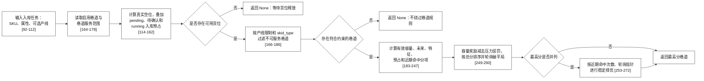

#### 1.1.1 流程图代码定位

| 图中节点 | 触发条件或输出 | 实现位置 |
| --- | --- | --- |
| 空位与预占统计 | 扫描真实空位并扣除 pending、待确认、running 入库 | `allocation/proposed_strategy.py:114-162` |
| 合法巷道过滤 | 校验启用状态、产线服务范围、`skid_type` 与禁配规则 | `allocation/proposed_strategy.py:164-181` |
| 未来和特征负载 | 计算未来生产计划压力和同特征库存集中度 | `allocation/proposed_strategy.py:183-205`、`400-501` |
| 综合评分 | 容量、未来、特征、预占、近期命中和可选作业时长的加减分 | `allocation/proposed_strategy.py:207-247` |
| 并列处理 | 总分、近期命中次数和轮询指针依次打破平局 | `allocation/proposed_strategy.py:249-290` |

#### 1.1.2 节点说明

- **模拟占用状态**：`empty_by_aisle` 是扣除禁用货位后的真实空位数；`pending_by_aisle` 统计已提交、待确认执行和运行中入库任务的预计占用。两者相减后得到本轮仍可继续承诺的有效空位数，避免把同一空位重复分配。
- **产线与 `skid_type` 过滤**：巷道必须同时满足产线可服务范围与当前车身托盘类型限制。缺少任何一项配置时仅按已有规则过滤，不会自动扩大到不符合约束的巷道。
- **有效空位比例**：`effective_capacity_ratio = 有效空位数 / 该巷道可用总容量`。它使不同容量巷道按剩余比例而非绝对空位数比较，避免大巷道仅因容量大而长期被优先选中。
- **未来出库负载**：从各产线当前生产组向后读取计划，统计未来窗口内需要由该巷道服务的出库需求。值越大，说明该巷道后续出库压力越高，当前入库评分中扣分越多。
- **特征负载**：在按 `color`、`rfid` 等规则匹配的巷道中，统计与当前任务相同匹配特征的在库数量。该项用于避免同类物料过度集中；未启用对应特征规则时该项为零。
- **近期命中次数**：记录最近窗口内各巷道被推荐的次数，仅作为抑制短期连续命中的轻度惩罚；候选总分并列时还会优先选近期命中更少的巷道。

#### 1.1.3 处理细节

- **有效空位的计算**：`empty_by_aisle` 由真实货位 `is_empty()` 统计；`pending_by_aisle` 再汇总 `pending_inbound_by_aisle`、待确认执行入库任务和 `running_tasks` 中的入库任务。最终 `effective_empty = max(0, empty - pending)`，表示本次推荐还能安全承诺的货位数量，不会把已提交但尚未反馈的入库任务当作不存在。
- **合法巷道的过滤顺序**：先要求有效空位大于零且巷道启用，再调用 `_get_valid_inbound_aisles` 按 `production_line`、巷道服务范围、`skid_type` 和禁配规则过滤。过滤后的候选为空即返回 `None`；系统不因某个巷道分高就绕开托盘类型或产线限制。
- **各分数的实际计算**：容量正向项为 `capacity_ratio_weight * effective_empty / usable_capacity`。未来负载、特征负载、pending 数量、近期选择次数和可选的预计作业时间分别乘对应权重后从容量项扣除。已开启作业时长项时，时长项替代单纯 pending 扣分，避免对同一排队压力重复处罚。
- **未来与特征负载的来源**：未来出库负载从每条产线 `current_group` 向后读取配置窗口内的生产计划，衡量后续需要该巷道服务的需求压力。特征负载只在该任务产线使用特征匹配时统计相同 `color`、`rfid` 等匹配字段的库存集中量；按 SKU 匹配的产线该项为零。
- **并列处理与日志**：先取总分最高的巷道；并列时比较最近窗口内被选次数，仍并列再用 `_rr_index` 在排序后的候选中轮询。每轮同时输出 `PROPOSED_AISLE_SCORE`，其中保存候选巷道的空位、预占、容量、原始负载、各扣分贡献、总分、未来窗口和最终结果。

### 1.2 详细决策分支

实现入口：`allocation/proposed_strategy.py:92-290`，方法 `ProposedAisleAllocator.allocate`。

#### 1.2.1 物理空位、预占和容量比例

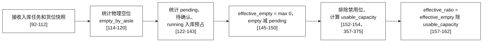

#### 1.2.2 合法巷道与负载数据准备

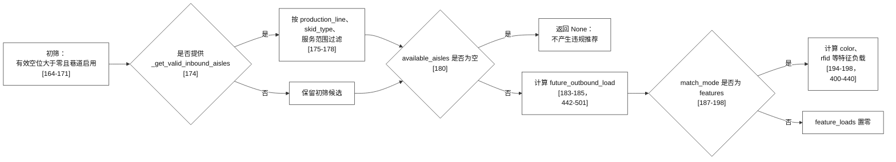

#### 1.2.3 每条巷道的容量、未来和特征评分

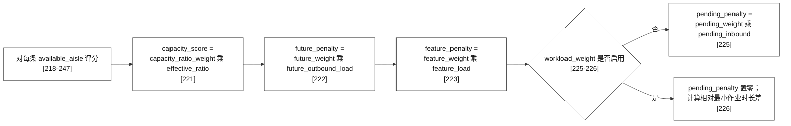

#### 1.2.4 总分、平局处理和日志

```mermaid
%%{init: {"theme":"base","themeVariables":{"background":"#ffffff","primaryColor":"#ffffff","primaryBorderColor":"#333333","primaryTextColor":"#111111","secondaryColor":"#ffffff","secondaryBorderColor":"#333333","secondaryTextColor":"#111111","tertiaryColor":"#ffffff","tertiaryBorderColor":"#333333","tertiaryTextColor":"#111111","lineColor":"#333333","mainBkg":"#ffffff","nodeBorder":"#333333","clusterBkg":"#ffffff","clusterBorder":"#333333"}}}%%
graph LR
    A["统计近期命中次数<br>recent_count<br>[200-205]"] --> B["recent_penalty =<br>recent_weight 乘 recent_count<br>[227]"]
    B --> C["total = capacity 减 future 减 feature<br>减 pending 减 recent 减 workload<br>[228]"]
    C --> D["保存原始值、<br>权重贡献和 total_score<br>[230-247]"]
    D --> E["取最高总分的并列候选<br>[251-252]"]
    E --> F["保留近期命中最少巷道<br>[253-264]"]
    F --> G["仍并列时按 _rr_index 轮询<br>[266-272]"]
    G --> H["输出 PROPOSED_AISLE_SCORE<br>并返回 selected_aisle<br>[273-290]"]
```

## 2. 改进货位选择

### 2.1 总体流程

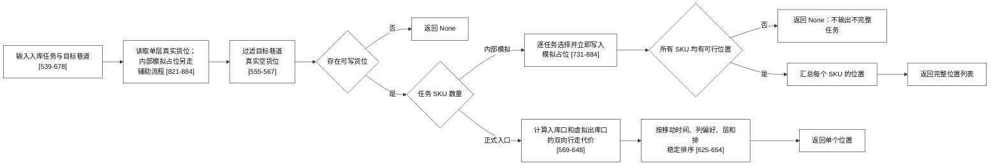

#### 2.1.1 流程图代码定位

| 图中节点 | 触发条件或输出 | 实现位置 |
| --- | --- | --- |
| 货位主入口 | 读取 `assigned_aisle`，计算候选位置的双向移动成本 | `allocation/proposed_strategy.py:539-678` |
| 主成本 | 入库口到位置、位置到虚拟出库口，按 `w_in` 与 `w_out` 加权 | `allocation/proposed_strategy.py:569-648` |
| 模拟占位 | 深拷贝货位、逐任务分配、写入 `__SIM_PENDING__` | `allocation/proposed_strategy.py:709-884` |
| 单位置选择 | 依次按移动成本、列模式、层、排排序 | `allocation/proposed_strategy.py:602-654` |

#### 2.1.2 节点说明

- **单层货位模型**：车身库每个坐标只表示一个可写货位，没有纵梁库的 `UPPER`、`LOWER` 双层配对关系，因此位置选择不产生上下层组合。
- **位置过滤**：候选必须不是禁用位、预留位和已占位，并满足该 SKU 的 `skid_type`、巷道服务范围及当前入库口可达性。过滤完成后才计算行走代价。
- **多 SKU 任务**：系统按任务中的 SKU 顺序逐个选择货位。每选中一个货位立即写入当前任务的模拟视图，因此后续 SKU 不会复用前一 SKU 的位置；任意一个 SKU 无位置时整项任务不返回推荐。
- **移动时间和列择优**：移动代价由堆垛机从当前入库口到候选货位的时间估计得到。时间接近的候选再使用 `position_column_preference_mode` 进行稳定排序：1 为最小列、2 为各巷道自适应中间列、3 为最大列优先。

#### 2.1.3 处理细节

- **单层位置与输入边界**：货位分配只读取任务 `assigned_aisle` 中的真实空货位；未先完成巷道分配或目标巷道已无空位时直接返回空列表。车身库的一个 `(aisle, row, column, level)` 坐标仅对应一个托盘位置，没有纵梁库的 `UPPER`、`LOWER` 配对关系。
- **多 SKU 的原子性**：批量分配使用深拷贝货位建立模拟视图。每选中一个位置，`_mark_position_occupied` 立即在副本写入 `__SIM_PENDING__` 和数量，后续 SKU 不会再次选到该位置；任何一个 SKU 无可写位置时，整个任务不返回部分位置。
- **入库与虚拟出库双向代价**：系统依据任务 `in_line` 和目标巷道解析实际入库口，再用 `_resolve_inbound_virtual_outbound_dock` 按配置构造虚拟出库口。每个候选计算 `in_leg` 与 `out_leg`，并以 `w_in * in_leg + w_out * out_leg` 作为主成本。虚拟出库口只基于仓库参数，不读取未传入的未来订单。
- **列偏好的生效位置**：`position_column_preference_mode` 仅作为主移动成本之后的稳定排序键。模式 1 取最小列，模式 2 按每条巷道自身列数计算中间列，模式 3 取最大列；它不能让明显更远的货位因列号偏好而超过移动成本更低的位置。
- **位置评分日志**：正式分配打印 `PROPOSED_POSITION_SCORE`，包含入库口、虚拟出库口、入出库权重、候选数、选中位置及前三候选的 `inbound_leg_s`、`outbound_leg_s`、加权成本和列偏好键，可直接解释选择结果。

### 2.2 详细决策分支

正式入口：`allocation/proposed_strategy.py:539-678`；批量模拟：`731-884`。

#### 2.2.1 目标巷道、空位和出入库口确定

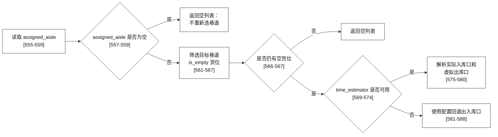

#### 2.2.2 双向移动成本、稳定排序和正式输出

#### 2.2.3 批量模拟：任务遍历与位置来源

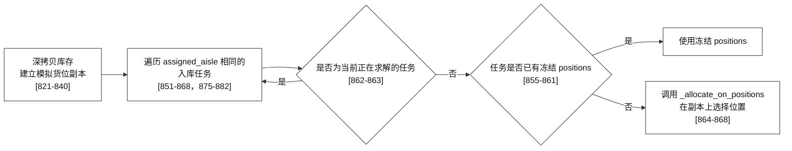

#### 2.2.4 批量模拟：完整性校验与占位写入

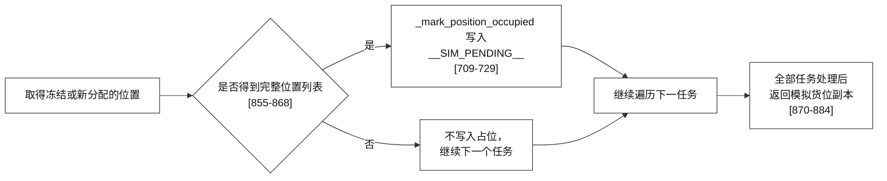

## 3. 混合调度与评分

### 3.1 总体流程

#### 3.1.1 任务准备与候选生成

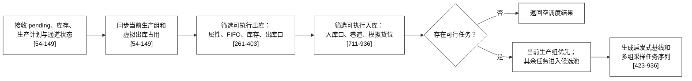

候选池准备完成后，每个采样任务序列进入下一图的“冻结、仿真、评分、比较”循环；启发式方案同时作为最终兜底基线。

#### 3.1.2 候选评估与结果输出

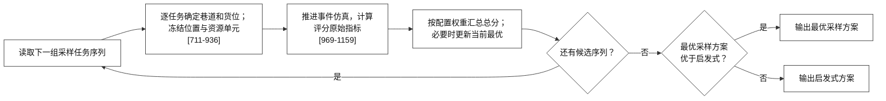

#### 3.1.3 流程图代码定位

| 图中节点 | 触发条件或输出 | 实现位置 |
| --- | --- | --- |
| 调度主入口 | 读取待处理任务和当前仓库运行状态 | `schedule/optimizer.py:54-149` |
| 出库可行过滤 | 当前生产组、特征或 SKU 匹配、FIFO、库存和资源校验 | `schedule/optimizer.py:261-403` |
| 候选方案构造 | 生成任务组合、巷道分配和资源冻结 | `schedule/optimizer.py:423-936`，采样核心为 `711-936` |
| 未来可连续出库 | 按匹配字段与库存预估各产线未来连续可执行出库量 | `schedule/optimizer.py:527-672` |
| 候选评分和输出 | 计算子项、选择采样或启发式方案 | `schedule/optimizer.py:969-1197` |

#### 3.1.4 节点说明

- **当前生产组优先**：出库候选先按 `production_line_current_group` 过滤，未到当前组的任务不会抢占当前组的资源。FIFO 启用时，还需在同一产线、同一匹配规则下优先选择入库时间更早的可执行库存。
- **虚拟出库占用**：已提交但尚未反馈完成的出库任务会在 API 内存中占用对应 SKU 和资源单元。该状态防止下一次 `/schedule/mixed` 又把同一库存或同一位置推荐给另一任务，但不会在提交时扣减真实库存。
- **候选方案评分**：每个样本方案独立推进，记录完工时间、库存均衡变化、产线平均时间、产线进度均衡、巷道离散度、入库等待及出库可选位置奖励。评分明细会写入调度日志，便于后续按 P95 校准权重。
- **启发式兜底**：若采样方案没有优于按既定优先级构造的启发式方案，系统返回启发式方案，避免随机采样造成明显退化。

#### 3.1.5 处理细节

- **当前组和 FIFO 的关系**：调度先按 `production_line_current_group` 限定生产线应推进的任务组；未到当前组的出库任务不会抢占资源。产线启用 FIFO 后，只在同样满足产线、SKU 或特征匹配、库存和出库口约束的候选中，按库存 SKU 的 `inbound_time` 由早到晚排序。FIFO 不会绕开颜色、RFID 或巷道规则。
- **虚拟预占与真实扣库的区别**：提交调度方案后，API 将任务及其 SKU、位置、资源单元记录为虚拟出库预占，防止下一次 `/schedule/mixed` 再次推荐同一份库存。真实库存不会在提交时扣减，只有收到任务完成反馈后才更新；失败、取消或释放反馈会撤销对应预占。
- **独立候选评估**：启发式方案与每个采样方案都从相同的 pending、库存、生产组和资源快照开始。单个候选内部依次冻结任务的巷道、位置和资源，再推进事件仿真；完成评分后恢复快照，因此候选之间不存在库存残留或资源残留。
- **评分记录和最终选择**：评分明细包含 `makespan_score`、`balance_penalty`、`production_line_avg_score`、`production_line_balance_score`、`aisle_dispersion_score`、`inbound_wait_score` 和适用时的 `outbound_choice_bonus`。原始指标经尺度转换和配置权重汇总为 `final_score`；只有采样方案可行且低于启发式 `final_score` 时输出采样方案，否则回退启发式方案。

### 3.2 详细决策分支：出库可行性

实现位置：`schedule/optimizer.py:261-403`，方法 `_filter_outbound_tasks` 与 `_compute_feasible_assignments`。

#### 3.2.1 当前生产组和匹配模式分流

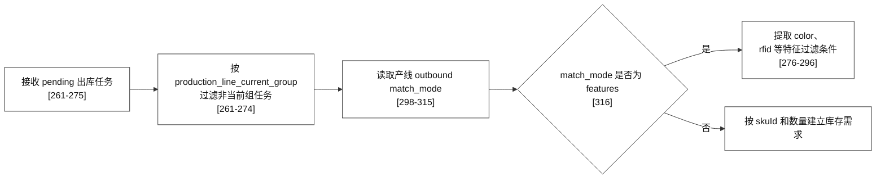

#### 3.2.2 库存位置筛选

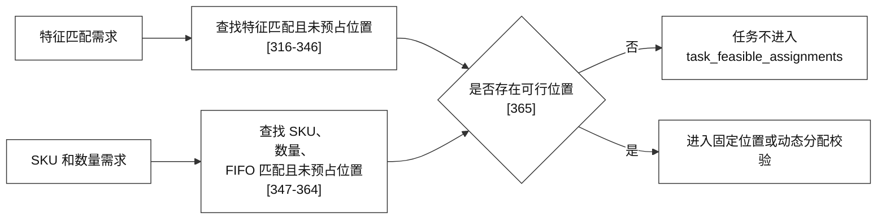

#### 3.2.3 固定位置校验与可行分配写入

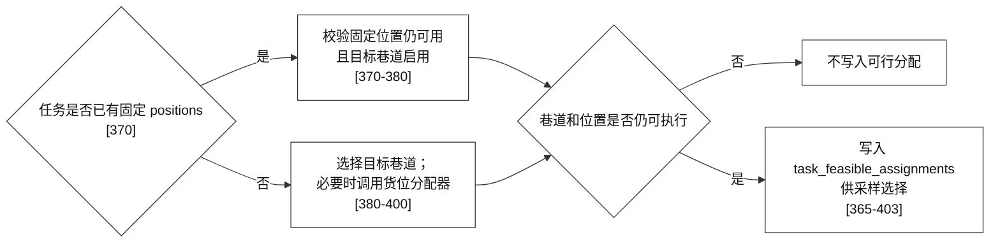

### 3.3 详细决策分支：候选方案评分

为避免长链路横向缩小，本节按入口、任务交错和逐任务冻结三段绘制。主入口：`schedule/optimizer.py:54-149`；采样入口：`711-936`。

#### 3.3.1 入口、强制出库和候选集准备

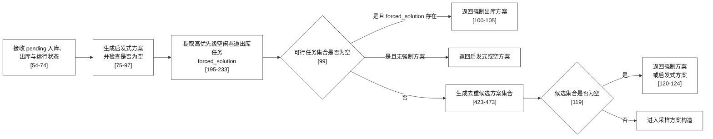

#### 3.3.2 当前组优先和入出库交错

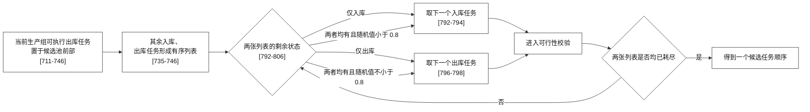

#### 3.3.3 逐任务可行性、资源冻结和状态写入

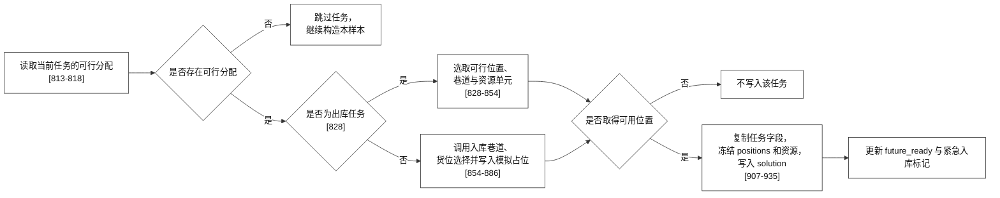

#### 3.3.4 候选评分和启发式兜底

实现位置：`schedule/optimizer.py:969-1159`。

##### 3.3.4.1 候选评分循环

```mermaid
%%{init: {"theme":"base","themeVariables":{"background":"#ffffff","primaryColor":"#ffffff","primaryBorderColor":"#333333","primaryTextColor":"#111111","secondaryColor":"#ffffff","secondaryBorderColor":"#333333","secondaryTextColor":"#111111","tertiaryColor":"#ffffff","tertiaryBorderColor":"#333333","tertiaryTextColor":"#111111","lineColor":"#333333","mainBkg":"#ffffff","nodeBorder":"#333333","clusterBkg":"#ffffff","clusterBorder":"#333333"}}}%%
graph LR
    A["接收候选 solutions<br>与 heuristic_solution<br>[969-1050]"] --> B["按 num_evaluate 选取候选<br>并补充随机样本<br>[1051-1110]"]
    B --> C["恢复统一快照，<br>推进当前候选事件仿真"]
    C --> D{"候选是否为空方案<br>[1112]"}
    D -- 是 --> C
    D -- 否 --> E["计算 makespan、<br>库存均衡、<br>产线平均和产线进度<br>[1113-1154]"]
    E --> F["计算巷道离散度、<br>入库等待与出库选择奖励<br>[1113-1154]"]
    F --> G["按权重与尺度形成 final_score"]
    G --> H{"final_score 是否更低<br>[1155]"}
    H -- 是 --> I["更新 best_solution 和 best_score"]
    H -- 否 --> J["保留已有最优候选"]
```

##### 3.3.4.2 与启发式方案的最终比较

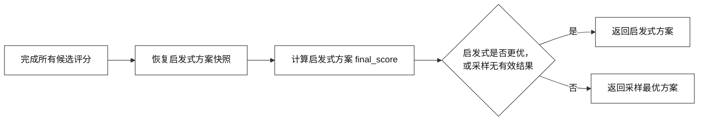

## 4. 图例与阅读说明

- 模拟占位用于一轮分配或调度内的冲突预防；真实库存仅在外部执行反馈确认后更新。
- 车身库货位为单层位置，多 SKU 入库任务必须为每个 SKU 找到一个位置后才返回完整推荐。
- FIFO 仅在对应产线启用且匹配规则适用时参与出库候选筛选；满足 FIFO 的任务仍需通过库存、路径和资源校验。

