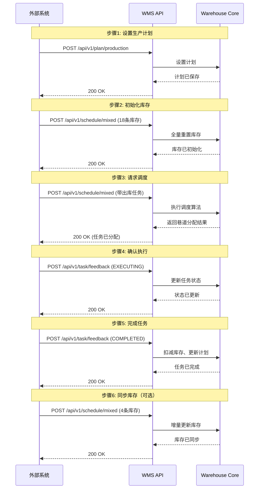
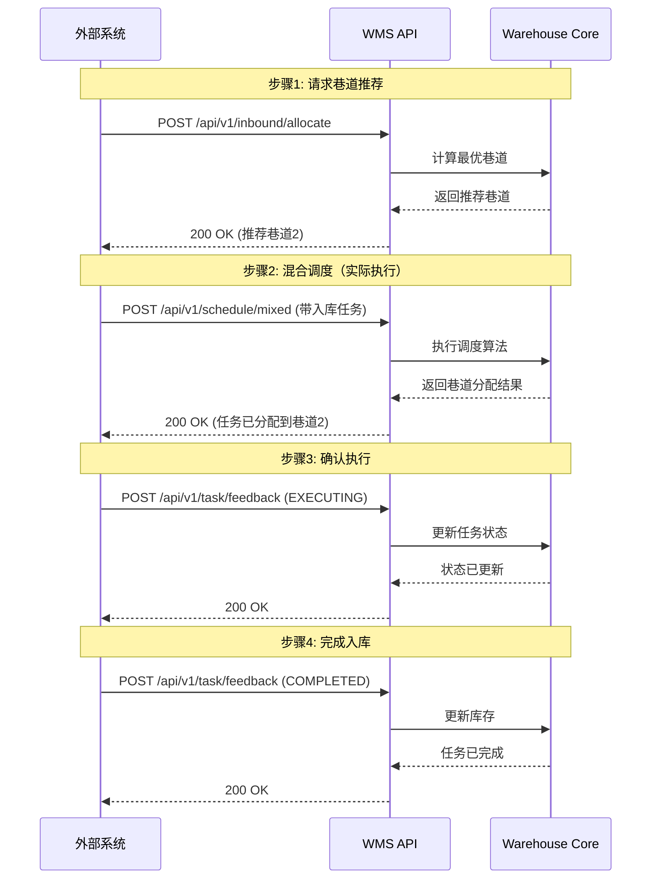

# 仓库管理系统 API 文档

**版本**: v1  
**最后更新**: 2026-01-21

---

## 快速开始

### 启动 API 服务

```bash
# 默认启动（监听所有网络接口）
python run_api.py
```

### 访问服务

**本机访问**:
- API 文档: `http://localhost:8000/docs`
- API 服务: `http://localhost:8000`

**局域网访问**（让其他人访问）:

1. **查看本机 IP 地址**:
   ```bash
   # macOS/Linux
   ifconfig | grep "inet "
   
   # Windows
   ipconfig
   ```

2. **其他人访问地址**（假设您的 IP 是 `192.168.1.100`）:
   - API 文档: `http://192.168.1.100:8000/docs`
   - API 服务: `http://192.168.1.100:8000`

3. **注意事项**:
   - 默认配置 `host=0.0.0.0` 已支持外部访问
   - 如无法连接，请检查防火墙设置并允许 8000 端口
   - 确保在同一局域网内

---

## 目录

- [一、系统概述](#一系统概述)
- [二、通用规范](#二通用规范)
- [三、API 接口详细说明](#三api-接口详细说明)
- [四、典型业务流程](#四典型业务流程)
- [五、数据模型与约束](#五数据模型与约束)
- [六、最佳实践与注意事项](#六最佳实践与注意事项)
- [七、完整示例](#七完整示例)
- [八、常见问题排查](#八常见问题排查)

---

## 一、系统概述

### 1.1 功能简介

仓库管理系统（Warehouse Management System, WMS）是一个智能化的立体仓库调度系统，主要功能包括：

- **生产计划管理**：设置和管理各产线的出库任务序列
- **库存管理**：实时同步和维护仓库库存状态
- **混合调度**：统一调度入库和出库任务，优化资源利用
- **任务反馈**：接收外部系统的任务执行状态反馈
- **入库分配**：为新到货物推荐最优存储位置

### 1.2 系统架构

系统采用 **Controller-Service-Model** 分层架构：

```
┌─────────────────────────────────────────────────┐
│              API Layer (FastAPI)                │
│  ┌──────────────────────────────────────────┐  │
│  │  Routes (Controllers)                    │  │
│  │  - plan.py      - schedule.py            │  │
│  │  - feedback.py  - inbound.py             │  │
│  └──────────────────────────────────────────┘  │
│                      ↓                          │
│  ┌──────────────────────────────────────────┐  │
│  │  Services (Business Logic)               │  │
│  │  - warehouse_service.py                  │  │
│  │  - state.py (TaskStateManager)           │  │
│  └──────────────────────────────────────────┘  │
│                      ↓                          │
│  ┌──────────────────────────────────────────┐  │
│  │  Models (Data Validation)                │  │
│  │  - models.py (Pydantic)                  │  │
│  └──────────────────────────────────────────┘  │
└─────────────────────────────────────────────────┘
                      ↓
┌─────────────────────────────────────────────────┐
│         Simulation Core (Warehouse Core)        │
│  - warehouse_core.py                            │
│  - inventory.py                                 │
│  - schedule/optimizer.py, heuristic.py          │
└─────────────────────────────────────────────────┘
```

### 1.3 关键概念

#### 巷道（Aisle）
- 立体仓库中的货物存取通道
- 每个巷道有独立的堆垛机（Stacker Crane）
- 系统支持多巷道并行作业

#### 货位（Position）
- 库存的最小存储单元
- 标识格式：`{aisleId}-{bank}-{column}-{level}`
- 支持双层货位（UPPER/LOWER）

#### 生产计划（Production Plan）
- 定义各产线的出库任务序列
- 分组管理：每个产线的计划分为多个组（Group）
- 顺序约束：同一产线必须按组顺序执行任务

#### 任务组（Task Group）
- 生产计划中的基本执行单元
- 一个组内可包含多个任务
- 组内任务可并行，组间任务串行

#### 任务 ID 命名规范
- **出库任务**：`OUTBOUND_PL{pl}_GP{group}_{sku1}_{sku2}`
  - `pl`: 产线编号（1, 2, 3, ...）
  - `group`: 组号（1, 2, 3, ...）
  - `sku1`, `sku2`: SKU ID
  - 示例：`OUTBOUND_PL1_GP1_2801021-H19H0_2801037-H19H0`

- **入库任务（执行）**：`INBOUND_{sku1}_{sku2}`
  - 示例：`INBOUND_2801021-KR8H4_2801037-KR8H4`

- **入库任务（分配推荐）**：`INBOUND_A_{sku1}_{sku2}`
  - `A` 表示 Allocate（分配）
  - 示例：`INBOUND_A_2801021-KR8H4_2801037-KR8H4`

---

## 二、通用规范

### 2.1 基础信息

- **协议**: HTTP/HTTPS
- **基础 URL**: `http://{host}:{port}/api/v1`
- **默认端口**: 8000
- **数据格式**: JSON
- **字符编码**: UTF-8

### 2.2 请求头

```http
Content-Type: application/json
Accept: application/json
```

### 2.3 响应格式

所有接口均返回统一的三键格式：

| 字段 | 类型 | 说明 |
|------|------|------|
| status | String | 操作状态："SUCCESS" 或 "FAILED" |
| message | String | 操作描述信息 |
| data | Object/null | 业务数据，无数据时为 null |

#### 成功响应

```json
{
  "status": "SUCCESS",
  "message": "操作成功",
  "data": {
    "scheduleId": "SCH-A1B2C3D4",
    "timestamp": "2026-01-21T10:00:00Z"
  }
}
```

#### 错误响应（HTTP 4xx / 5xx）

```json
{
  "status": "FAILED",
  "message": "错误信息",
  "data": null
}
```

#### 参数校验失败响应（HTTP 422）

```json
{
  "status": "FAILED",
  "message": "请求参数验证失败",
  "data": {
    "errors": [
      "body -> tasks: field required",
      "body -> aisleStatus -> 0 -> bank: value is not a valid enumeration member"
    ]
  }
}
```

**注意**：
- **所有** HTTP 状态码的响应（包括 200、400、409、422、500）都包含 `status`、`message`、`data` 三个字段。
- 422 参数校验错误时，`data.errors` 包含各字段的详细错误信息。
- 混合调度在 409 冲突时 `data` 会包含 `unconfirmed_tasks` 等附加信息。

### 2.4 HTTP 状态码

| 状态码 | 说明 | 触发场景 |
|--------|------|---------|
| 200 OK | 请求成功 | 所有正常请求 |
| 400 Bad Request | 请求参数错误 | 缺少必填参数、参数类型错误 |
| 409 Conflict | 资源冲突 | 存在未确认任务时发起新的调度请求 |
| 422 Unprocessable Entity | 数据验证失败 | Pydantic 模型验证失败（如枚举值错误、数值超出范围） |
| 500 Internal Server Error | 服务器内部错误 | 调度算法异常、系统内部错误 |

---

## 三、API 接口详细说明

### 3.1 生产计划管理

#### 3.1.1 设置生产计划

**接口**: `POST /api/v1/plan/production`

**说明**: 设置或更新各产线的生产计划。

**请求参数**:

| 字段 | 类型 | 必填 | 说明 |
|------|------|------|------|
| operationType | String | 是 | 操作类型：ADD（新增）或 UPDATE（更新） |
| planDate | String | 是 | 计划日期，格式：YYYY-MM-DD HH:mm:ss |
| plans | Array | 是 | 生产计划列表 |
| plans[].planId | String | 是 | 计划唯一标识符 |
| plans[].lineId | String | 是 | 产线唯一标识符（如 "LINE-1"） |
| plans[].planIndex | Array | 是 | 计划组列表，每个元素代表一组任务 |
| plans[].planIndex[].requiredSkus | Array | 是 | 该组的任务列表，每个元素是一个任务的 SKU 列表 |
| plans[].planIndex[].requiredSkus[][] | Array | 是 | 单个任务的 SKU 列表 |
| plans[].planIndex[].requiredSkus[][].skuId | String | 是 | SKU 唯一标识符 |
| plans[].planIndex[].requiredSkus[][].quantity | Integer | 是 | 需求数量 |

**附加属性要求**:
- 任何 `skuId` 有值且 `quantity > 0` 的 SKU，必须包含 `match_fields` 中定义的所有附加属性字段（如 `version`、`生产属性`）。

**请求示例**:

```json
{
  "operationType": "ADD",
  "planDate": "2026-01-21 09:00:00",
  "plans": [
    {
      "planId": "PLAN-LINE1-20260121",
      "lineId": "LINE-1",
      "planIndex": [
        {
          "requiredSkus": [
            [
              {"skuId": "2801021-H19H0", "quantity": 1, "version": "00", "生产属性": "默认"},
              {"skuId": "2801037-H19H0", "quantity": 1, "version": "00", "生产属性": "默认"}
            ],
            [
              {"skuId": "2801021-KFDD0", "quantity": 1, "version": "00", "生产属性": "默认"},
              {"skuId": "2801037-KFDD0", "quantity": 1, "version": "00", "生产属性": "默认"}
            ]
          ]
        },
        {
          "requiredSkus": [
            [
              {"skuId": "2801021-TR200", "quantity": 1, "version": "00", "生产属性": "默认"},
              {"skuId": "2801037-TR200", "quantity": 1, "version": "00", "生产属性": "默认"}
            ]
          ]
        }
      ]
    }
  ]
}
```

**响应示例**:

```json
{
  "status": "SUCCESS",
  "message": "生产计划设置成功",
  "data": null
}
```

或失败时：

```json
{
  "status": "FAILED",
  "message": "生产计划设置失败",
  "data": null
}
```

**响应字段说明**:
- `status`: 操作结果状态（SUCCESS / FAILED）
- `message`: 操作描述信息
- `data`: 业务数据（此接口为 null）

**planIndex 结构说明**:

```
planIndex: [        // 数组，每个元素是一个组
  {
    requiredSkus: [  // 数组，每个元素是该组内的一个任务
      [             // 数组，该任务包含的 SKU 列表
        {skuId: "...", quantity: 1, version: "00", 生产属性: "默认"},
        {skuId: "...", quantity: 1, version: "00", 生产属性: "默认"}
      ],
      [             // 第二个任务
        {skuId: "...", quantity: 1, version: "00", 生产属性: "默认"},
        {skuId: "...", quantity: 1, version: "00", 生产属性: "默认"}
      ]
    ]
  },
  {               // 第二组
    requiredSkus: [
      [...]
    ]
  }
]
```

#### 3.1.2 获取生产计划

**接口**: `GET /api/v1/plan/production`

**说明**: 获取当前所有产线的生产计划。

**响应示例**:

```json
{
  "status": "SUCCESS",
  "message": "获取生产计划成功",
  "data": {
    "production_plan": {
      "1": [
        [
          ["2801021-H19H0", "2801037-H19H0"],
          ["2801021-KFDD0", "2801037-KFDD0"]
        ],
        [
          ["2801021-TR200", "2801037-TR200"]
        ]
      ],
      "2": [
        [
          ["2801022-H19H0", "2801038-H19H0"]
        ]
      ]
    }
  }
}
```

**响应字段说明**:
- `status`: 操作状态（"SUCCESS" 或 "FAILED"）
- `message`: 操作描述信息
- `data.production_plan`: 各产线的计划，格式为 `{产线ID: [组1[任务1[SKU列表], 任务2[...]], 组2[...]]}`
  - 产线ID为数字字符串（"1", "2", "3", ...）
  - 组索引从 0 开始计数
  - 每个任务是一个 SKU ID 列表

**注意**: 此接口不返回 `currentGroups`（当前执行进度），如需查询进度请使用系统状态接口。

---

### 3.2 混合调度

#### 3.2.1 混合调度接口

**接口**: `POST /api/v1/schedule/mixed`

**说明**: 系统的核心调度接口，同时处理库存同步、巷道状态同步和任务调度。

**重要**: 如果有未确认的任务（未收到 EXECUTING 反馈），将返回 409 错误，拒绝新的调度请求。

**请求参数**:

| 字段 | 类型 | 必填 | 说明 |
|------|------|------|------|
| currentTime | String | 是 | 当前时间，格式：YYYY-MM-DD HH:mm:ss（当前实现中此字段可选，建议提供以便后续功能扩展） |
| inventory | Array | 是 | 库存列表，用于同步库存状态（可为空数组） |
| aisleStatus | Array | 是 | 巷道状态列表 |
| tasks | Array | 是 | 待调度的任务列表（可为空数组） |

**inventory 字段（库存同步）**:

| 字段 | 类型 | 必填 | 说明 |
|------|------|------|------|
| aisleId | String | 是 | 巷道ID |
| row | Integer | 是 | 行号（1 或 2，对应左/右侧） |
| column | Integer | 是 | 列号（1-3） |
| level | Integer | 是 | 层号（1-18） |
| shelf | String | 否 | 货架位置："UPPER" 或 "LOWER"（双层货位必填） |
| positions | Array | 是 | 该货位的库存信息 |
| positions[].skuId | String | 是 | SKU ID（空字符串表示空货位） |
| positions[].quantity | Integer | 是 | 数量（只能是 1 或 0） |

**附加属性要求**:
- `positions` 中的 SKU 如非空货位，必须包含 `match_fields` 中定义的所有附加属性字段（如 `version`、`生产属性`）。

**库存同步机制**:

系统根据 `inventory` 数组的长度自动判断同步模式：

- **全量重置**（inventory 数组长度 >= 15）：
  - 清空所有货位库存
  - 清空所有任务队列（running_tasks, pending_*, completed_tasks）
  - 清空待执行任务缓存
  - 重置巷道当前位置
  - 重新设置提供的库存数据

- **增量更新**（inventory 数组长度为 1-14）：
  - 只更新提供的货位
  - 不影响其他货位和任务队列

- **保持不变**（inventory 数组为空，长度 = 0）：
  - 不进行任何库存更新
  - 保持原有库存状态
  - 通常用于仅调度任务而不同步库存的场景

**aisleStatus 字段（巷道状态）**:

| 字段 | 类型 | 必填 | 说明 |
|------|------|------|------|
| aisleId | String | 是 | 巷道ID |
| isAvailable | Boolean | 是 | 巷道是否可用 |
| bank | String | 是 | 货位面："LEFT" 或 "RIGHT" |
| exitCongestion | Array | 是 | 各产线的出口拥堵状态 |
| exitCongestion[].lineId | String | 是 | 产线ID |
| exitCongestion[].isCongested | Boolean | 是 | 是否拥堵 |

**tasks 字段（待调度任务）**:

| 字段 | 类型 | 必填 | 说明 |
|------|------|------|------|
| taskId | String | 是 | 任务唯一标识符（遵循命名规范） |
| taskType | String | 是 | 任务类型："OUTBOUND" 或 "INBOUND" |
| planId | String | 出库必填 | 所属生产计划ID |
| planIndex | Integer | 出库必填 | 所属组号（从 1 开始） |
| skus | Array | 是 | 任务包含的 SKU 列表 |
| skus[].skuId | String | 是 | SKU ID |
| skus[].quantity | Integer | 是 | 数量 |

**附加属性要求**:
- 任何 `skuId` 有值且 `quantity > 0` 的 SKU，必须包含 `match_fields` 中定义的所有附加属性字段（如 `version`、`生产属性`）。

**请求示例**:

```json
{
  "currentTime": "2026-01-21 10:15:00",
  "inventory": [],
  "aisleStatus": [
    {
      "aisleId": "1",
      "isAvailable": true,
      "bank": "LEFT",
      "exitCongestion": [
        {"lineId": "LINE-1", "isCongested": false},
        {"lineId": "LINE-2", "isCongested": false},
        {"lineId": "LINE-3", "isCongested": false}
      ]
    },
    {
      "aisleId": "2",
      "isAvailable": true,
      "bank": "RIGHT",
      "exitCongestion": [
        {"lineId": "LINE-1", "isCongested": false},
        {"lineId": "LINE-2", "isCongested": false},
        {"lineId": "LINE-3", "isCongested": false}
      ]
    }
  ],
  "tasks": [
    {
      "taskId": "OUTBOUND_PL1_GP1_2801021-H19H0_2801037-H19H0",
      "taskType": "OUTBOUND",
      "planId": "PLAN-LINE1-20260121",
      "planIndex": 1,
      "skus": [
        {"skuId": "2801021-H19H0", "quantity": 1, "version": "00", "生产属性": "默认"},
        {"skuId": "2801037-H19H0", "quantity": 1, "version": "00", "生产属性": "默认"}
      ]
    }
  ]
}
```

**响应示例**:

```json
{
  "status": "SUCCESS",
  "message": "调度成功",
  "data": {
    "scheduleId": "SCH-A1B2C3D4",
    "timestamp": "2026-01-21T10:15:00Z",
    "aisleAssignments": [
      {
        "aisleId": "1",
        "assignedTask": {
          "taskId": "OUTBOUND_PL1_GP1_2801021-H19H0_2801037-H19H0",
          "taskType": "OUTBOUND",
          "planId": "PLAN-LINE1-20260121",
          "planIndex": 1,
          "positions": [
            {
              "row": 1,
              "column": 1,
              "level": 1,
              "shelf": "UPPER",
              "skuId": "2801021-H19H0",
              "quantity": 1,
              "version": "00",
              "生产属性": "默认"
            },
            {
              "row": 1,
              "column": 1,
              "level": 1,
              "shelf": "LOWER",
              "skuId": "2801037-H19H0",
              "quantity": 1,
              "version": "00",
              "生产属性": "默认"
            }
          ]
        }
      },
      {
        "aisleId": "2",
        "assignedTask": null
      }
    ]
  }
}
```

**409 冲突示例（存在未确认任务）**:

```json
{
  "status": "FAILED",
  "message": "存在未确认的任务，请等待反馈后再请求调度。",
  "data": {
    "unconfirmed_tasks": ["OUTBOUND_PL1_GP1_2801021-H19H0_2801037-H19H0"],
    "timestamp": "2026-01-21T10:15:00Z"
  }
}
```

**响应字段说明**:
- `status`: 调度结果状态（SUCCESS / FAILED）
- `message`: 操作描述信息
- `data.scheduleId`: 本次调度的唯一标识符
- `data.timestamp`: 响应时间戳（UTC）
- `data.aisleAssignments`: 各巷道的任务分配结果
- `data.aisleAssignments[].aisleId`: 巷道ID
- `data.aisleAssignments[].assignedTask`: 分配给该巷道的任务（null 表示无任务分配）
- `assignedTask.taskId`: 任务ID
- `assignedTask.taskType`: 任务类型（OUTBOUND / INBOUND）
- `assignedTask.planId`: 出库任务所属计划ID（入库任务为 null）
- `assignedTask.planIndex`: 出库任务所属组号（入库任务为 null）
- `assignedTask.positions`: 出库任务涉及的货位（入库任务可能为 null）
- `positions[]`: 货位详细信息（row/column/level/shelf/skuId/quantity）

---

### 3.3 入库管理

#### 3.3.1 入库巷道分配

**接口**: `POST /api/v1/inbound/allocate`

**说明**: 为新到货物推荐最优的入库巷道。此接口仅返回推荐结果，不会实际执行入库任务。

**请求参数**:

| 字段 | 类型 | 必填 | 说明 |
|------|------|------|------|
| tasks | Array | 是 | 入库任务列表 |
| tasks[].taskId | String | 是 | 任务ID（建议使用 INBOUND_A_ 前缀） |
| tasks[].skus | Array | 是 | SKU 列表 |
| tasks[].skus[].skuId | String | 是 | SKU ID |
| tasks[].skus[].quantity | Integer | 是 | 数量 |

**附加属性要求**:
- 任何 `skuId` 有值且 `quantity > 0` 的 SKU，必须包含 `match_fields` 中定义的所有附加属性字段（如 `version`、`生产属性`）。

**请求示例**:

```json
{
  "tasks": [
    {
      "taskId": "INBOUND_A_2801021-KR8H4_2801037-KR8H4",
      "skus": [
        {"skuId": "2801021-KR8H4", "quantity": 1, "version": "00", "生产属性": "默认"},
        {"skuId": "2801037-KR8H4", "quantity": 1, "version": "00", "生产属性": "默认"}
      ]
    }
  ]
}
```

**响应示例**:

```json
{
  "status": "SUCCESS",
  "message": "入库分配成功",
  "data": {
    "allocationId": "ALLOC-12345678",
    "assignments": [
      {
        "taskId": "INBOUND_A_2801021-KR8H4_2801037-KR8H4",
        "recommendedAisle": "2"
      }
    ]
  }
}
```

**响应字段说明**:
- `status`: 操作状态（SUCCESS / FAILED）
- `message`: 操作描述信息
- `data.allocationId`: 本次分配的唯一标识符
- `data.assignments`: 分配结果列表
- `data.assignments[].taskId`: 任务ID
- `data.assignments[].recommendedAisle`: 推荐巷道ID

**推荐算法考虑因素**:
- SKU 类型（是否为配对的双梁）
- 巷道库存容量
- 历史存储位置
- 巷道负载均衡

---

### 3.4 任务反馈

#### 3.4.1 任务执行状态反馈

**接口**: `POST /api/v1/task/feedback`

**说明**: 外部系统报告任务执行状态。这是保证系统状态一致性的关键接口。

**请求参数**:

| 字段 | 类型 | 必填 | 说明 |
|------|------|------|------|
| taskId | String | 是 | 任务ID |
| taskType | String | 是 | 任务类型："OUTBOUND" 或 "INBOUND" |
| status | String | 是 | 状态："EXECUTING", "COMPLETED", "FAILED" |
| startTime | String | 是 | 任务开始时间（ISO 8601 格式） |
| failureReason | String | FAILED 时必填 | 失败原因 |

**任务状态说明**:

1. **EXECUTING（执行中）**:
   - 外部系统收到调度指令并开始执行时发送
   - 系统收到后：
     - 将任务从待确认队列移入运行队列
     - 允许发起下一次调度请求
   - **必须发送**，否则系统会拒绝后续调度请求

2. **COMPLETED（已完成）**:
   - 任务成功完成时发送
   - 系统收到后：
     - 将任务移入已完成队列
     - 自动扣减库存（出库任务）
     - 设置巷道+产线拥堵状态（出库任务，持续 5 秒）
     - 更新生产计划进度

3. **FAILED（失败）**:
   - 任务执行失败时发送
   - 系统收到后：
     - 从所有任务队列中移除该任务
     - 清理该任务导致的拥堵状态
     - 不扣减库存

**请求示例 - EXECUTING**:

```json
{
  "taskId": "OUTBOUND_PL1_GP1_2801021-H19H0_2801037-H19H0",
  "taskType": "OUTBOUND",
  "status": "EXECUTING",
  "startTime": "2026-01-21T10:16:00Z"
}
```

**请求示例 - COMPLETED**:

```json
{
  "taskId": "OUTBOUND_PL1_GP1_2801021-H19H0_2801037-H19H0",
  "taskType": "OUTBOUND",
  "status": "COMPLETED",
  "startTime": "2026-01-21T10:16:00Z"
}
```

**请求示例 - FAILED**:

```json
{
  "taskId": "OUTBOUND_PL1_GP1_2801021-H19H0_2801037-H19H0",
  "taskType": "OUTBOUND",
  "status": "FAILED",
  "startTime": "2026-01-21T10:16:00Z",
  "failureReason": "机械故障"
}
```

**响应示例**:

```json
{
  "status": "SUCCESS",
  "message": "反馈处理成功",
  "data": null
}
```

**响应字段说明**:
- `status`: 反馈处理结果（SUCCESS / FAILED）
- `message`: 操作描述信息
- `data`: 业务数据（此接口为 null）

---

### 3.5 调试接口

#### 3.5.1 查看未确认任务

**接口**: `GET /api/v1/task/unconfirmed`

**说明**: 获取已发送但尚未收到 EXECUTING 反馈的任务列表（调试用）。

**响应示例**:

```json
{
  "status": "SUCCESS",
  "message": "获取未确认任务成功",
  "data": {
    "count": 1,
    "tasks": ["OUTBOUND_PL1_GP1_2801021-H19H0_2801037-H19H0"],
    "can_accept_new_task": false
  }
}
```

**响应字段说明**:
- `data.count`: 未确认任务数量
- `data.tasks`: 未确认任务ID列表
- `data.can_accept_new_task`: 是否允许接受新任务（未确认任务为空时为 true）

---

#### 3.5.2 获取系统状态

**接口**: `GET /api/v1/status`

**说明**: 获取系统运行状态和统计信息（调试用）。

**响应示例**:

```json
{
  "status": "SUCCESS",
  "message": "获取系统状态成功",
  "data": {
    "system_status": "running",
    "current_time": 12345.67,
    "running_tasks_count": 2,
    "completed_tasks_count": 5,
    "aisle_status": {
      "1": {
        "is_busy": false,
        "blockage": {
          "1": {"blocked": false, "unblock_time": 0},
          "2": {"blocked": false, "unblock_time": 0},
          "3": {"blocked": false, "unblock_time": 0}
        },
        "current_position": "1-1-5-3"
      }
    },
    "inventory_summary": {
      "1": {"2801021-H19H0": 1, "2801037-H19H0": 1},
      "2": {}
    },
    "inventory": [
      {
        "aisleId": "1",
        "row": 1,
        "column": 1,
        "level": 1,
        "shelf": "UPPER",
        "positions": [{"skuId": "2801021-H19H0", "quantity": 1, "version": "00", "生产属性": "默认"}]
      },
      {
        "aisleId": "1",
        "row": 1,
        "column": 1,
        "level": 1,
        "shelf": "LOWER",
        "positions": [{"skuId": "", "quantity": 0}]
      }
    ]
  }
}
```

**响应字段说明**:
- `status`: 操作状态（"SUCCESS" 或 "FAILED"）
- `message`: 操作描述信息
- `data.system_status`: 系统状态（"running" 或 "error"）
- `data.current_time`: 当前仿真时间（秒）
- `data.running_tasks_count`: 正在执行的任务数
- `data.completed_tasks_count`: 已完成的任务数
- `data.aisle_status`: 各巷道状态（以巷道ID为 key 的字典）
- `data.aisle_status[].is_busy`: 巷道当前是否忙碌
- `data.aisle_status[].blockage`: 各产线的拥堵状态（key 为产线编号）
- `data.aisle_status[].blockage[].blocked`: 是否拥堵
- `data.aisle_status[].blockage[].unblock_time`: 预计解除时间（秒；-1 表示无限）
- `data.aisle_status[].current_position`: 当前巷道位置（可能为 null）
- `data.inventory_summary`: 按巷道汇总的 SKU 数量统计（`{aisleId: {skuId: quantity}}`）
- `data.inventory`: 全局库存列表（结构同混合调度请求中的 `inventory` 字段）

---

### 3.6 BOM 配置更新接口

#### 3.6.1 更新 BOM 配置

**接口**: `POST /api/v1/bom/update`

**说明**: 更新系统的 SKU 配置信息（BOM 表），包括 SKU 类型、配对关系、产线映射等。

**请求参数**:

| 字段 | 类型 | 必填 | 说明 |
|------|------|------|------|
| config | Object | 是 | 完整的 SKU 配置数据 |
| config.sku_types | Array | 是 | SKU 类型列表，包含所有可用的 SKU ID |
| config.sku_pairs | Object | 是 | SKU 配对关系，key 和 value 互为配对的 SKU |
| config.sku_solo | Object | 是 | 需要单独存放的 SKU，key 为 SKU ID，value 为 true |
| config.sku_to_production_line | Object | 是 | SKU 到产线的映射关系，key 为 SKU ID，value 为可用产线 ID 列表 |

**配置说明**:

1. **sku_types**: 所有系统支持的 SKU ID 列表
2. **sku_pairs**: SKU 配对关系，表示哪些 SKU 可以存放在同一货位的上下两层
   - 如果 SKU A 和 SKU B 配对，则需要同时添加两条记录：`"A": "B"` 和 `"B": "A"`
   - 自配对 SKU（如 `"A": "A"`）表示该 SKU 的上下层可以存放相同 SKU
3. **sku_solo**: 需要独立存放的 SKU，这些 SKU 必须单独占用一个货位
4. **sku_to_production_line**: SKU 与产线的映射关系，定义每个 SKU 可以用于哪些产线

**请求示例**:

```json
{
  "config": {
    "sku_types": [
      "2801021-H19H0",
      "2801037-H19H0",
      "2801021-H22F0",
      "2801022-H17F4",
      "2801038-H17F4"
    ],
    "sku_pairs": {
      "2801021-H19H0": "2801037-H19H0",
      "2801037-H19H0": "2801021-H19H0",
      "2801021-H22F0": "2801021-H22F0",
      "2801022-H17F4": "2801038-H17F4",
      "2801038-H17F4": "2801022-H17F4"
    },
    "sku_solo": {
      "2801021-H22F0": true
    },
    "sku_to_production_line": {
      "2801021-H19H0": ["1", "2", "3"],
      "2801037-H19H0": ["1", "2", "3"],
      "2801021-H22F0": ["1", "2", "3"],
      "2801022-H17F4": ["1", "2", "3"],
      "2801038-H17F4": ["1", "2", "3"]
    }
  }
}
```

**响应示例（成功）**:

```json
{
  "status": "SUCCESS",
  "message": "SKU配置更新成功",
  "data": {
    "timestamp": "2026-01-21T10:30:00Z"
  }
}
```

**响应示例（失败）**:

```json
{
  "status": "FAILED",
  "message": "SKU配置更新失败",
  "data": {
    "timestamp": "2026-01-21T10:30:00Z"
  }
}
```

**错误响应**:

当配置数据不完整或格式错误时，返回 400 错误：

```json
{
  "status": "FAILED",
  "message": "配置数据验证失败: 缺少必填字段: sku_types",
  "data": null
}
```

**注意事项**:

1. **立即生效**: 配置更新会立即在系统中生效
2. **保持现有状态**: 更新不会影响现有的库存数据和任务队列
3. **完整性要求**: 必须提供所有四个配置字段的完整数据
4. **更新时机**: 建议在系统空闲时进行更新，避免影响正在执行的任务
5. **数据一致性**: 
   - `sku_pairs` 中的所有 SKU 必须在 `sku_types` 中存在
   - `sku_solo` 中的所有 SKU 必须在 `sku_types` 中存在
   - `sku_to_production_line` 中的所有 SKU 必须在 `sku_types` 中存在

---

#### 3.6.2 获取当前 BOM 配置

**接口**: `GET /api/v1/bom/config`

**说明**: 获取系统当前的 SKU 配置信息（调试用）。

**请求参数**: 无

**响应示例**:

```json
{
  "status": "SUCCESS",
  "message": "获取BOM配置成功",
  "data": {
    "config": {
      "sku_types": [
        "2801021-H19H0",
        "2801037-H19H0"
      ],
      "sku_pairs": {
        "2801021-H19H0": "2801037-H19H0",
        "2801037-H19H0": "2801021-H19H0"
      },
      "sku_solo": {},
      "sku_to_production_line": {
        "2801021-H19H0": ["1", "2", "3"],
        "2801037-H19H0": ["1", "2", "3"]
      }
    }
  }
}
```

---

## 四、典型业务流程

### 4.1 出库流程



### 4.2 入库流程



## 五、数据模型与约束

### 5.1 inventory 字段约束

| 字段 | 类型 | 取值范围 | 说明 |
|------|------|----------|------|
| aisleId | String | "1", "2", "3", ... | 巷道编号 |
| row | Integer | 1, 2 | 1=左侧，2=右侧 |
| column | Integer | 1-3 | 列号（共3列） |
| level | Integer | 1-18 | 层号（共18层） |
| shelf | String | "UPPER", "LOWER" | 双层货位时必填 |
| positions[].skuId | String | 任意或空字符串 | 空字符串表示空货位 |
| positions[].quantity | Integer | 0, 1 | 只能是 0（空）或 1（有货） |

**重要**: 
- 一个货位只能存放一个 SKU，quantity 必须为 0 或 1
- 当前版本对数值上限的验证不严格，但强烈建议遵循上述范围
- 超出范围的值可能导致运行时错误

### 5.2 task_id 命名规范

**建议格式**（非强制，但推荐使用以提高可读性）：

#### 出库任务

格式：`OUTBOUND_PL{pl}_GP{group}_{sku1}_{sku2}...`

- `pl`: 产线编号（整数，如 1, 2, 3）
- `group`: 组号（整数，如 1, 2, 3）
- `sku1`, `sku2`, ...: 任务包含的 SKU ID

示例：
```
OUTBOUND_PL1_GP1_2801021-H19H0_2801037-H19H0
OUTBOUND_PL2_GP3_2801022-TR320_2801038-TR320
```

#### 入库任务（执行）

格式：`INBOUND_{sku1}_{sku2}...`

示例：
```
INBOUND_2801021-KR8H4_2801037-KR8H4
```

#### 入库任务（分配推荐）

格式：`INBOUND_A_{sku1}_{sku2}...`

示例：
```
INBOUND_A_2801021-KR8H4_2801037-KR8H4
```

**注意**: 
- 系统不强制验证 taskId 格式，您可以使用任意唯一标识符
- 推荐使用上述格式以便于日志追踪和问题排查
- taskId 在系统中必须唯一，避免重复使用


### 5.3 时间格式

| 字段 | 格式 | 示例 | 说明 |
|------|------|------|------|
| planDate | YYYY-MM-DD HH:mm:ss | "2026-01-21 09:00:00" | 生产计划日期 |
| currentTime | YYYY-MM-DD HH:mm:ss | "2026-01-21 10:15:00" | 混合调度请求的当前时间 |

**注意**: 
- 请求参数使用 `YYYY-MM-DD HH:mm:ss` 格式（空格分隔）


### 5.4 SKU 附加属性（match_fields）

系统会从配置文件 `config/warehouse.json` 读取 `match_fields` 作为 SKU 的必填附加属性字段。

- **规则**: 只要 `skuId` 有值且 `quantity > 0`，就必须包含 `match_fields` 中列出的所有字段。
- **示例**: 当前配置为 `["version", "生产属性"]`，因此所有 SKU 都必须带上 `version` 和 `生产属性`。
- **空货位**: `skuId=""` 或 `quantity=0` 时不强制附加属性。

示例（SKU 必填附加属性）：
```json
{
  "skuId": "2801021-H19H0",
  "quantity": 1,
  "version": "00",
  "生产属性": "默认"
}
```


---

## 六、最佳实践与注意事项

### 6.1 任务确认机制

**规则**: 系统每次只能处理一个未确认的任务。

**原因**: 避免任务重复分配和资源冲突。

**最佳实践**:
1. 调用 `/api/v1/schedule/mixed` 获取任务分配
2. 立即发送 `EXECUTING` 反馈（1-2秒内）
3. 任务完成后发送 `COMPLETED` 或 `FAILED` 反馈
4. 再发起下一次调度请求

**错误处理**:
如果收到 409 错误（存在未确认任务），应：
1. 检查是否有遗漏的 `EXECUTING` 反馈
2. 调用 `GET /api/v1/task/unconfirmed` 查看未确认任务
3. 补发 `EXECUTING` 反馈或等待任务超时

### 6.2 生产计划约束

**规则**: 同一产线的任务必须按组顺序执行。

**说明**:
- 第 N 组的所有任务完成后，才能开始第 N+1 组
- 同一组内的任务可以并行执行

**最佳实践**:
1. 设计生产计划时，将紧急任务放在前面的组
2. 组内任务数量不宜过多（建议 2-5 个）
3. 定期检查生产计划进度（`GET /api/v1/plan/production`）

### 6.3 库存同步策略

**场景选择**:

| 场景 | 库存记录数 | 触发条件 | 用途 |
|------|-----------|---------|------|
| 全量重置 | >= 15 | 系统初始化、跨天重置 | 建立完整的库存基线，清空所有任务队列 |
| 增量更新 | 1-14 | 任务完成后、定期同步 | 保持局部库存准确性，不影响任务队列 |
| 保持不变 | 0（空数组） | 仅调度任务、不更新库存 | 保持原有库存状态，常用于纯调度场景 |

**最佳实践**:
1. **初始化时**: 使用全量重置（>= 15 条记录，建议提供完整的18条）
2. **任务完成后**: 使用增量更新（2-4 条记录）同步已变更的货位
3. **纯调度场景**: 使用空数组（0 条记录），保持原有库存不变
4. **定期全量同步**: 每天开始时进行一次全量重置
5. **异常恢复**: 出现库存不一致时，执行全量重置

**注意事项**:
- 全量重置会清空所有任务队列和待执行任务，请谨慎使用
- 如果只是想调度任务而不改变库存，请传入空数组 `[]`
- 增量更新不会影响任务队列，适合频繁调用

### 6.4 巷道拥堵管理

**拥堵设置时机**:
- 出库任务完成（COMPLETED）时自动设置
- 默认持续时间：5 秒（由配置文件 `config/warehouse.json` 中的 `outbound_congestion_time` 参数控制）
- 拥堵期间该产线不能使用该巷道

**最佳实践**:
1. 在 `aisleStatus` 中准确反映拥堵状态
2. 拥堵解除后再请求下一次调度
3. 如需调整拥堵时间，修改配置文件后重启服务

**配置说明**:
- 配置文件：`config/warehouse.json`
- 参数名：`outbound_congestion_time`
- 单位：秒（浮点数）
- 默认值：5.0
- 示例：设置为 3.0 表示拥堵持续 3 秒

### 6.5 错误处理建议

| 错误类型 | HTTP 状态码 | 处理建议 |
|---------|-----------|---------|
| 参数验证失败 | 422 | 检查请求参数格式和取值范围 |
| 未确认任务冲突 | 409 | 补发 EXECUTING 反馈或等待超时 |
| 调度失败 | 500 | 检查库存和巷道状态，重试请求 |
| 任务执行失败 | - | 发送 FAILED 反馈，系统自动清理状态 |

**重试策略**:
- 422 错误：修正参数后立即重试
- 409 错误：等待 1-2 秒后重试，最多 3 次
- 500 错误：等待 5 秒后重试，最多 2 次

---

## 七、完整示例

### 7.1 从零开始的完整流程

以下是一个完整的测试流程，涵盖从设置生产计划到任务完成的全过程。

#### 步骤 0: 设置生产计划

```bash
curl -X POST http://localhost:8000/api/v1/plan/production \
  -H "Content-Type: application/json" \
  -d '{
    "operationType": "ADD",
    "planDate": "2026-01-21 09:00:00",
    "plans": [
      {
        "planId": "PLAN-LINE1-20260121",
        "lineId": "LINE-1",
        "planIndex": [
          {
            "requiredSkus": [
              [
                {"skuId": "2801021-H19H0", "quantity": 1, "version": "00", "生产属性": "默认"},
                {"skuId": "2801037-H19H0", "quantity": 1, "version": "00", "生产属性": "默认"}
              ]
            ]
          }
        ]
      }
    ]
  }'
```

#### 步骤 1: 初始化库存

```bash
curl -X POST http://localhost:8000/api/v1/schedule/mixed \
  -H "Content-Type: application/json" \
  -d '{
    "currentTime": "2026-01-21 10:00:00",
    "inventory": [
      {"aisleId": "1", "row": 1, "column": 1, "level": 1, "shelf": "UPPER", "positions": [{"skuId": "2801021-H19H0", "quantity": 1, "version": "00", "生产属性": "默认"}]},
      {"aisleId": "1", "row": 1, "column": 1, "level": 1, "shelf": "LOWER", "positions": [{"skuId": "2801037-H19H0", "quantity": 1, "version": "00", "生产属性": "默认"}]},
      ... (共18条)
    ],
    "aisleStatus": [...],
    "tasks": []
  }'
```

#### 步骤 2: 请求出库调度

```bash
curl -X POST http://localhost:8000/api/v1/schedule/mixed \
  -H "Content-Type: application/json" \
  -d '{
    "currentTime": "2026-01-21 10:15:00",
    "inventory": [],
    "aisleStatus": [...],
    "tasks": [
      {
        "taskId": "OUTBOUND_PL1_GP1_2801021-H19H0_2801037-H19H0",
        "taskType": "OUTBOUND",
        "planId": "PLAN-LINE1-20260121",
        "planIndex": 1,
        "skus": [
          {"skuId": "2801021-H19H0", "quantity": 1, "version": "00", "生产属性": "默认"},
          {"skuId": "2801037-H19H0", "quantity": 1, "version": "00", "生产属性": "默认"}
        ]
      }
    ]
  }'
```

响应：
```json
{
  "status": "SUCCESS",
  "message": "调度成功",
  "data": {
    "scheduleId": "SCH-XXXXXXXX",
    "aisleAssignments": [
      {
        "aisleId": "1",
        "assignedTask": {
          "taskId": "OUTBOUND_PL1_GP1_2801021-H19H0_2801037-H19H0",
          ...
        }
      }
    ]
  }
}
```

#### 步骤 3: 确认执行

```bash
curl -X POST http://localhost:8000/api/v1/task/feedback \
  -H "Content-Type: application/json" \
  -d '{
    "taskId": "OUTBOUND_PL1_GP1_2801021-H19H0_2801037-H19H0",
    "taskType": "OUTBOUND",
    "status": "EXECUTING",
    "startTime": "2026-01-21T10:16:00Z"
  }'
```

#### 步骤 4: 完成任务

```bash
curl -X POST http://localhost:8000/api/v1/task/feedback \
  -H "Content-Type: application/json" \
  -d '{
    "taskId": "OUTBOUND_PL1_GP1_2801021-H19H0_2801037-H19H0",
    "taskType": "OUTBOUND",
    "status": "COMPLETED",
    "startTime": "2026-01-21T10:16:00Z"
  }'
```

#### 步骤 5: 同步库存

```bash
curl -X POST http://localhost:8000/api/v1/schedule/mixed \
  -H "Content-Type: application/json" \
  -d '{
    "currentTime": "2026-01-21 10:20:00",
    "inventory": [
      {"aisleId": "1", "row": 1, "column": 1, "level": 1, "shelf": "UPPER", "positions": [{"skuId": "", "quantity": 0}]},
      {"aisleId": "1", "row": 1, "column": 1, "level": 1, "shelf": "LOWER", "positions": [{"skuId": "", "quantity": 0}]}
    ],
    "aisleStatus": [...],
    "tasks": []
  }'
```

### 7.2 使用自动化测试脚本

系统提供了 Python 自动化测试脚本 `test_api_flow.py`，可以按顺序执行所有测试场景。

**运行方式**:

```bash
# 使用默认 URL (http://localhost:8000)
python test_api_flow.py

# 指定自定义 URL
python test_api_flow.py --base-url http://192.168.1.100:8000
```

**脚本功能**:
- 按顺序执行 7 个测试场景
- 打印每个请求和响应
- 自动等待任务确认
- 基本错误处理

---

## 八、常见问题排查

### 8.1 调度请求被拒绝（409 错误）

**错误信息**: "存在未确认的任务，请等待反馈后再请求调度"

**原因**: 上一次调度的任务尚未收到 EXECUTING 反馈。

**解决方案**:
1. 检查是否遗漏发送 EXECUTING 反馈
2. 调用 `GET /api/v1/task/unconfirmed` 查看未确认任务
3. 补发 EXECUTING 反馈
4. 如果任务已失败，发送 FAILED 反馈

### 8.2 参数验证失败（422 错误）

**常见原因**:

| 错误 | 原因 | 解决方案 |
|------|------|---------|
| row 字段类型错误 | 使用了字符串 "A", "B" | 改为整数 1, 2 |
| column 超出范围 | 值 > 3 | 使用 1-3 范围内的值 |
| level 超出范围 | 值 > 18 | 使用 1-18 范围内的值 |
| quantity 不合法 | 值 > 1 | 使用 0 或 1 |
| 缺少必填字段 | 如缺少 bank | 补充必填字段 |

### 8.3 库存不一致

**症状**: 调度结果与预期不符，找不到所需的 SKU。

**原因**: 库存同步不及时或增量更新遗漏。

**解决方案**:
1. 执行全量库存重置（提供 >= 15 条记录）
2. 检查库存同步的频率
3. 任务完成后及时进行增量更新

### 8.4 任务无法分配

**症状**: 调用 `/api/v1/schedule/mixed` 后，所有巷道的 `assignedTask` 都是 null。

**可能原因**:
1. 库存中没有所需的 SKU
2. 所有巷道都不可用（isAvailable = false）
3. 所有巷道都处于拥堵状态
4. 生产计划顺序约束未满足（前一组未完成）

**解决方案**:
1. 检查库存数据（调用 `GET /api/v1/plan/production` 查看）
2. 检查巷道状态（aisleStatus）
3. 检查生产计划进度（currentGroups）
4. 等待拥堵解除（5 秒）

### 8.5 生产计划设置失败

**症状**: 设置生产计划时返回错误或无效。

**常见问题**:
1. planIndex 结构不正确（需要三层嵌套）
2. lineId 格式不对（应为 "LINE-1" 而非 "1"）
3. SKU ID 不存在

**正确的 planIndex 结构**:
```json
"planIndex": [           // 第1层：组数组
  {
    "requiredSkus": [    // 第2层：任务数组
      [                  // 第3层：SKU数组
        {"skuId": "...", "quantity": 1, "version": "00", "生产属性": "默认"},
        {"skuId": "...", "quantity": 1, "version": "00", "生产属性": "默认"}
      ]
    ]
  }
]
```

### 8.6 获取帮助

如果以上方法无法解决问题，请：

1. **查看日志**: 检查服务端日志输出
2. **调用调试接口**: 
   - `GET /api/v1/task/pending` - 查看待处理任务
   - `GET /api/v1/task/unconfirmed` - 查看未确认任务
   - `GET /api/v1/plan/production` - 查看当前生产计划
   - `GET /api/v1/status` - 查看系统运行状态
3. **联系技术支持**: 提供完整的请求和响应日志

---

## 九、版本兼容性

### 9.1 当前版本

- **版本号**: v1.1
- **API 前缀**: `/api/v1`
- **发布日期**: 2026-01-21
- **状态**: 稳定


## 附录

### A. 完整的 API 端点列表

| 方法 | 端点 | 说明 | 类型 |
|------|------|------|------|
| POST | /api/v1/plan/production | 设置生产计划 | 生产 |
| GET | /api/v1/plan/production | 获取生产计划 | 生产 |
| POST | /api/v1/schedule/mixed | 混合调度（核心接口） | 调度 |
| POST | /api/v1/inbound/allocate | 入库巷道分配 | 入库 |
| POST | /api/v1/task/feedback | 任务执行状态反馈 | 反馈 |
| GET | /api/v1/task/unconfirmed | 查看未确认任务 | 调试 |
| GET | /api/v1/status | 获取系统状态 | 调试 |
| GET | / | 服务信息 | 基础 |

### B. 快速参考卡片

**库存同步阈值**:
- >= 15 条：全量重置（清空任务队列）
- 1-14 条：增量更新
- 0 条：保持不变

**任务 ID 格式**（建议）:
- 出库：`OUTBOUND_PL{pl}_GP{group}_{sku1}_{sku2}`
- 入库执行：`INBOUND_{sku1}_{sku2}`
- 入库分配：`INBOUND_A_{sku1}_{sku2}`
- 注意：格式非强制，但推荐使用

**字段取值范围**:
- row: 1-2
- column: 1-3
- level: 1-18
- quantity: 0 或 1

**必须发送的反馈**:
1. EXECUTING（确认执行）
2. COMPLETED 或 FAILED（完成状态）

**拥堵时间**: 出库完成后 5 秒

---

**文档结束**

如有疑问或需要进一步支持，请联系技术团队。

