# 纵梁库策略流程图说明

本文档按“总体流程图、详细决策分支图”的顺序组织。所有图均使用白色节点底色；方框和菱形中的方括号为当前实现代码行号。

以下流程图对应 `allocation/proposed_strategy.py` 与调度主流程。图中只描述实际决策路径；`None` 表示当前任务不产生推荐结果，由调用方保留在待处理集合中等待下一轮。

## 1. 改进巷道选择

### 1.1 总体流程

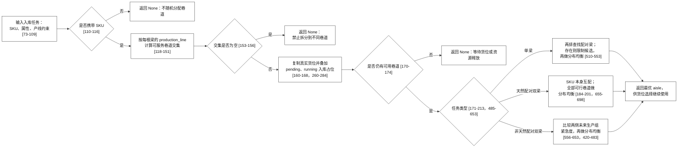

#### 1.1.1 流程图代码定位

| 图中节点 | 触发条件或输出 | 实现位置 |
| --- | --- | --- |
| 输入、SKU 校验、产线交集 | 接收任务；缺 SKU 或可服务巷道交集为空时返回 `None` | `allocation/proposed_strategy.py:73-156` |
| 模拟占位 | 将前序 pending/running 入库写入货位副本，并删除无空位巷道 | `allocation/proposed_strategy.py:160-174`、`260-284` |
| 单梁 | 一根有效 SKU；先检索左右排的可配对梁 | `allocation/proposed_strategy.py:510-553` |
| 天然配对双梁 | `sku_pairs[sku1] == sku2` | `allocation/proposed_strategy.py:184-201`、`655-698` |
| 非天然配对双梁 | 两根 SKU 不是同一 BOM 对；比较两侧直接配对与未来需求 | `allocation/proposed_strategy.py:556-653`、`420-483` |

#### 1.1.2 节点说明

- **production_line 巷道交集**：任务的每根梁可能绑定不同产线。系统从 `aisle_production_line_mapping` 找出各产线可服务巷道，并取交集；交集为空意味着没有一条巷道能同时完成该任务，不能拆分到不同巷道。
- **模拟货位状态**：在真实库存副本上预先写入同一调度批次中 `pending`、待确认执行及 `running` 入库任务的预计位置。这样后来的任务不会再次拿到已承诺的位置；该过程不修改真实库存。
- **单梁分支**：`beamSide` 仅决定在没有现成配对梁时优先使用左排或右排空位。系统仍会先在两排寻找 SKU、`match_fields` 属性均兼容的配对梁；找到后只在这些巷道中做库存分布均衡，找不到才在全部可行巷道中均衡。
- **天然配对双梁分支**：本次入库的两根 SKU 已互为 BOM 配对，例如 A 与 B 同时到达。此时不需要在两根梁之间选择优先级，而是调用 `_balance_by_sku_distribution`，优先选择该组 SKU 当前分布更少、且模拟后仍能容纳完整一组的位置所在巷道。
- **非天然配对双梁分支**：两根入库梁彼此不是一组，但各自可能和库内其他梁配对。系统先找出两侧各自可直接配对的巷道；若无法落在同一巷道，则由 `_get_pair_urgency_index` 从对应产线当前组向后扫描计划。相对组号越小，说明该侧越早会影响出库推进，优先保留该侧的直接配对机会。

#### 1.1.3 处理细节

- **产线交集的输入形式**：`production_line` 可以是单值，也可以是与任务 SKU 一一对应的列表。对每个非空产线值，系统从 `aisle_production_line_mapping` 取出可服务巷道并与当前候选求交集。两根梁即使属于不同产线，也必须在一条能同时服务两条产线的巷道中完成，交集为空时不允许拆分推荐。
- **模拟状态的写入范围**：`_build_simulated_positions_by_aisle` 深拷贝真实货位后，依次模拟本批次前面已承诺的入库任务。副本只用于当前巷道和货位评分，真实 `InventoryPosition`、`position_map`、SKU 索引和库存数量都不改变；因此一次推荐失败不会损坏真实库存。
- **单梁的完整规则**：单梁被标准化为 `[SKU, None]` 或 `[None, SKU]`。系统利用 `_find_paired_beam_in_side` 在左右排分别寻找该 SKU 的 BOM 配对品，要求 SKU 与 `match_fields` 属性兼容、对侧位置可写。只要找到直接配对机会，所有无配对机会的巷道被排除；两排均找不到时才允许在所有合法巷道中均衡。
- **天然配对双梁的排序**：当 `sku_pairs[sku1] == sku2` 时，两根梁已经互配，不需要比较哪一根更紧急。`_balance_by_sku_distribution` 对候选巷道按 `direct_pair_count` 降序、`sku_count` 升序、`same_suffix_sku_count` 升序、`empties` 降序排序。即优先增加直接可出库配对，同时避免同 SKU 或同后缀 SKU 过度集中。
- **非天然配对双梁的优先级**：若两侧可直接配对的巷道没有交集，`_get_pair_urgency_index` 从每条产线的 `production_line_current_group` 开始向后扫描。首次出现当前 SKU 或其 BOM 配对 SKU 的相对组号越小，优先级越高；优先级相同则优先选择同时包含另一根梁配对品的巷道，以降低后续跨巷道移库概率。两侧均无直接配对时，仍会先寻找两根梁配对品同巷道存在的情况，再退化为全局分布评分。

### 1.2 详细决策分支

实现入口：`allocation/proposed_strategy.py:73-213`，方法 `ProposedAisleAllocator.allocate`。

#### 1.2.1 输入校验和产线硬约束

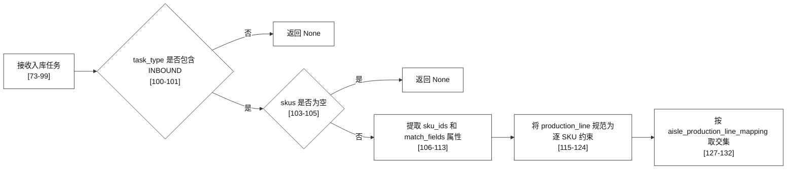

#### 1.2.2 SKU 可服务范围、模拟占位和类型分流

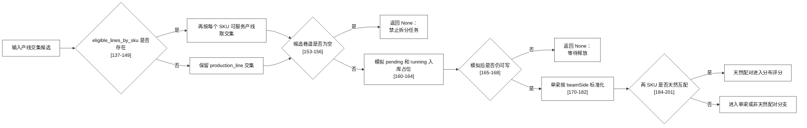

**本图关键点**：`None` 不是失败后随机分配，而是要求调用方将任务继续保留在待处理集合。产线交集和 `eligible_lines_by_sku` 均属于硬约束，优先于库存均衡评分。

#### 1.2.3 单梁、天然配对与非天然配对选择

实现位置：`allocation/proposed_strategy.py:485-653`，方法 `_allocate_with_urgency_comparison`；最终排序：`655-698`。

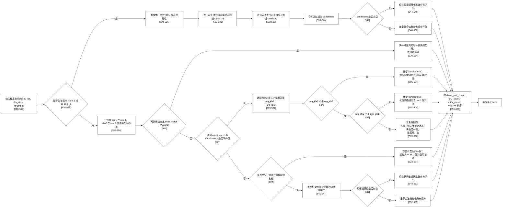

#### 1.2.4 分布评分的精确排序

`_balance_by_sku_distribution` 在 `allocation/proposed_strategy.py:655-698` 使用如下字典序：

`(-direct_pair_count, sku_count, same_suffix_sku_count, -empties)`。

- `direct_pair_count` 越大越优：当前入库后可直接形成的配对机会更多。
- `sku_count` 越小越优：避免相同 SKU 集中在某一巷道。
- `same_suffix_sku_count` 越小越优：避免相同后缀物料集中。
- `empties` 越大越优：前述指标仍相同才保留更高容量冗余。

## 2. 改进货位选择

### 2.1 总体流程

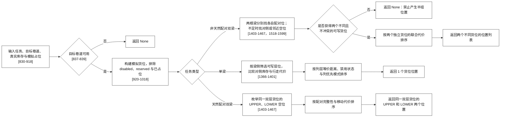

#### 2.1.1 流程图代码定位

| 图中节点 | 触发条件或输出 | 实现位置 |
| --- | --- | --- |
| 货位主入口 | 读取 `assigned_aisle`，无目标巷道或无空位时返回空列表 | `allocation/proposed_strategy.py:830-918` |
| 模拟入库占位 | 将当前批次的前序任务投影到深拷贝货位 | `allocation/proposed_strategy.py:920-1018`、`1303-1364` |
| 单梁择位 | 一个有效 SKU；优先补齐已有配对梁 | `allocation/proposed_strategy.py:1366-1401` |
| 天然配对双梁择位 | 两个 SKU 互配；返回同一双层货位的上下层两位置 | `allocation/proposed_strategy.py:1403-1467` |
| 非天然配对双梁择位 | 两个 SKU 不互配；返回两个不同且不冲突的可写位置 | `allocation/proposed_strategy.py:1403-1467` |
| 对侧和邻近空位检索 | 按属性、排、层位和列层等价移动距离检索 | `allocation/proposed_strategy.py:1469-1599` |

#### 2.1.2 节点说明

- **模拟货位视图**：货位选择继承巷道分配阶段的预测状态，先排除禁用、预留、已有库存和已被前序任务占用的位置，再开始枚举候选。
- **单梁**：先尽量放在已有属性兼容配对梁的对侧；没有此类位置时，再按 `beamSide` 选择对应排的空位。候选排序结合列层等价移动距离与 `position_column_preference_mode`，而不是只比较列号。
- **天然配对双梁**：只能从同一双层货位中同时取得 `UPPER` 与 `LOWER` 两个可写层位。这样入库后天然形成一组可直接出库的双梁。
- **非天然配对双梁**：两根梁不要求落在同一双层货位。系统先在左排为第一根寻找其 BOM 配对梁的对侧位置，在右排为第二根进行同样检索；两侧均能直接配对时，直接返回这两个不同位置。仅一侧能直接配对时，另一根围绕该位置选择对侧或最近空位；两侧均无直接配对时，先选第一排空位，再选第二排同列对侧或最近空位。最终必须返回两个不同且不冲突的位置；否则整个任务返回 `None`，不会提交半组位置。

#### 2.1.3 处理细节

- **候选过滤顺序**：货位选择只处理已经写入 `assigned_aisle` 的任务。首先从模拟货位中排除禁用、预留、已有库存和前序任务占位；随后再按双层上下层规则、梁侧、SKU 和 `match_fields` 属性过滤。巷道有物理空位但没有符合层位或属性规则的位置时，仍返回空结果。
- **单梁放置**：若库存中存在兼容配对梁，单梁优先落在其对侧的可写层位，使入库后立即形成可出库的一组；只有不存在任何配对机会时，才用 `beamSide` 确定新开空位优先落在左排还是右排。
- **天然配对双梁**：候选必须是同一 `(aisle, row, column)` 下的 `UPPER` 与 `LOWER` 两个层位，且两层同时满足空闲、未禁用、未预留、未被模拟占用。返回值始终同时包含两个位置，后续无需移库即可按一组出库。
- **非天然配对双梁与半组保护**：`_allocate_double_constrained` 通过 `exclude_position` 排除已选的第一位置，确保第二根不会复用同一个位置。两个位置可以处于不同列、不同双层货位，也不要求层号相同；其约束是均可写、符合各自排向且坐标不同。只有两个位置都确定后才生成 `positions`；第二根找不到时返回不完整中间结果，由上层判定为失败并返回 `None`，不会下发“第一根已分位、第二根待定”的半组任务。
- **距离与列偏好**：主排序使用堆垛机物理参数换算的列层等价移动距离。列差与层差不是等权曼哈顿距离，而是由“移动一列时间内可连续升降的等价层数”归一；仅在主移动代价相同或接近时，`position_column_preference_mode` 才用最小列、中间列或最大列稳定打破平局。

### 2.2 详细决策分支

#### 2.2.1 货位入口与三类任务分支

实现入口：`allocation/proposed_strategy.py:830-918`，方法 `ProposedPositionAllocator.allocate`。

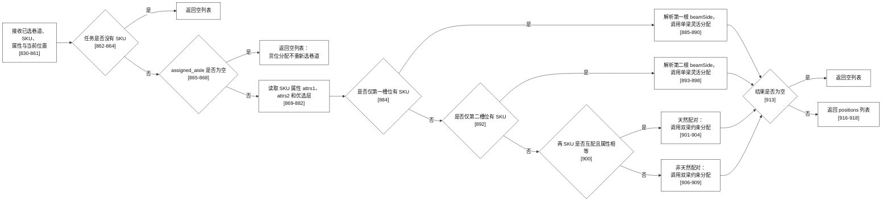

#### 2.2.2 非天然配对双梁的货位回退树

实现位置：`allocation/proposed_strategy.py:1403-1467`，方法 `_allocate_double_constrained`。

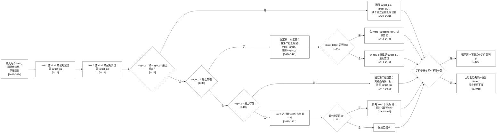

**边界说明**：只有天然配对双梁才要求同一双层货位的 `UPPER`、`LOWER`。本图的非天然双梁可返回不同列、不同双层货位甚至不同层号的两个位置；唯一硬条件是两个位置可写且不复用。

## 3. 调度侧候选方案评分

### 3.1 总体流程

```mermaid
%%{init: {"theme":"base","themeVariables":{"background":"#ffffff","primaryColor":"#ffffff","primaryBorderColor":"#333333","primaryTextColor":"#111111","secondaryColor":"#ffffff","secondaryBorderColor":"#333333","secondaryTextColor":"#111111","tertiaryColor":"#ffffff","tertiaryBorderColor":"#333333","tertiaryTextColor":"#111111","lineColor":"#333333","mainBkg":"#ffffff","nodeBorder":"#333333","clusterBkg":"#ffffff","clusterBorder":"#333333"}}}%%
graph LR
    S["接收 pending 入库、出库、<br>库存、产线与资源状态<br>[58-143]"] --> A["过滤不可执行任务，校验<br>库存、配对、巷道与资源<br>[258-398]"]
    A --> B{"存在可行任务"}
    B -- 否 --> X["返回空方案"]
    B -- 是 --> C["先放当前生产组；其余入出库<br>按 80 比 20 混合<br>[863-1112]"]
    C --> D["生成启发式基线方案"]
    D --> E["按样本数量生成候选任务序列"]
    E --> F["逐任务确认巷道与货位，冻结已选位置 [863-1112]"]
    F --> G["事件仿真推进，计算<br>完工、等待、均衡指标<br>[1125-1304]"]
    G --> H["计算加权总分，<br>保留当前最优候选<br>[1125-1304]"]
    H --> I{"是否还有候选样本"}
    I -- 是 --> E
    I -- 否 --> J{"最优候选优于启发式"}
    J -- 是 --> O["返回最优采样方案"]
    J -- 否 --> P["返回启发式基线方案"]
```

#### 3.1.1 流程图代码定位

| 图中节点 | 触发条件或输出 | 实现位置 |
| --- | --- | --- |
| 调度主入口 | 接收入出库任务、选择启发式或优化器流程 | `schedule/optimizer.py:58-143` |
| 出库可行性 | 校验库存、FIFO、配对、属性与资源，形成可行分配 | `schedule/optimizer.py:258-398` |
| 候选生成与混合 | 当前组优先；构建样本序列、冻结巷道和位置 | `schedule/optimizer.py:428-1112`，核心采样为 `863-1112` |
| 未来可连续出库 | 估算候选方案对未来生产组可执行性的影响 | `schedule/optimizer.py:545-763` |
| 候选评分及选择 | 逐方案仿真、比较加权分和启发式基线 | `schedule/optimizer.py:1125-1382` |

#### 3.1.2 节点说明

- **可执行过滤**：出库任务需满足库存数量、SKU 配对和属性匹配、同层位规则、产线当前组和资源可用性；入库任务需满足巷道和货位可行性。不能执行的任务保留在待处理队列，不进入本轮候选。
- **80 比 20 混合**：当前生产组任务优先保留在序列前部；其余入库与出库任务以约 80% 入库、20% 出库的随机比例交错，目的是同时探索不同的资源占用与库存结构，而不是保证每一种排列组合都枚举。
- **位置冻结**：候选序列内某任务一旦选定 `aisle` 和 `positions`，后续任务按该冻结结果建立模拟状态，避免两个任务占用同一货位或同一移库资源。
- **评分比较**：每个候选从同一快照开始推进事件，评分由完工时间、库存均衡、产线平均时间、产线进度均衡、巷道离散度、入库等待及可选出库奖励等配置项组成；最终只在采样最优方案和启发式方案之间二选一。

#### 3.1.3 处理细节

- **可执行过滤**：出库任务必须同时满足库存数量、BOM 配对、`match_fields` 属性、同一双层货位上下层关系、产线当前组和堆垛机资源约束；入库任务必须能获得完整巷道和货位。任一条件失败的任务仍保留在待处理集合，不会被计为完成或从队列删除。
- **80 比 20 混合的实际含义**：当前生产组内的可执行出库任务先放到序列前部。其余入库、出库列表循环取值时约以 80% 概率优先取入库、20% 概率优先取出库；若其中一张列表耗尽，另一张列表会连续取完。因此该比例控制任务穿插顺序，不会漏掉样本内可行的任务，也不表示穷举全部排列。
- **冻结和快照**：每个采样方案从同一仓库快照开始。方案内已选任务会冻结 `assigned_aisle`、`positions`、预留位置和资源，后续任务只能看见冻结后的模拟状态；评分结束后恢复快照再评估下一个方案，避免前一方案的库存或队列副作用污染后一方案。
- **评分与兜底**：事件推进后产生完工时间、等待、库存变化和产线进度等原始指标，再按配置中的权重和尺度汇总为总分。采样最优方案仅在可行且总分严格优于启发式基线时返回；相等或更差时保持启发式方案，避免随机采样造成退化。

### 3.2 详细决策分支

为避免长链路横向缩小，本节按四个连续阶段拆图。主入口：`schedule/optimizer.py:58-143`；采样：`863-1112`；评分：`1125-1304`。

#### 3.2.1 入口、启发式和候选集准备

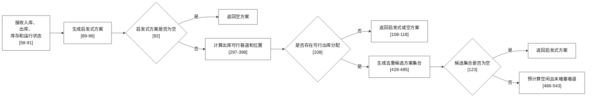

#### 3.2.2 样本内任务交错

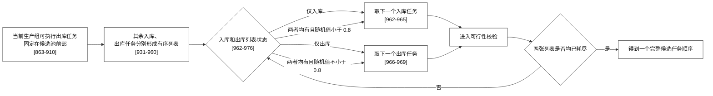

#### 3.2.3 逐任务选择、冻结和写入方案

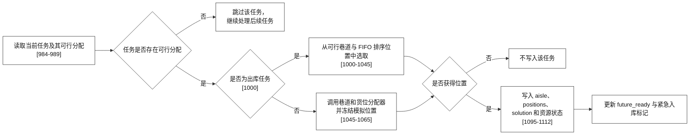

#### 3.2.4 候选评分、最优更新和启发式兜底

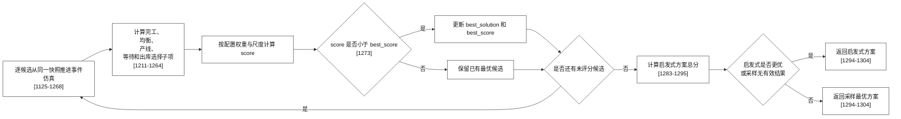

## 4. 图例与阅读说明

- `pending/running` 入库占位只用于预测后续可用货位，不会在推荐阶段直接写入真实库存。
- 双梁货位选择必须同时得到两个可写位置；任何一个位置不存在时，整个任务不推荐。
- 调度评分以同一份输入状态为起点分别评估各候选方案，避免由前一候选方案残留状态影响下一候选。

