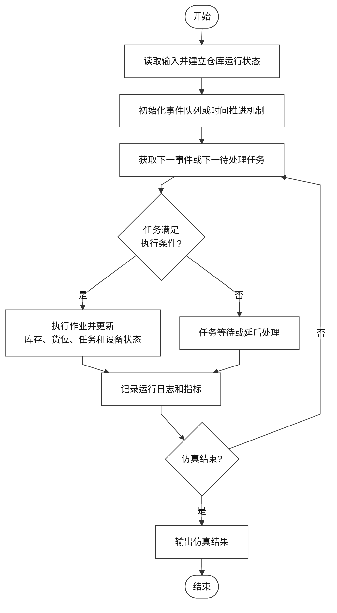
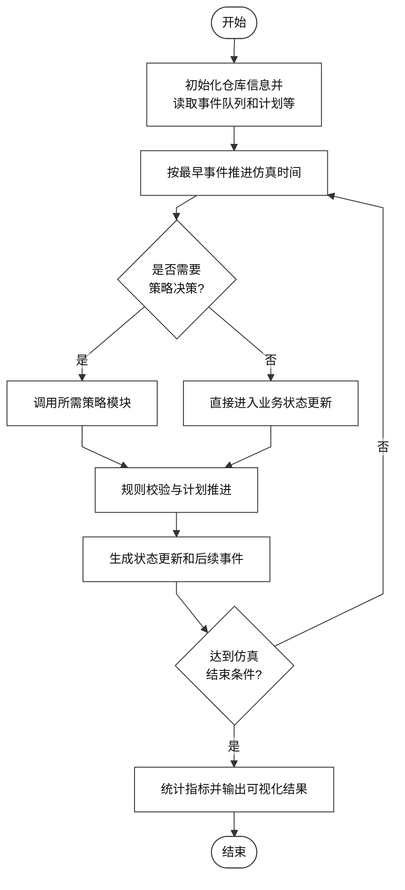
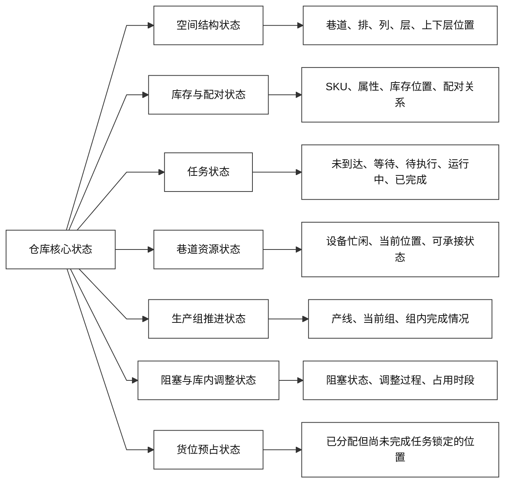
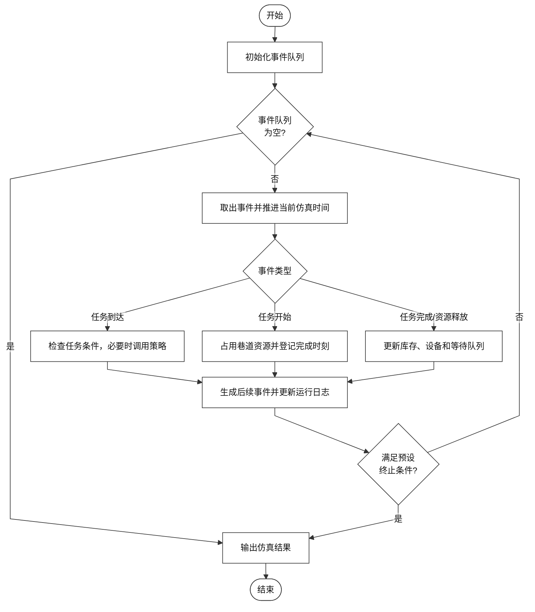
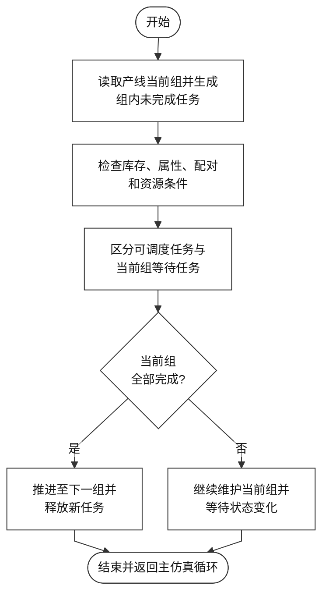
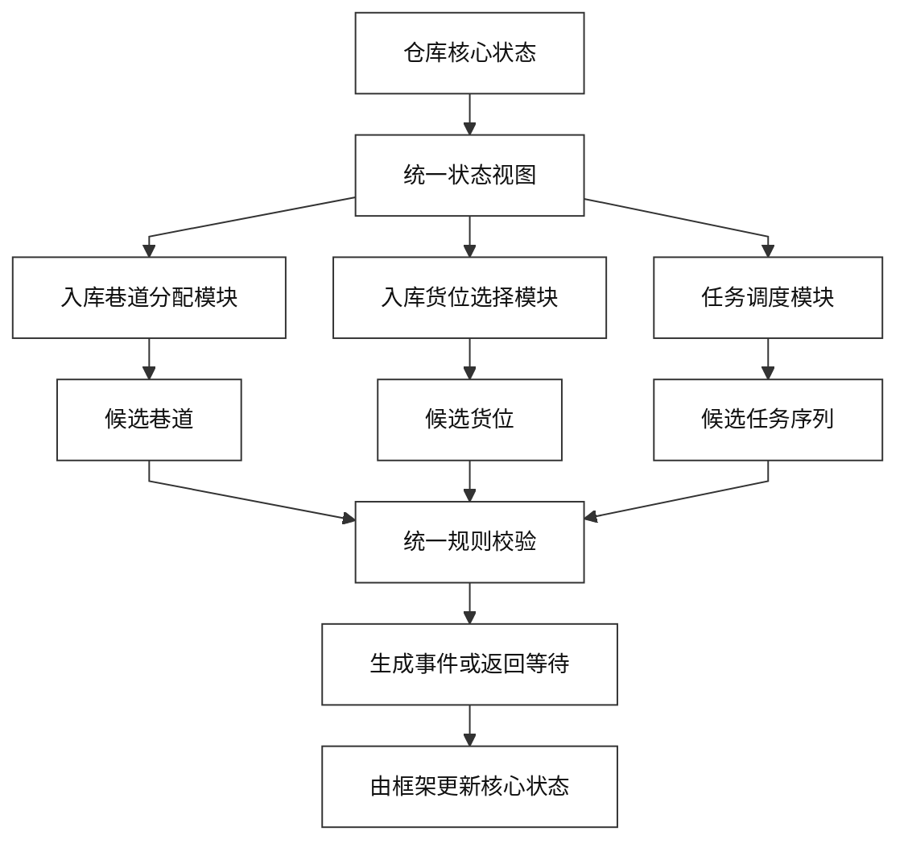
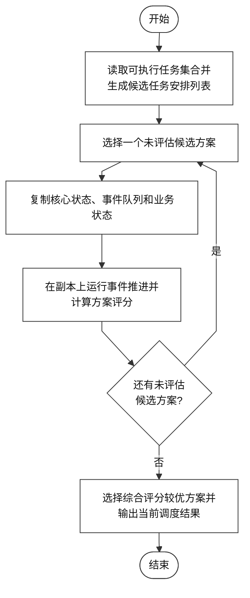

# 一种面向配对型纵梁立体库的事件驱动仿真框架

## 基本信息

- 技术主题：配对型纵梁立体库仿真框架
- 技术方向：智能仓储、离散事件仿真、生产计划驱动的仓储调度验证
- 适用对象：具有纵梁配对关系、双层货位、巷道资源约束和产线组推进约束的自动化立体库

---

## 一、相关技术背景与现有技术发展情况

### 1. 背景技术领域

本技术方案属于智能仓储与仿真技术领域，具体涉及一种面向配对型纵梁立体库的连续运行仿真框架。该框架用于在给定仓库布局、SKU 配对关系、入库记录、生产计划、时间参数和任务安排方案的条件下，对仓库从初始库存状态到任务完成状态的运行过程进行持续推演，并输出可用于比较不同运行方案的量化结果。

在一般自动化立体库仿真中，通常需要描述仓库空间结构、库存位置、出入库任务、设备资源以及任务执行时间等基本要素。通过这些要素，仿真系统可以模拟任务到达、任务分配、设备执行、库存更新和结果统计等过程，从而评估不同运行规则下的总完成时间、设备利用率或巷道负载情况。对于普通物料场景而言，只要物料库存满足出库需求、目标货位具备入库容量，任务通常即可按照既定规则执行。

但是，配对型纵梁立体库与普通物料立体库存在明显差异。该类仓库通常用于汽车或大型结构件制造场景，核心存储对象不是彼此独立的一般散件，而是具有成套关系和配对关系的纵梁。对于这类纵梁，判断某一出库任务能否执行，不能只看目标 SKU 是否存在于库存中，还需要进一步判断目标纵梁之间是否满足配对关系、属性关系以及货位组织关系。

这里所说的“配对”，并不仅仅是业务上知道两根纵梁相互对应，而是指两根纵梁在后续出库时需要满足特定的组织状态。以双梁出库任务为例，较理想的可直接出库状态，是两根目标纵梁位于同一双层货位的上下层，并且满足既定配对关系和属性关系。若两根纵梁虽然均已在库，但分散在不同货位，则系统可能仍需通过移库（将纵梁从一个货位移动到另一货位，若跨巷道，则需要从源巷道通过出库口或专门设置的移库口移动到目标巷道）或继续等待配对梁入库，才能形成可直接执行的出库状态。

从仓库空间结构看，配对型纵梁立体库通常由多个巷道、货位排、列位和层位组成，并在货位内部进一步区分上层和下层。其中，“巷道”是可独立承接任务、维护设备资源状态和记录当前位置状态的作业单元；“排”用于区分一条巷道的左右两侧货位；“列”表示货位沿巷道纵深方向的位置；“层”表示货位在竖直方向上的高度；“双层货位”则是在同一排、列、层位置上进一步区分上层和下层，用于承载可能形成配对关系的一组纵梁。因此，本场景中的完整货位是由巷道、排、列、层以及上层或下层属性共同确定。

从任务组织方式看，仓库通常存在明确的入库口和出库口。入库任务可能来自不同入库线或不同层位的入库入口，出库任务则可能对应不同产线或不同层位的出库出口。巷道内作业设备（一般为堆垛机）需要在列向和层向移动，并在任务执行过程中完成取货、放货等动作。因此，任务时长不仅取决于任务类型，也与设备当前位置、目标货位位置、巷道几何参数、设备速度、加速度、取放动作时间以及是否发生额外移库操作等因素有关。

从仿真对象组成角度看，至少需要同时处理五类对象。第一类是空间对象，即巷道、排、列、层以及双层货位的上下层，用于定义库存和任务可落位的空间边界；第二类是库存对象，即具体存放在货位中的纵梁 SKU 和其他属性信息（如颜色、尺寸、版本号等），用于描述货位当前承载了什么物料；第三类是任务对象，即入库任务、出库任务和移库任务，用于描述系统需要推进的业务动作及其目标位置关系；第四类是资源对象，即巷道内作业设备及其当前位置、忙闲状态、出入库口的阻塞状态和可用时刻，用于决定任务是否能够在当前时刻真正开始执行；第五类是计划对象，即产线当前组、组内任务完成状态以及后续组释放条件，用于约束出库任务的进入时机和执行顺序。对于配对型纵梁立体库而言，只有将上述对象及其相互关系纳入同一仿真框架，才能较真实地反映系统的连续运行过程。

在连续运行过程中，配对型纵梁立体库的状态变化会持续影响后续任务的可执行性和推进节奏。因此，仿真框架不能仅采用“有货即可出、有空位即可入”的简化判断方式，而需要统一维护仓库空间结构、双层货位状态、库存属性状态、纵梁配对状态、入库和出库任务状态、巷道资源状态、阻塞状态、移库状态以及生产计划当前组状态。具体而言，库存状态不仅包括某个货位是否存放纵梁，还包括纵梁的 SKU、属性、所在层位以及是否已经与另一根纵梁形成有效配对；配对状态会直接影响出库可执行性，即“库存存在”并不必然等于“可以直接出库”；某些入库任务虽然尚未完成，但其目标货位已经被前序任务分配并锁定，此时该货位应视为已预占，后续任务不得重复占用；出库任务通常受生产计划组顺序约束，需要按照产线当前组逐步释放，不能任意跳过当前组直接执行后续组任务；移库、阻塞解除和设备资源占用也会改变后续任务的等待时间、可执行状态和产线推进节奏。由此可见，某一次入库落位、出库选择或移库动作，都可能改变后续任务是否可直接执行、是否需要等待、是否触发额外移库，以及后续产线是否能够连续推进。

基于上述特点，本技术方案需要建立一种能够持续维护配对状态、任务状态和资源状态的仿真框架，使策略评估不再局限于单次任务是否可行的静态判断，而是扩展为面向连续业务过程的统一验证。通过该框架，可以在相同输入数据、相同事件推进规则和相同评价口径下，比较不同入库、出库和调度方案对整体完工时间、配对保持情况、移库次数和产线推进稳定性的影响。

### 2. 现有技术方案

现有仓储仿真技术主要用于在虚拟环境中复现仓库运行过程，并在不影响真实生产的条件下，对不同作业规则、设备配置或任务安排方案进行比较。其基本思路是：根据仓库布局、初始库存、已知任务清单、设备参数和作业规则，建立可随时间变化的仓库运行状态；随后按照任务到达、任务开始、任务完成、设备释放等过程推进仿真，并在仿真结束后输出仿真结束时间、设备利用率、任务完成情况等评价指标。

从系统组成看，现有仓储仿真通常包括输入数据模块、仓库状态模块、任务执行与调度模块以及结果统计模块。输入数据模块用于读取仓库布局、货位容量、物料信息、初始库存、入库任务、出库任务和设备运行参数等数据，其中待处理任务通常已经由外部订单、生产计划或历史任务记录给定。仓库状态模块用于维护库存位置、货位占用情况、任务队列、设备当前位置以及设备忙闲状态等信息。任务执行与调度模块用于根据预设规则或调度算法判断任务是否可执行，并确定任务执行顺序、目标区域或目标货位。结果统计模块则用于记录任务开始时间、完成时间、设备占用时间和最终运行结果。

从时间推进方式看，现有仓储仿真通常可以采用离散事件推进或时间步推进机制。离散事件推进方式以事件队列为核心，将任务到达、任务开始、任务完成、设备释放等状态变化作为事件，并按照事件发生时间依次处理；时间步推进方式则按照固定时间间隔扫描系统状态，判断是否有新任务到达、是否有任务完成、是否有设备可用。相比固定时间步推进，离散事件推进在任务发生时间不均匀、设备占用时间不同、资源释放时刻不固定的场景下通常更加高效，也更适合描述仓库中异步发生的作业过程。

从任务处理方式看，现有仓储仿真通常会在任务到达或任务被选中后判断其是否满足执行条件。对于入库任务，系统一般需要判断是否存在可用货位，并根据入库规则选择目标货位或目标区域；对于出库任务，系统一般需要判断目标物料是否在库、所在位置是否可访问、相关设备是否可用，并据此生成出库作业。部分仓储仿真也可能涉及库内位置调整或移库类作业，例如为了整理库存、释放货位、改善后续作业路径或处理局部阻塞，将货物从一个位置移动到另一个位置。但在一般仓储仿真中，这类作业通常主要体现为库存位置变化和额外作业时间；与配对型纵梁立体库不同，其通常不直接承担形成上下层配对关系、改变双梁出库可执行状态或推动生产组连续推进等业务作用。

从方案比较方式看，现有仓储仿真通常是在相同输入数据和相同基础规则下，替换不同的任务排序规则、货位选择规则或设备调度规则，并比较仿真输出结果。例如，可以比较不同规则下的仿真结束时间、设备利用率、任务完成数量或巷道负载情况等。通过这些结果，仿真系统可以为仓库运行方案选择提供一定的量化依据。

总体来看，现有仓储仿真已经形成了较为完整的基本框架，即通过输入数据构建仓库运行状态，通过事件推进或时间步推进模拟任务过程，通过规则或算法控制任务执行，并在仿真结束后输出运行结果。该类方法能够较好地描述一般仓储场景中的库存变化、任务排队、设备占用、资源释放和方案比较过程。

现有技术中的通用仿真流程可概括如下图所示：

**图 1 现有通用仓储仿真流程示意图。** 该图用于说明现有仓储仿真通常通过输入数据建立仓库运行状态，并基于事件推进或时间步推进机制处理任务、更新库存与设备状态，最终输出任务日志和仿真结果。

### 3. 现有技术方案缺点

上述通用仓储仿真方法能够较好地描述一般仓储场景中的库存变化、任务排队、设备占用、任务执行和结果统计过程。但在直接应用于配对型纵梁立体库时，由于该场景中的出库可执行性不仅取决于库存是否存在，还取决于纵梁之间的配对关系、上下层组织状态以及移库或库内调整后的状态变化，因此仍存在以下不足。

1. 对配对型纵梁“库存状态”和“可执行状态”的区分不够充分。
在一般仓储仿真中，库存状态通常主要表示某种物料是否存在、存放在何处以及数量是否满足需求。对于普通物料而言，只要目标物料在库且所在位置可访问，通常即可作为出库任务的执行依据。但在配对型纵梁立体库中，双梁出库任务能否执行，不仅取决于两根目标纵梁是否都在库，还取决于二者是否满足预设配对关系、左右或型号属性关系，以及是否已经在双层货位中形成可直接出库的上下层组合。若仿真状态仅记录普通库存位置和数量，而没有持续区分“库存存在但尚未形成直接配对”和“库存存在且已经形成可直接出库状态”，就难以准确判断双梁出库任务的真实可执行性。
2. 对库内搬移与移库调整结果的状态传播表达不足。
一般仓储仿真中也可能包含库内搬移、位置调整或移库类作业，这类作业通常用于库存整理、释放空间、改善作业路径或处理局部阻塞，其主要影响通常体现为库存位置变化和额外作业时间。但在配对型纵梁立体库中，移库或库内调整动作不仅是一次位置变化，还可能改变两根纵梁是否能够形成上下层配对，进而影响某个出库任务是否能够由等待状态转为可执行状态，也可能影响后续任务的候选选择和整体推进节奏。若仿真仅将此类操作作为普通搬移动作处理，而没有进一步维护其对配对状态、可执行状态和后续任务判断的影响，就难以准确评估库存组织方式和任务安排方案的连续运行效果。
3. 对配对组织质量和方案差异来源的评价口径不够完整。
现有通用仓储仿真通常关注仿真结束时间、设备利用率、任务完成数量等指标，这些指标能够反映一般运行效率，但不足以完整解释配对型纵梁立体库中方案差异的来源。对于本场景，仅知道某一方案完成时间更短，并不能说明其是否减少了后续移库或库内调整、是否提高了直接可出库比例（运行中的配对率）、是否更好地保持了上下层配对状态，或者是否降低了因配对失败造成的移库事件。因此，在配对型纵梁立体库中，还需要进一步统计配对状态保持情况、直接可执行任务比例、移库触发情况以及不同方案在统一状态更新规则下的可比性。若评价口径仅停留在通用效率指标上，就难以说明某一方案究竟是通过缩短设备作业时间、改善库存组织，还是减少后续移库调整而取得更优结果。

因此，面向配对型纵梁立体库，需要在通用仓储仿真的基础上进一步扩展与配对关系、上下层组织、移库调整后的状态传播和配对质量评价相关的状态表达与统计口径，使仿真不仅能够推进任务过程，还能够准确反映配对型纵梁业务规则对后续任务可执行性和整体运行结果的影响。

## 二、本技术方案详细阐述

### 1. 本技术方案所要解决的技术问题

本技术方案所要解决的技术问题是：针对配对型纵梁立体库中纵梁配对关系强、双层货位组织重要、出库任务受生产组顺序约束、入库和出库任务连续到达、巷道资源存在阻塞和移库占用等特点，建立一种能够模拟仓库连续运行过程的事件驱动仿真框架。该框架需要在同一套状态模型和事件推进规则下，持续维护库存、配对、预占、资源和生产组状态，并据此评价不同入库分配、货位选择和任务调度方案的长期运行效果。

结合上述不足，本技术方案主要解决三个层面的问题。第一，如何建立一套面向配对型纵梁业务的统一状态模型，使库存数量、配对状态、上下层关系、属性关系、移库或库内调整形成配对的条件、货位预占状态和生产组状态能够在同一仿真状态中持续维护。第二，如何建立一套能够表达任务连续推进过程及其时序影响的事件驱动机制，使任务时间预估、资源占用、阻塞解除、移库过程和后续状态传播能够被统一模拟。第三，如何建立一套适用于配对型纵梁立体库的统一实验比较口径，使不同运行方案能够在相同输入、相同状态更新规则和相同评价指标下输出更完整、更可解释的评价结果。

因此，本技术方案的核心不是限定某一个具体入库策略或某一个具体调度策略，而是提供一个能够承载、验证和比较这些策略的配对型纵梁立体库仿真框架。不同策略可以作为模块接入，但策略运行所依赖的仓库状态、事件推进逻辑和结果统计口径应保持一致，从而保证实验结果具有可比性。

### 2. 完整技术方案阐述

本技术方案提出一种面向配对型纵梁立体库的事件驱动仿真框架。该框架以仓库核心状态为统一状态载体，以事件队列为时间推进机制，以纵梁配对关系、上下层组织关系和属性匹配关系为出库可执行性判断基础，并结合生产计划当前组状态，对入库、出库、库内调整和任务调度过程进行连续仿真。其目的不是单独限定某一种入库规则或调度规则，而是提供一个能够在统一状态、统一事件推进规则和统一评价口径下验证不同运行方案的平台。

从整体结构看，该框架主要包括输入数据层、仓库核心状态层、事件驱动主循环、业务规则层、策略模块接入层以及结果输出层。输入数据层负责读取并规范化仓库布局、SKU 信息、入库任务、出库任务、生产计划和设备运行参数；仓库核心状态层负责维护库存位置、上下层配对状态、货位预占状态、任务状态、巷道资源状态、阻塞状态、库内调整状态和生产组推进状态；事件驱动主循环负责按照事件发生时间推进仿真时钟，并触发相应状态更新；业务规则层负责对任务可执行性和状态转换合法性进行统一判断；策略模块接入层负责接收入库分配、货位选择和任务调度等决策建议；

其总体流程可概括如下图所示。

**图 2 本技术方案仿真框架总体流程图。** 该图用于说明本技术方案在统一仓库状态上，通过事件驱动方式持续处理任务、资源和业务状态变化。图中将“是否需要决策”单独列出，是为了区分事件处理和策略调用：任务到达、候选任务释放等事件可能需要调用策略模块，而任务完成、阻塞解除或资源释放等事件通常先进行状态更新，再判断是否触发新的可调度任务。

在输入阶段，系统至少读取以下数据：仓库布局参数、巷道与货位结构、SKU 配对关系及属性数据、已知入库任务、生产计划数据、仿真时间参数、设备运行参数、阻塞或库内调整相关参数以及待比较的运行方案。输入数据进入仿真前需要进行统一规范化处理，例如将生产计划按产线和组组织，将入库任务按到达时间排序，将 SKU 属性字段映射为统一格式，将 SKU 配对关系整理为便于查询的关系表，并在需要时按仿真日或仿真批次切分为连续输入序列。通过统一输入格式，可以避免不同方案因数据预处理方式不同而造成比较口径不一致。

任务时间由框架内部的时间预估模块统一计算，而不是简单为所有任务设定相同固定时长。该模块以堆垛机运动和取放动作的物理参数为基础，利用巷道参数、列间距、层间距、水平与垂直方向最大速度、水平与垂直方向加速度、取货时间、放货时间、入库口位置、出库口位置以及设备当前位置等信息，对入库、出库和库内调整类任务进行基础时长估计。这样可以使不同列位、不同层位、不同出入口位置和不同设备当前位置对任务时长的影响进入仿真过程。在具备历史运行数据时，系统还可以选择启用残差修正模型，在物理估计结果上叠加由历史数据学习得到的修正值，以提高任务时间估计与真实运行时间之间的一致性。

在初始化阶段，系统根据初始库存数据或历史入库记录构造仓库核心状态。仓库核心状态不是简单的库存表，而是面向连续运行过程维护的一组状态集合，至少包括空间结构状态、库存与属性状态、上下层配对状态、任务状态、巷道资源状态、生产组推进状态、阻塞与库内调整状态以及货位预占状态。对于两根纵梁均已在库但尚未形成直接配对的情况，系统应能够标识其当前不可直接出库，并进一步判断是否具备后续移库或库内调整形成配对的条件。对于已经获得目标货位但尚未完成入库的任务，系统应将该目标位置记录为预占状态，以避免后续任务在仿真推进过程中重复使用同一位置。

仓库核心状态关系可概括如下图所示。

**图 3 仓库核心状态模型示意图。** 该图用于说明本技术方案将空间结构、库存配对、任务状态、巷道资源、生产组推进、阻塞调整和货位预占统一纳入同一状态对象。不同策略模块只能基于该状态给出决策建议，最终状态更新仍由统一规则完成，从而保证仿真过程的一致性。

在时间推进阶段，本技术方案采用离散事件驱动方式。系统维护一个按事件发生时间排序的事件队列，每次取出最早事件，将仿真时钟推进到该事件时刻，并调用对应的事件处理逻辑。事件处理完成后，系统根据新的仓库状态生成后续事件并重新入队。事件类型可以包括入库任务到达事件、入库任务分配事件、任务开始事件、任务完成事件、移库或库内调整事件、阻塞解除事件、资源释放事件以及生产组状态检查事件。不同事件的处理方式不同：有些事件只引起状态更新，有些事件会触发新的任务释放，有些事件则需要调用策略模块进行候选选择。

需要说明的是，事件驱动方式并不意味着每个事件都会产生新的策略决策。例如，任务完成事件通常先更新库存、配对、设备位置和产线组状态，再检查是否出现新的可调度任务；阻塞解除事件通常先释放相应状态，再判断等待队列是否可以继续推进；入库任务到达或出库任务释放事件则可能触发入库分配、货位选择或任务调度。通过将事件处理和策略调用分开，可以避免把状态更新逻辑与策略逻辑混在一起，也能更清楚地表达前序任务对后续任务的影响。

事件驱动主循环如下图所示。

**图 4 事件驱动主循环流程图。** 该图用于说明仿真时间由任务到达、任务开始、任务完成、阻塞解除和资源释放等事件推进。流程中将任务条件检查、策略选择、规则校验和后续事件生成分开表达，以避免把所有事件都处理成同一种调度流程。

在业务规则层，本技术方案将配对型纵梁的关键规则作为统一仿真规则维护，而不是完全写入某一个策略模块内部。该类规则至少包括纵梁预设配对关系规则、同一双层货位上下层直接配对规则、属性匹配规则、左右排或左右属性约束规则、货位预占规则以及移库调整规则。通过这些规则，仿真系统能够区分“库存不存在”“库存存在但尚未形成直接可执行配对”和“库存存在且已经形成可直接出库状态”三类情况，从而避免将普通库存满足误认为出库任务已经可执行。

对于入库任务，业务规则主要用于判断候选巷道和候选货位是否适合承接当前纵梁。系统不仅检查货位是否可用，还需要检查该位置是否已被未完成任务预占、是否与当前纵梁类型和属性相匹配，以及是否有利于后续形成有效配对。对于出库任务，业务规则主要用于判断目标纵梁是否存在、属性是否匹配、上下层组织关系是否满足直接出库要求；如果尚未满足直接出库要求，系统再判断是否可以通过库内调整或移库形成可执行状态。对于移库或库内调整类任务，业务规则主要用于判断被调整纵梁、目标位置和相关设备资源是否满足安全和可执行约束，并在调整完成后同步更新配对状态和等待任务状态，使相关出库任务有可能由不可执行转为可执行。

进一步地，移库触发条件并不是任意出现库存分散就立即执行，而是与当前待推进的双梁出库任务直接相关。系统首先检查当前组中尚未完成的双梁出库任务：若两根目标纵梁已经处于同一双层货位的上下层，则不触发移库；若相关 SKU 仍存在对应入库任务正在队列中等待到达或执行，则暂不触发移库，而优先等待入库完成后再判断；若两根目标纵梁均已在库、但分散在不同货位且尚未形成直接配对，则触发移库判断；若仅有一根在库或两根均不在库，则当前不执行移库，只记录为等待库存补足的状态。

在满足移库判断条件后，系统优先尝试将其中一根纵梁移动到另一根纵梁所在货位的空余层，以最少的移动操作形成上下层配对。若某一根纵梁所在货位的下层可用，则优先把另一根纵梁移入该下层；选择目标位时，优先选择能够在同巷道内完成的方案，以减少跨巷道搬移。若涉及跨巷道，则将移出巷道和移入巷道分别计入移库占用时段；若目标货位在移库执行前已被其它任务占用，或相关巷道当前存在运行任务、未来已有移库占用、或运行任务中包含与该移库相关的冲突 SKU，则本次移库推迟执行。移库一旦被确认，系统会先锁定目标位置，登记移库完成时刻和相关操作，在对应时刻真正更新库存位置和配对状态，并在移库期间将相关巷道视为忙碌。通过这样的处理方式，移库在仿真中不再只是普通搬运动作，而是一个会占用巷道资源、改变库存组织并直接影响后续出库可执行性的独立业务过程。

在生产计划约束方面，系统按产线维护当前组号，并根据当前组任务完成情况决定是否推进到下一组。出库任务不是一次性全部释放，而是在组推进约束下逐步生成。当前组中的任务若库存不足、配对状态不满足或资源暂不可用，可以暂时处于等待状态；但该等待状态不会使后续组任务自动越过当前组执行。只有当当前组内需要完成的任务均达到完成条件后，系统才将该产线推进到下一组，并释放下一组对应的候选出库任务。其基本关系如下图所示。

**图 5 生产计划组推进与出库任务生成流程图。** 该图用于说明本技术方案按照产线当前组控制出库任务释放，并将单个任务可执行判断与整组完成判断分开处理，从而避免后续组任务越过当前组直接执行。

在策略接入层，本技术方案将入库巷道分配、入库货位选择和任务调度设计为可替换模块。策略模块只基于统一状态视图给出候选巷道、候选货位或候选任务序列，不能直接修改仓库核心状态。策略输出后，系统仍需要通过业务规则层统一校验其是否满足配对约束、货位约束、生产组约束和资源约束；只有通过校验的决策才会转化为事件并进入执行过程。这样，不同策略可以在同一仿真环境下比较，而不会因为各自实现了不同的状态更新方式导致结果不可比。

策略接入关系如下图所示。

**图 6 策略模块可插拔接入关系图。** 该图用于说明不同策略只改变候选决策输出，而不直接改变核心状态、事件推进规则和评价口径。策略结果必须经过统一规则校验后才能进入仿真执行过程。

对于需要比较多个候选任务安排结果的场景，本技术方案还支持在当前仓库状态副本上模拟候选方案。具体做法是：先读取当前可执行任务集合并生成若干候选任务安排；然后复制当前仓库核心状态、事件队列和相关业务状态；随后在副本上按同一事件推进规则运行候选方案；最后计算该候选方案对应的时间、等待、设备占用、配对保持和库内调整等评价指标，并选择综合评分较优的方案。由于候选评估发生在状态副本中，不会污染主仿真状态，因此既能比较方案优劣，又能保持主仿真过程的一致性。其流程如下图所示。

**图 7 候选调度方案仿真评分流程图。** 该图用于说明本技术方案在仓库状态副本上评估候选任务安排方案。该方式能够避免只凭单步规则选择任务，同时避免候选评估过程改变主仿真状态。

在结果输出阶段，本技术方案基于统一评价口径输出结果。评价指标至少包括仿真结束时间、各产线完成时间、设备利用率、组推进情况、库内调整次数、阻塞持续时间、库存均衡度、直接可出库任务比例、配对状态统计、候选方案评分以及任务时间估计与仿真推进结果之间的差异等。通过这些指标，系统不仅可以判断某一运行方案是否更快完成任务，还可以进一步判断其是否改善了库存组织质量、是否减少了移库或库内调整，以及是否使多产线推进更加稳定。为保证不同方案之间具有可比性，上述指标应基于同一批输入数据、同一套状态更新规则和同一套仿真终止条件进行统计。

下面给出一个具体实施例。设一配对型纵梁立体库包含多个巷道，每个巷道具有双排、双层货位结构。系统读取 SKU 配对关系、SKU 属性、入库任务记录和生产计划记录，并从仿真起点前的历史入库记录或外部库存文件中构造初始库存。仿真开始后，系统将当天入库任务按到达时间生成事件，同时根据各产线当前组生成候选出库任务。若某条出库任务对应的两根纵梁已在同一双层货位中形成有效配对，则该任务可进入可执行集合；若两根纵梁均在库但尚未形成直接配对，则系统根据移库调整规则判断是否可以通过库内调整形成可执行状态；若库存不足、属性不匹配或当前组尚未释放，则任务进入等待状态。

在仿真运行过程中，每当发生任务到达、任务开始、任务完成、阻塞解除或资源释放事件时，系统均更新统一仓库核心状态，并重新检查等待任务和当前组任务。当某一入库任务已经获得目标货位但尚未完成时，该位置在状态视图中被视为预占；当某一出库任务需要的两根纵梁尚未形成上下层直接配对时，系统不仅判断其当前不可直接执行，还可结合移库调整规则判断其是否具备后续调整可能；各类任务的开始时刻和完成时刻由时间预估模块持续计算并向后传播，所依据的信息包括设备速度、加速度、取放时间、巷道几何参数、出入口位置和设备当前位置，也可在需要时叠加残差修正，从而影响后续任务释放、资源占用和组推进节奏。当当前组全部任务满足完成条件后，系统才推进到下一组并释放新的出库任务。仿真结束后，系统统一输出仿真结束时间、组推进情况、库内调整次数、库存均衡度变化、配对状态统计和调度日志。通过该实施例可以看出，本技术方案提供的是一个能够持续验证配对型纵梁库存组织、组推进约束和任务安排长期影响的仿真框架。

### 3. 本技术方案带来的有益效果

1. 能够更准确地表达配对型纵梁立体库中的“可执行状态”。对于普通仓储场景，仿真通常只需判断物料是否在库、货位是否可用、设备是否可执行；而对于纵梁场景，双梁任务能否真正执行，还取决于两根纵梁是否满足预设配对关系、属性关系以及同一双层货位的上下层组织关系。通过把这些关系持续纳入统一仿真状态，系统能够区分“库存存在”和“可直接执行”这两类在纵梁场景中本质不同的状态，从而更准确地反映双梁出库、移库调整和组推进之间的关系。

2. 将移库或库内调整显式纳入仿真过程。在纵梁场景中，移库或库内调整并不只是一次普通的位置变化，而是可能直接改变两根纵梁能否形成上下层配对，并进一步改变某条出库任务能否由等待状态转为可执行状态。本技术方案将移库或库内调整作为会改变配对状态和可执行状态的仿真对象处理，因此能够更真实地反映前序入库、前序出库和前序调整对后续任务释放、后续配对形成和整体推进节奏的连续影响。

3. 能够输出更贴合纵梁场景的比较结果。除仿真结束时间、巷道吞吐率、设备利用率等通用结果外，系统还能够反映配对状态和移库次数等结果。因此，仿真不仅能够比较不同方案的快慢，还能够进一步比较不同方案对纵梁配对保持、后续移库调整需求和连续执行能力的影响，从而更适合作为配对型纵梁立体库方案选择和优化的依据。

## 三、本技术方案的技术关键点和拟保护点

1. 面向配对型纵梁立体库的统一仓库核心状态模型。

拟保护的重点在于，将仓库空间结构、库存与属性信息、上下层配对关系、任务状态、巷道资源状态、货位预占状态、库内调整与阻塞状态以及生产组推进状态统一纳入同一核心状态对象。该状态对象不仅记录纵梁是否在库，还进一步记录其是否已经形成满足规则的可直接出库状态。该保护点的效果在于，使事件处理、任务可执行性判断、策略决策和结果统计均基于同一状态运行，避免因库存状态、任务状态和配对状态分散维护而造成仿真结果不一致。

2. 基于事件队列和任务时间预估的连续运行仿真推进机制。

拟保护的重点在于，通过任务到达、任务开始、任务完成、阻塞解除和资源释放等事件驱动仿真时间推进，并在事件处理过程中持续更新库存、任务、巷道资源、配对状态和生产组状态。任务执行时长由时间预估模块根据巷道参数、出入口位置、目标货位位置、设备当前位置、水平与垂直运动参数以及取放动作时间等信息计算得到，在需要时还可叠加由历史数据得到的修正量。该保护点的效果在于，使不同任务的空间位置、设备状态和前序任务影响能够进入仿真时间线，从而更准确地反映连续运行过程中的等待、占用和状态传播。

3. 面向配对型纵梁任务的可执行性判断与状态更新方法。

拟保护的重点在于，在仿真过程中区分“库存存在”和“可直接出库执行”两类状态，并将 SKU 配对关系、属性匹配关系、上下层组织关系、货位预占关系、库内调整后的配对结果以及当前生产组状态共同纳入任务判断。对于入库任务，系统判断目标巷道和目标货位是否能够承接当前纵梁，并记录未完成任务造成的预占影响；对于出库任务，系统判断目标纵梁是否满足直接出库条件，若不满足则进一步判断是否具备通过库内调整形成可执行状态的可能。该保护点的效果在于，避免仅依据库存数量或普通货位状态判断任务可执行性，从而提高仿真对配对型纵梁业务过程的表达能力。

4. 支持策略模块统一接入和候选方案副本评估的仿真框架。

拟保护的重点在于，将入库巷道分配、入库货位选择和任务调度等决策过程设计为可替换模块，并使各类策略均在统一输入数据、统一仓库核心状态、统一事件推进规则和统一评价口径下运行。对于需要比较多个候选安排的场景，系统复制当前仓库核心状态和事件队列，在状态副本上运行候选方案并计算对应指标，再选择评价结果较优的方案进入主仿真流程。该保护点的效果在于，能够在不污染主状态的前提下比较不同候选方案，并减少不同策略实现方式对实验结论的干扰。

5. 面向配对型纵梁立体库的统一结果输出与方案评价方法。

拟保护的重点在于，除仿真结束时间和设备利用情况等通用指标外，进一步输出与配对型纵梁业务相关的结果信息，包括配对状态统计、直接可执行任务比例、库内调整或移库发生情况、阻塞持续时间、生产组推进情况、各巷道任务分布以及候选方案评分等。该保护点的效果在于，使方案比较不仅能够说明某一方案是否完成得更快，还能够说明其是否改善了配对组织质量、是否减少了后续移库调整需求，以及是否提高了产线任务连续推进的稳定性。

## 四、附图

图 1：现有通用仓储仿真流程示意图。
用于说明现有仓储仿真通常通过输入数据建立仓库运行状态，并基于事件推进或时间步推进机制处理任务、更新库存与设备状态，最终输出任务日志和仿真结果。
图 2：本技术方案仿真框架总体流程图。
用于说明本技术方案中输入数据、仓库核心状态、事件驱动主循环、业务规则、策略模块和结果输出之间的总体关系。
图 3：仓库核心状态模型示意图。
用于说明本技术方案如何在同一状态对象中统一维护空间结构、库存属性、上下层配对、任务状态、巷道资源、货位预占、库内调整与阻塞状态以及生产组推进状态。
图 4：事件驱动主循环流程图。
用于说明事件队列如何驱动仿真时间推进，以及任务到达、任务开始、任务完成、阻塞解除和资源释放等事件如何触发状态更新和后续事件生成。
图 5：生产计划组推进与出库任务生成流程图。
用于说明各产线当前组如何约束出库任务释放，以及组内任务完成后如何推进至下一组。
图 6：策略模块可插拔接入关系图。
用于说明入库巷道分配模块、入库货位选择模块和任务调度模块如何基于同一仓库核心状态给出决策建议，并经过统一规则校验后进入事件执行流程。
图 7：候选调度方案仿真评分流程图。
用于说明系统如何在仓库状态副本上模拟多个候选任务安排
