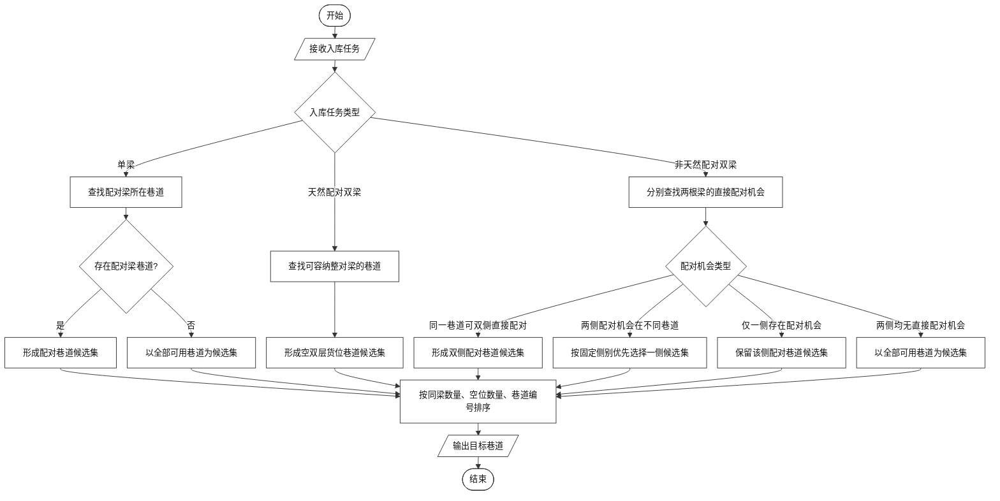
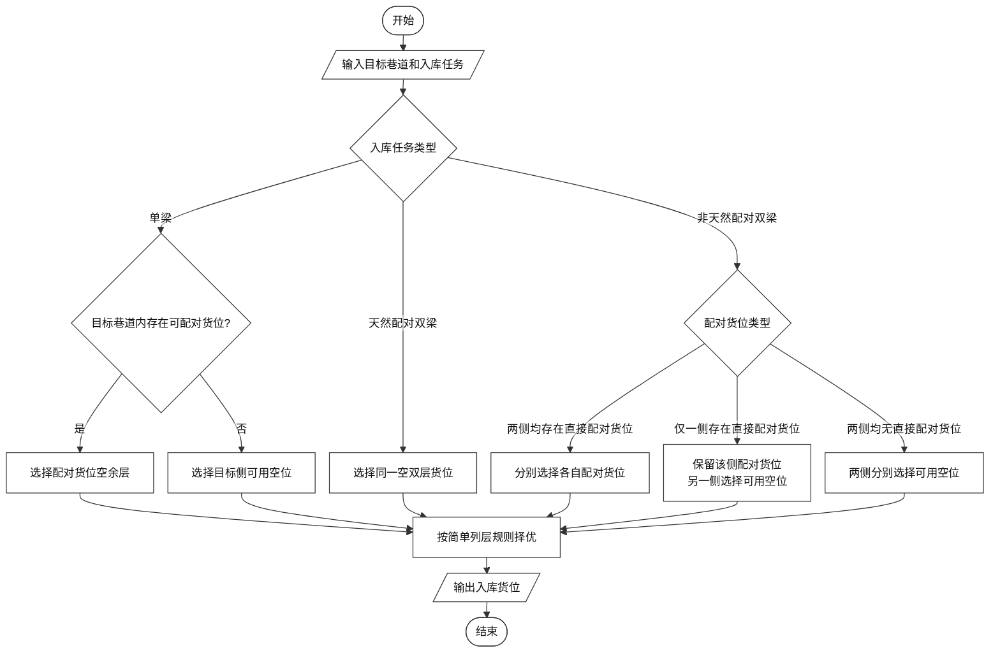
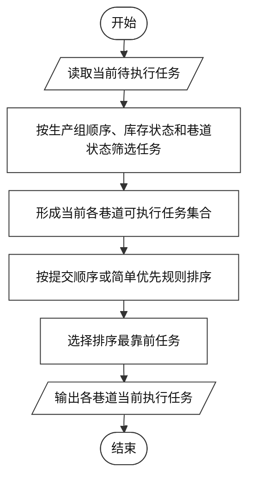
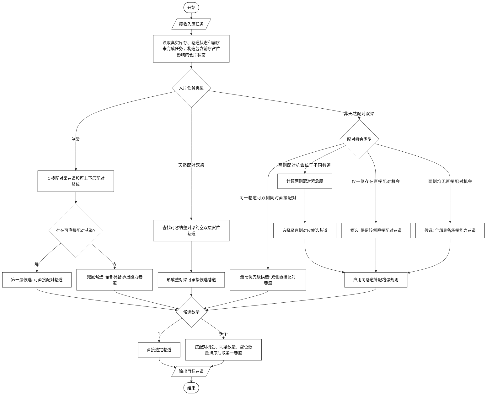
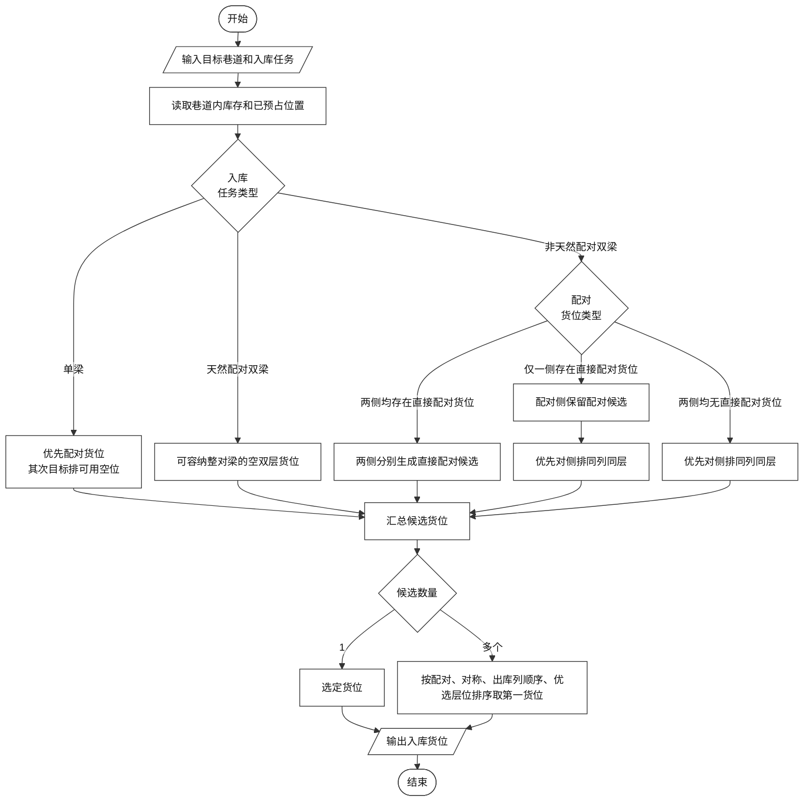
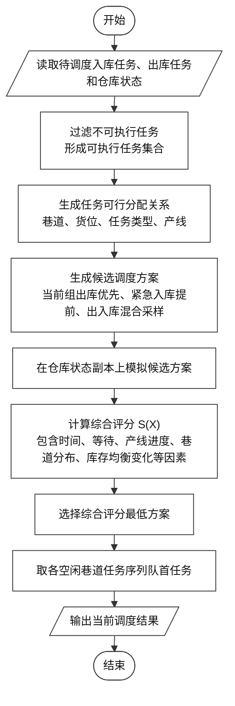

# 一种配对型纵梁立体库的入库分配与任务调度控制方法

## 基本信息

- 拟申请类型：发明专利
- 联系人：樊子逸
- 联系方式：15694052823

---

## 一、相关技术背景与现有技术发展情况

### 1. 背景技术领域

配对型纵梁立体库属于面向汽车或大型结构件制造场景的自动化仓储与调度技术领域。与普通按件存取的立体库不同，该类系统中的物料通常以主梁/副梁加左梁/右梁或其他具有成套关系的形式组织，后续出库执行往往要求相关纵梁能够直接成对获取或在较少调整成本下完成配对。所谓“配对”不仅指两根纵梁在业务上存在对应关系，更是指两根后续需要共同出库的纵梁在库内已经被组织为可直接执行的库存状态。具体而言，对于需要双梁共同完成的出库任务，系统通常要求两根目标纵梁位于同一双层货位的上下层，并满足既定的型号及属性对应关系，才能视为已完成配对并可直接执行出库。若两根纵梁虽均已在库，但分散存放于不同货位，则后续往往需通过移库（将一根梁移动到与其可配对梁相同的位置）等操作重新组合，才能满足执行条件。而移库所面临的代价是对应的巷道需要额外执行任务，导致后续出库任务暂停。因此，在该场景下，入库阶段对纵梁配对状态的维护，直接影响后续出库任务是否能够快速执行，以及是否会额外产生移库和等待。

在仓储载体上，该类立体库通常由多个巷道、不同排列层位及双层货位组成，货位既承担容量功能，也影响后续配对可行性、出库便利性和移库成本。一般而言，每个巷道两侧分别布置货位排，每个货位由排、列、层及上下层属性共同确定其空间位置。其中，排用于区分巷道左右两侧的货位序列，移动纵梁的载具（一般为堆垛机）在两排之间的间隙移动；列用于表征货位沿出入口方向的前后位置，层用于表征货位在竖直方向上的高低位置，上下层则用于表征同一双层货位内部的配对承载关系。在典型约束下，双梁同时入库时，左梁优先在左侧货位序列中判断配对与落位可行性，右梁优先在右侧货位序列中判断配对与落位可行性；而单梁入库时，其可能处于载具的左侧或右侧，但是在满足配对条件的情况下，其允许其跨侧落位于对侧货位的低位层。对于每个巷道，通常还预先定义入库列、出库列（一般为最后一列），以及当有多个入库和出库口时，其可以分布于不同的层。后续所谓“更靠近出库口”或“更靠近出库方向”的货位，均是相对于该预先定义的出库方向而言。与此同时，一个巷道可能持续接收入库任务、执行出库任务并响应外部状态同步，因此库存状态并非静态，而是在任务到达、任务执行、库存同步和巷道阻塞变化过程中持续演化。在业务流程上，入库策略不仅影响当前货位利用率，还会直接影响后续出库任务能否按照生产计划顺序快速执行；而调度策略通常需要决定不同任务在各巷道中的执行先后顺序、任务进入可执行状态的时机、巷道资源的占用安排以及阻塞冲突下的任务衔接关系。

因此，若入库阶段未能持续维护纵梁配对关系，相关纵梁容易分散于不同巷道或不同不利位置，降低后续直接配对出库或同巷道处理的可能性，并增加额外移库调整的风险。另一方面，若调度阶段未能合理安排任务执行顺序、巷道占用时机及任务衔接关系，则容易造成部分出库任务等待时间增加、巷道资源利用不均衡以及整体完工时间延长。基于此，配对型纵梁立体库的核心问题包括两个层面：一是在入库阶段如何形成更有利于后续出库的库存组织状态；二是在出入库任务同时存在时，如何根据可执行条件和执行代价选择当前应推进的任务。

以下以一个典型的配对型纵梁立体库结构作为说明。该立体库设置 4 个巷道，每个巷道两侧分别布置货位排，每排包含 3 列、18 层；同一排、列、层位置处设置上货位与下货位，用于承载可形成配对关系的一组纵梁。图 1 至图 3 分别从正视、侧视和俯视角度展示该类立体库的空间结构，用于将前述巷道、货位排、列、层、上下层货位及出入库方向等定义与实际仓储结构对应起来。

**图 1 配对型纵梁立体库正视结构示意图。** 该图从正面展示立体库的整体高度方向和列向布置关系，可以看出货架主体、输送线、不同高度出入库接口以及纵梁在竖直方向上的存储层位。其中，图中左侧为两层出库口，用于将已满足出库条件的纵梁输送至后续生产或转运环节；右侧为两层入库口，用于接收入库纵梁并送入对应巷道。该视角主要用于说明出入库口可能分布于不同高度，以及货位层位选择对后续出入库作业便利性的影响。

**图 2 配对型纵梁立体库侧视结构示意图。** 该图从入库侧展示巷道方向、左右两侧货位排以及巷道内载具运行空间的相对关系。图中每个巷道两侧均布置多层货位，载具在两排货位之间运行，因此双梁入库时左梁和右梁通常分别受到左右侧货位序列约束，后续策略中的“左侧排”“右侧排”“对侧排”均基于该结构关系定义。

**图 3 配对型纵梁立体库俯视结构示意图。** 该图从平面方向展示多个巷道、输送线、列向延伸以及入库/出库方向之间的关系。图中沿巷道深度方向布置的货位序列对应本文所述“列”，靠近预设出库端的列在货位择优中通常具有更高优先级；多个巷道并列布置也说明了为什么入库巷道选择会影响后续同巷道配对、跨巷道移库和任务调度效率。

### 2. 现有技术方案

在配对型纵梁立体库的策略设计中，通常首先需要满足若干固定业务约束。其一，巷道左右两侧货位序列具有明确的侧别对应关系。在双梁同时入库场景下，左梁仅能在左侧货位序列中判断配对与落位可行性，右梁仅能在右侧货位序列中判断配对与落位可行性，不能跨侧替代。在单根纵梁入库场景下，若其对侧存在可配对纵梁，则允许该单梁跨侧落位于对应货位的低位层；除此之外，单梁通常仍在本侧货位序列中判断高位或低位的落位可行性。其二，对于需要双梁共同完成的出库任务，通常只有当两根目标纵梁已经位于同一双层货位的上下层，并满足既定型号及属性对应关系时，才可视为处于可直接执行的配对状态。其三，产线任务执行通常受生产计划顺序约束，后续组任务一般不能在前序组任务尚未满足推进条件时跳跃执行。其四，巷道资源本身具有独占性，同一时刻是否空闲、是否阻塞、是否已承接其他任务，也会直接限制任务能否进入执行。

在此前提下，现有技术中，配对型纵梁立体库在处理入库任务时，通常先完成巷道选择，再在目标巷道内确定具体货位。

对于单根纵梁入库，通常会优先检查仓库中已经存在与其相对应的另一根纵梁所在的巷道，若存在这样的巷道，则在所有的可选巷道中择优；若不存在，则在所有巷道中择优。对于双根纵梁同时入库的情况，现有做法通常还会区分这两根纵梁彼此是否本身构成一对。若两根纵梁本身构成一对，则倾向于将两根纵梁共同放入同一双层货位，以形成直接配对状态。若两根纵梁本身不构成一对，则通常会优先寻找在同侧约束下能够使两根纵梁在同一巷道内分别与各自对应纵梁形成配对的方案；若当前不存在这样的方案，则再区分不同情况处理。若仅有一侧纵梁存在直接配对机会，则通常直接优先保留该侧的配对条件，而另一侧未来仅选择当前可放位置。若两侧纵梁均存在直接配对机会，但两侧对应的配对机会分别落在不同巷道中，则现有方法通常会按固定侧别顺序优先其中一侧，再据此确定候选巷道。

其巷道择优基本思路是：优先检查纵梁配对约束，在满足约束的巷道中依据当前纵梁在巷道中的数量（同梁越少越好）以及空位数量进行选择（空位越多越好），若都相同，则优先选择编号小的巷道。

在货位选择过程中，现有技术通常按入库任务类型分别处理。对于单梁入库，若目标巷道内存在可与其配对梁形成上下层关系的货位，则选择该配对货位的空余层；若不存在，则选择目标侧可用空位。对于天然配对双梁入库，通常选择一个可同时容纳两根纵梁的空双层货位。对于非天然配对双梁入库，若两侧均存在可直接配对货位，则分别选择各自对应的配对货位；若仅一侧存在直接配对货位，则保留该侧配对货位，并为另一侧选择可用空位；若均不存在直接配对货位，则分别在对应侧选择可用空位。

其货位择优基本思路是：优先检查纵梁配对约束，然后通常固定一些简单策略，如列号越小（大）/层号越小（大）越优先。

在出库及任务执行安排方面，现有技术通常先根据生产计划确定当前优先处理的任务范围，再从中筛选当前已经具备执行条件的任务进行安排。对于只涉及单根纵梁的任务，只要对应纵梁已在库且当前位置允许执行，即可进入调度；而对于需要双梁共同完成的任务，通常要求两根纵梁已经处于可直接配对执行的状态，例如已经位于同一双层货位的上下层并满足对应关系，才将该任务视为可直接执行。若两根纵梁虽均已在库，但分散在不同货位，则一般还不能直接执行，而需要等待后续调整或移库后再满足条件。

当多个任务同时存在时，现有技术通常优先安排当前可立即执行的任务，例如所在巷道当前空闲、出库口是否可用、库存条件已经满足且组顺序允许启动的任务；在多个候选任务都可执行时，再根据当前任务提交顺序及其他简单优先规则（如出库优先）进行安排。

现有技术中的巷道选择流程可概括如下图所示：

**图 4 现有技术巷道选择流程图。** 该图用于说明现有方案如何根据入库任务类型形成巷道候选，并在候选巷道中按照同梁数量、空位数量和巷道编号等简单规则确定目标巷道。

现有技术中的货位选择流程可概括如下图所示：

**图 5 现有技术货位选择流程图。** 该图用于说明现有方案如何在目标巷道内按照任务类型选择配对货位或可用空位，并采用相对简单的列层规则确定最终货位。

现有技术中的任务调度流程可概括如下图所示：

**图 6 现有技术任务调度流程图。** 该图用于说明现有方案通常先根据生产组顺序、库存状态和巷道状态筛选各巷道可执行任务，再按照提交顺序或简单优先规则选择当前执行任务。

### 3. 现有技术方案缺点

现有技术至少存在如下不足：

1. 忽略同巷道移库的价值。现有技术虽然会在当前时刻尽量利用已有配对机会或可用空位完成入库存放，但其判断重点通常仍集中于当前能否配、能否放，而较少进一步考虑当前落位是否能够为后续同巷道内的配对恢复留出更低代价的处理空间。特别是在两根纵梁的配对机会集中于同一巷道、但受左右侧货位约束无法同时直接落入各自配对位置时，现有方法可能会忽视该巷道的额外优势，从而错失后续同巷道调整成本低于跨巷道调整的机会。这样一来，即使当前入库决策本身可行，也可能在后续任务推进时形成额外搬运、等待和巷道占用。
2. 对紧急需求纵梁的识别和优先保障不足。在双梁入库特别是非天然配对双梁入库场景下，若两侧纵梁均存在直接配对机会，但这些机会分别落在不同巷道中，现有技术通常会按固定侧别顺序优先其中一侧，而不是进一步比较哪一侧对应的后续生产需求更紧迫。也就是说，只有在两侧都存在可优先保留的配对机会、需要在不同巷道之间进行取舍时，现有方法才会暴露出对紧急度不敏感的问题，从而可能造成真正更影响后续生产节拍的纵梁未被优先组织到更有利的位置。
3. 对前序未完成任务影响下的实际库存状态考虑不足。现有技术在做巷道选择和货位分配时，通常主要读取当前已经写入库存的货位状态，而对前序已下发但尚未完成的入库任务、这些任务已经占用或即将占用的货位、以及它们对当前配对机会和承接能力的影响考虑不足。由此容易出现当前判断看似可行、但在前序任务真正执行后承接条件发生变化的情况，进而影响后续任务连续推进。
4. 缺乏对出入库任务执行顺序的整体优化。
   现有技术在调度阶段通常优先选择当前已经具备执行条件的任务，能够较快推进局部步骤，但对入库后形成的库存组织状态与后续出库任务执行顺序之间的联系考虑不足，也缺少对不同任务顺序对等待时间、巷道利用和整体完工时间影响的统一优化。在多巷道、多任务并发执行场景下，如果调度仅依据当前一步的局部可执行性进行选择，就容易造成部分巷道任务集中、部分任务长期等待，以及整体完工效率下降。

## 二、本技术方案详细阐述

### 1. 本技术方案所要解决的技术问题

本技术方案所要解决的技术问题是：针对配对型纵梁立体库中入库落位容易影响后续配对出库、任务调度容易造成等待的问题，提出一种基于仓库实际状态的入库分配与出入库任务调度控制方法，使入库阶段尽量形成有利于后续出库的库存组织状态，并在任务调度阶段减少等待、移库和执行中断。

在配对型纵梁立体库中，纵梁通常以主梁、副梁等配对形式参与后续出库执行。对该类立体库而言，入库过程不仅是把纵梁放入某个空货位，更重要的是尽量使具有配对关系的纵梁保持或形成便于后续直接执行的库存状态。若入库时仅依据当前空位数量、当前巷道负载或者当前位置远近来进行分配，而不结合仓库中已有配对梁分布、前序未完成任务影响以及当前巷道承接状态进行判断，则容易造成配对梁被分散存放，或者虽然当前可以存放，但后续出库时无法直接成对执行，从而引发移库补配、任务等待和巷道占用。

同时，在出库任务安排过程中，若仅依据某个任务当前是否可以启动，或者仅依据某条巷道当前是否空闲来推进任务，而不结合当前生产组顺序、纵梁实际配对状态、巷道占用情况及后续任务连续执行需求进行判断，则容易出现当前一步可以执行、后续却频繁等待或切换的情况，影响整体作业连续性和执行效率。

因此，本技术方案要解决的核心问题是：如何根据仓库实时运行状态，分别改进入库巷道选择与货位分配，并在出入库任务共同待执行时进行任务调度择优，使纵梁在入库后尽量保持有利于后续直接出库的组织状态，并在满足当前执行条件的前提下减少后续移库、等待和阻塞。

### 2. 完整技术方案阐述

本技术方案提出一种配对型纵梁立体库的入库分配与出入库任务调度控制方法。该方法包括入库巷道选择、入库货位分配以及出入库任务调度择优三个部分。其中，入库巷道选择和货位分配用于改善纵梁入库后的库存组织状态；出入库任务调度择优用于在多个可执行任务之间选择当前应推进的任务。

具体设计思路如下：

巷道选择采用逐级候选筛选方式。系统先根据入库任务类型生成第一层候选巷道；若第一层候选为空，则进入下一层候选规则；若各层候选均为空，则使用全部具备承接能力的巷道作为兜底候选。每一层候选确定后，先剔除不可承接巷道，包括巷道不可达、阻塞、无可用货位或与已确定任务位置冲突的巷道。过滤后若只剩一个巷道，则直接选定；若剩余多个巷道，则按以下优先级排序：该梁直接配对机会数量更多者优先（也就是未形成配对状态的的配对梁），该梁当前数量更少者优先，剩余空货位数量更多者优先。排序第一位即为目标巷道。

并且需要说明的是，在进行入库决策时，系统并不只读取当前静态库存，而是结合当前实际仓库情况判断前序未完成任务对后续落位的影响。对于已经进入系统且已确定位置的前序入库任务，由于其一定会先于后到的入库任务执行，所以系统在当前决策时将其视为已经占用相应货位。由此，系统在选择巷道和货位时，依据的是结合当前库存和前序任务后的仓库实际承接状态，而不是仅依据当前时刻表面上尚未写入库存的空位状态。

对于单根纵梁入库任务，系统先查找其配对梁所在巷道，并判断这些巷道中是否存在可形成上下层配对的货位。存在时，以这些巷道作为第一层候选；不存在时，以全部具备承接能力的巷道作为兜底候选。随后按上述过滤和排序规则确定目标巷道。

对于两根纵梁本身构成预设配对关系的双梁入库任务，系统以可容纳整对纵梁的巷道作为候选，并按上述过滤和排序规则确定目标巷道。目标巷道确定后，系统在该巷道中优先寻找同一个空双层货位，使两根纵梁分别落于该货位的上层和下层。

对于两根纵梁本身不构成预设配对关系的双梁入库任务，系统分别判断两根纵梁各自的直接配对机会，并按以下顺序生成候选巷道。

首先，若存在同一巷道能够在满足左右侧货位约束的前提下，同时为两根纵梁提供各自的直接配对条件，则将这些巷道作为最高优先级候选集合。

若不存在上述双侧同时直接配对巷道，则系统在后续候选生成中引入同巷道补配增强规则。该规则用于识别虽不能使两根纵梁同时直接落入各自配对货位、但仍有利于后续同巷道移库补配的巷道。具体而言，若某候选巷道能够保障其中一根纵梁直接配对，且该巷道内还包含另一根纵梁的配对梁，则该巷道作为增强候选巷道；若两侧当前均不能直接配对，则仅当同一巷道同时包含两根纵梁各自的配对梁时，才将该巷道作为增强候选巷道。

若左右两侧均存在直接配对机会，但分别位于不同巷道，无法在同一巷道内同时满足，则系统计算两侧的配对紧急度。紧急度优选根据当前库存和已进入系统但尚未完成的任务共同估计：统计该纵梁在当前库存和待执行入库中的可用数量作为该侧配对保障程度；该值越小，说明该侧后续可形成配对的余量越少，紧急度越高。若一侧紧急度高于另一侧，则以保障该侧直接配对机会的巷道作为候选集合，并应用同巷道补配增强规则；若两侧紧急度相同，则合并两侧可配对巷道作为候选集合，并应用同巷道补配增强规则。

若仅有一侧纵梁存在直接配对机会，则以能够保留该侧直接配对条件的巷道作为候选集合，并应用同巷道补配增强规则。若两侧纵梁均不存在直接配对机会，则优先采用同巷道补配增强规则生成候选集合；若仍无候选，则将全部具备承接能力的巷道作为候选集合。由此，该方法对于非天然配对双梁任务，并非固定先处理左梁或右梁，也并非仅依据当前能否简单放下进行判断，而是按照“先双侧同时直接配对，再对不同巷道配对机会按紧急度取舍，再处理单侧直接配对，最后处理两侧均不可直接配对”的顺序生成候选集合，并在相关分支中用同巷道补配增强规则修正候选优先级，最终按统一巷道排序规则确定目标巷道。

在目标巷道确定后，系统采用逐级候选货位筛选方式确定具体位置。对于单梁入库，第一层候选货位为目标巷道内可与其配对梁形成上下层关系的货位；若第一层候选为空，则第二层候选货位为该纵梁优先侧目标排内的可用空货位。对于天然配对双梁入库，候选货位为目标巷道内可同时容纳两根纵梁的空双层货位。对于非天然配对双梁入库，若两侧均存在可直接配对货位，则分别以各自可配对货位作为候选；若仅一侧存在可直接配对货位，则该侧以配对货位作为候选，另一侧优先以对侧排、同列同层的对称空位作为候选。该对称空位与已选货位处于同一列、同一层，仅位于巷道对侧排，堆垛机完成一侧放置后不需要额外进行列向或层向移动，也可减少重新定位和启停调整时间，因此能够降低本次双梁入库动作时间；对称位置不可用时再以目标排内其它可用空位作为候选。若两侧均不存在直接配对货位，则先为一侧生成目标排空位候选，再为另一侧优先生成对侧排、同列同层候选位置，必要时再生成目标排内其它可用空位候选。

每一类候选货位生成后，若候选为空则进入下一层规则；若候选只有一个，则直接选定；若候选存在多个，则按以下顺序排序：能够直接形成上下层配对的货位优先；与已选货位在对侧排、同列同层的对称位置优先，以减少堆垛机列向、层向移动和启停调整；符合预先定义出库列顺序的货位优先，在当前实施方式中列号越大的货位优先级越高；若列位相同，则层位更接近优选层位的货位优先。所述优选层位优选取出库口所在的层；若存在多个出库口，则取巷道层数的中部层位作为默认优选层位。

通过上述方式，系统先生成明确的候选货位，再在候选货位内按配对关系、堆垛机移动代价、出库列顺序和层位接近程度确定唯一货位。

在任务调度方面，系统首先按照业务硬约束过滤当前不可执行任务。所述硬约束包括：生产组顺序是否允许、目标物料是否在库、双梁出库任务是否已经处于同一货位上下层的直接配对状态、对应巷道是否可承接、巷道是否阻塞以及目标货位是否可达等。该步骤用于形成可执行任务集合，其作用是保证进入调度择优的任务均满足基本执行条件。

在可执行任务集合形成后，系统再进行出入库任务调度择优。具体而言，系统先为每个可执行任务生成可行分配关系，所述可行分配关系至少包括任务可进入的巷道、对应货位、任务类型、目标产线以及当前巷道已有任务数。对于出库任务，若同一物料存在多个可出库货位，在启用先进先出规则时优先选择入库时间更早的货位；在同等条件下，再考虑更靠近出库方向的列位和层位顺序。对于入库任务，则使用前述入库巷道选择和货位分配结果作为其可行分配关系。

随后，系统基于可行分配关系生成若干候选调度方案。这里的候选调度方案并不是用于决定哪些任务被系统读取，而是在已经读取并筛选出可执行任务之后，比较不同执行方式的优劣。其典型情形包括：同一出库任务在多个巷道均存在可直接出库库存时，选择使用哪个巷道、哪个货位的库存；同一巷道同时存在可执行出库任务和可执行入库任务时，选择先执行出库还是先执行入库；多个空闲巷道同时具备任务承接条件时，决定各巷道当前轮次的队首任务。候选生成时，系统优先考虑当前生产组内的出库任务；对于入库任务，若其纵梁将在较近的后续生产组中被需求，则提高其进入候选方案的优先级；对于不同产线的出库任务，结合各产线当前推进进度和后续可连续执行任务数量进行排序，使可连续推进更多任务或进度相对滞后的产线获得更高优先级。对于入库任务和出库任务同时存在的情况，系统在候选方案生成时对两类任务混合采样，形成多个可比较的任务组合，而不是固定先执行某一类任务。

候选调度方案生成后，系统在不改变真实仓库状态的仿真副本上评估各方案。评估时，系统根据各任务选择的巷道、货位、任务类型、产线和巷道状态估算本轮执行影响，并得到各巷道占用时间、各产线推进情况、入库等待时间以及调度后的库存均衡状态。系统据此计算综合得分，得分越小表示该执行方式越优。综合得分至少包括以下因素：当前调度轮次的完成时间，库存均衡度变差惩罚，各产线平均完成时间，产线推进进度不均衡惩罚，巷道任务分布不均衡惩罚，以及入库等待时间惩罚。在可选实施方式中，还可对有利于后续出库连续执行的方案给予优先，使能够带来更多后续可执行出库任务的产线或巷道库存被优先使用。

为便于对候选调度方案进行量化比较，设候选调度方案为 \(X\)，候选方案集合为 \(\Omega\)，评分越小表示方案越优。下面对各指标的含义和计算方式进行说明。

首先定义库存均衡度。设仓库巷道集合为 \(\mathcal{A}_0\)，SKU 集合为 \(\mathcal{U}\)，在某一库存状态下，SKU \(u\) 在巷道 \(a\) 中的数量为 \(q_{u,a}\)，SKU \(u\) 的总库存数量为：

$$
Q_u=\sum_{a\in\mathcal{A}_0}q_{u,a}
$$

对于某一 SKU \(u\)，其在各巷道中的平均数量为：

$$
\bar{q}_u=\frac{Q_u}{|\mathcal{A}_0|}
$$

若 \(Q_u>0\)，则该 SKU 在巷道间的分布离散程度可用变异系数表示：

$$
\mathrm{CV}_u=
\frac{
\sqrt{\frac{1}{|\mathcal{A}_0|}\sum_{a\in\mathcal{A}_0}(q_{u,a}-\bar{q}_u)^2}
}{\bar{q}_u}
$$

对应的 SKU 巷道均衡得分为：

$$
B_u^{\mathrm{aisle}}=\frac{1}{1+\mathrm{CV}_u}
$$

该值越接近 1，说明该 SKU 在各巷道中分布越均衡；越接近 0，说明该 SKU 过度集中于少数巷道。所有有库存 SKU 的平均值可作为整体巷道分布均衡度：

$$
B^{\mathrm{aisle}}=
\frac{1}{|\mathcal{U}^{+}|}
\sum_{u\in\mathcal{U}^{+}}B_u^{\mathrm{aisle}}
$$

其中，\(\mathcal{U}^{+}\) 表示当前总库存数量大于 0 的 SKU 集合。进一步地，若需要考虑左右区域均衡，设左侧巷道集合为 \(\mathcal{A}_L\)，右侧巷道集合为 \(\mathcal{A}_R\)，则 SKU \(u\) 在左右区域的实际数量分别为：

$$
Q_u^L=\sum_{a\in\mathcal{A}_L}q_{u,a},
\qquad
Q_u^R=\sum_{a\in\mathcal{A}_R}q_{u,a}
$$

其按巷道数量比例得到的期望数量分别为：

$$
\hat{Q}_u^L=Q_u\frac{|\mathcal{A}_L|}{|\mathcal{A}_0|},
\qquad
\hat{Q}_u^R=Q_u\frac{|\mathcal{A}_R|}{|\mathcal{A}_0|}
$$

由此可得到左右区域偏差：

$$
D_u^{LR}=
\frac{1}{2}
\left(
\frac{|Q_u^L-\hat{Q}_u^L|}{\hat{Q}_u^L}
+
\frac{|Q_u^R-\hat{Q}_u^R|}{\hat{Q}_u^R}
\right)
$$

对应的左右均衡得分为：

$$
B_u^{LR}=\frac{1}{1+D_u^{LR}}
$$

此外，为避免库存过度集中于少数 SKU，可统计不同 SKU 总库存数量 \(Q_u\) 之间的离散程度。设所有 SKU 总库存数量的平均值为 \(\bar{Q}\)，则 SKU 总量均衡得分可表示为：

$$
B^{\mathrm{sku}}=
\frac{1}{
1+
\frac{
\sqrt{\frac{1}{|\mathcal{U}|}\sum_{u\in\mathcal{U}}(Q_u-\bar{Q})^2}
}{\bar{Q}}
}
$$

综合库存均衡度可表示为：

$$
B=(1-\lambda)B^{\mathrm{aisle}}+\lambda B^{LR}+B^{\mathrm{sku}}
$$

其中，\(B^{LR}\) 为各 SKU 左右均衡得分的平均值，\(\lambda\) 为左右均衡权重。该库存均衡度越高，表示库存越均匀地分布在不同巷道和左右区域中；若某个候选调度方案执行后使该值降低，则说明该方案可能使库存分布变差。设 \(B_0\) 表示调度前库存均衡度，\(B_X\) 表示执行候选方案 \(X\) 后的库存均衡度，则库存均衡恶化惩罚仅在 \(B_X<B_0\) 时产生。

设 \(T_{\max}(X)\) 表示候选方案的本轮完工时间，即该方案中所有被安排任务完成所需的最大时间，则完工时间项和库存均衡恶化惩罚可表示为：

$$
S_{\mathrm{time}}(X)=w_m T_{\max}(X)
$$

$$
S_{\mathrm{bal}}(X)=w_b \cdot \max(0, B_0-B_X)
$$

如果有多条产线，设参与计算的产线集合为 \(\mathcal{L}\)，产线 \(l\) 所对应的出库任务在候选方案下的完成时间为 \(C_l(X)\)，则产线平均完成时间项为：

$$
S_{\mathrm{lineTime}}(X)
=
w_t \cdot \frac{1}{|\mathcal{L}|}
\sum_{l\in\mathcal{L}} C_l(X)
$$

其中，\(C_l(X)\) 表示候选方案执行后产线 \(l\) 最后一个被安排出库任务的完成时间。该项越小，表示候选方案对产线整体完成时间越有利。

如果有多条产线，且每天开始时就有完整的生产计划，设产线 \(l\) 的计划总组数为 \(G_l\)，候选方案执行后产线 \(l\) 已推进或预计推进的出库任务数量为 \(g_l(X)\)，则产线推进比例为：

$$
p_l(X)=\frac{g_l(X)}{G_l}
$$

产线推进比例 \(p_l(X)\) 表示产线 \(l\) 当前已完成或在候选方案中预计推进的任务量占该产线总计划量的比例。若某一产线推进比例明显低于其它产线，则说明该产线可能长期滞后；若某一产线推进比例明显高于其它产线，则说明调度资源可能过度集中于该产线。因此，产线推进不均衡惩罚可表示为各产线推进比例的方差：

$$
S_{\mathrm{lineBal}}(X)
=
w_p \cdot
\frac{1}{|\mathcal{L}|}
\sum_{l\in\mathcal{L}}
\left(p_l(X)-\bar{p}(X)\right)^2
$$

$$
\bar{p}(X)=
\frac{1}{|\mathcal{L}|}
\sum_{l\in\mathcal{L}}p_l(X)
$$

设候选方案中被分配任务的巷道集合为 \(\mathcal{A}\)，巷道 \(a\) 被分配的任务数量为 \(n_a(X)\)。该数量表示候选方案在当前调度轮次中给巷道 \(a\) 安排的任务负载。若任务过度集中于少数巷道，则容易导致这些巷道后续持续忙碌，而其它巷道空闲，因此巷道任务分布不均衡惩罚为：

$$
S_{\mathrm{aisle}}(X)
=
w_a \cdot
\frac{1}{|\mathcal{A}|}
\sum_{a\in\mathcal{A}}
\left(n_a(X)-\bar{n}(X)\right)^2
$$

$$
\bar{n}(X)=
\frac{1}{|\mathcal{A}|}
\sum_{a\in\mathcal{A}}n_a(X)
$$

设候选方案中的入库任务集合为 \(\mathcal{I}\)，入库任务 \(i\) 的开始执行时间为 \(s_i(X)\)，其进入系统或可等待起点时间为 \(r_i\)。二者之差表示该入库任务在系统中等待被执行的时间；虽然一般选择结果会以出库优先，但是一个入库任务等待越久，越容易导致入库序列过长，造成入库口堵塞。因此，需要对入库等待添加一个惩罚项：

$$
S_{\mathrm{inWait}}(X)
=
w_i \cdot
\sum_{i\in\mathcal{I}}
\max(0, s_i(X)-r_i)
$$

在非先进先出出库场景下，若某一出库任务存在多个可直接执行货位，说明该任务具有更高的选择灵活度。设出库任务集合为 \(\mathcal{O}\)，出库任务 \(o\) 的可选货位数量为 \(q_o(X)\)，即该任务在当前库存中可从多少个货位直接取货。由于进入该评分环节的出库任务已经满足可执行条件，因此 \(q_o(X)\ge 1\)。\(q_o(X)\) 越大，说明该出库任务调度选择余地越大。由此可设置出库选择灵活度修正项：

$$
R_{\mathrm{out}}(X)
=
-w_o \cdot
\sum_{o\in\mathcal{O}}
\log q_o(X)
$$

其中，\(w_m,w_b,w_t,w_p,w_a,w_i,w_o\) 均为非负权重，用于调节不同指标在综合评分中的影响程度。除 \(R_{\mathrm{out}}(X)\) 为奖励型修正项外，其余各项均为惩罚项或成本项；因此总评分越小，候选方案越优。由此，候选方案的最终综合评分可表示为：

$$
\begin{aligned}
S(X)=&
S_{\mathrm{time}}(X)
+S_{\mathrm{bal}}(X)
+S_{\mathrm{lineTime}}(X)
+S_{\mathrm{lineBal}}(X) \\
&+S_{\mathrm{aisle}}(X)
+S_{\mathrm{inWait}}(X)
+R_{\mathrm{out}}(X)
\end{aligned}
$$

系统从候选方案集合中选择综合评分最小的方案作为当前调度方案：

$$
X^*=\arg\min_{X\in\Omega} S(X)
$$

最后，系统从候选调度方案中选择综合得分最低的方案作为当前调度结果，并将各空闲巷道任务序列中的队首任务下发至对应巷道。该调度择优步骤不同于硬约束过滤：硬约束过滤只判断任务能不能执行，调度择优则在多个均可执行的任务组合之间比较时间、等待、产线推进和巷道利用等因素，以减少频繁等待、额外移库和无效切换，提高整体作业连续性。

本技术方案中的巷道选择流程可概括如下图所示：

**图 7 本技术方案巷道选择流程图。** 该图用于说明本技术方案如何在读取真实库存、巷道状态和前序未完成任务影响后，按单梁、天然配对双梁和非天然配对双梁分别生成候选巷道；其中右侧以外挂模块形式细化了非天然配对双梁的候选生成过程，并通过配对机会、紧急度、同巷道补配增强和排序规则确定目标巷道。

本技术方案中的货位选择流程可概括如下图所示：

**图 8 本技术方案货位选择流程图。** 该图用于说明本技术方案如何在目标巷道内根据任务类型生成候选货位，并按直接配对、对称货位对应的堆垛机移动代价、出库列顺序和优选层位等规则确定最终货位；其中右侧以外挂模块形式细化了非天然配对双梁的货位生成过程，并将候选货位汇入主流程。

本技术方案中的出入库任务调度择优流程可概括如下图所示：

**图 9 本技术方案出入库任务调度择优流程图。** 该图用于说明本技术方案如何在形成可执行任务集合后，生成任务可行分配关系和候选调度方案，并通过仓库状态副本模拟及综合评分选择当前调度结果。

下面给出一个具体实施例。

设一配对型纵梁立体库包含 5 个巷道，每个巷道均具有左右两排双层货位。当前仓库实际情况如下：第 1 巷道存有纵梁 B1，B1 与待入库纵梁 A1 构成预设配对关系；第 2 巷道存有纵梁 B2，B2 与待入库纵梁 A2 构成预设配对关系；第 3 巷道已有一项尚未完成但货位已经确定的入库任务，该任务将占用第 3 巷道某一靠近出库端的双层货位；第 4 巷道存在一组已经配对完成、可直接出库的纵梁 C1 和 C2；第 5 巷道当前空位较多但不存在 A1 或 A2 的配对梁。生产计划显示，A2 与 B2 对应的出库需求距离当前生产组更近，而 A1 与 B1 对应的出库需求相对靠后。此时系统接收到一项非天然配对双梁入库任务，包含纵梁 A1 和 A2，二者本身不构成一对，但分别具有各自的预设配对梁 B1 和 B2。

系统首先读取当前真实库存、巷道状态和前序未完成任务状态，并将第 3 巷道中已确定货位但尚未完成的入库任务视为即将占用相应货位。这样，在后续判断可用货位和配对机会时，第 3 巷道的该货位不会被错误地视为空位。随后，系统分别判断 A1 和 A2 的直接配对机会：A1 可在第 1 巷道与 B1 形成上下层配对，A2 可在第 2 巷道与 B2 形成上下层配对，但不存在同一巷道能够同时在满足左右侧货位约束的前提下使 A1 和 A2 均完成直接配对。

在该分支下，系统不再固定优先左梁或右梁，而是比较两侧配对紧急度。由于生产计划中 A2 与 B2 对应的需求距离当前组更近，且当前库存中 A2 侧的可配对余量更少，因此 A2 侧紧急度高于 A1 侧。系统据此优先保留 A2 的直接配对机会，将第 2 巷道作为候选巷道；若第 2 巷道内同时存在有利于 A1 后续同巷道补配的 B1 或相关配对条件，则该巷道会通过同巷道补配增强规则获得更高优先级。若存在多个满足该条件的候选巷道，则系统继续按照直接配对机会数量、该梁当前数量和剩余空货位数量排序，最终确定第 2 巷道为本次入库目标巷道。

目标巷道确定后，系统在第 2 巷道内进行货位分配。对于紧急侧 A2，系统优先将其分配至 B2 所在双层货位的空余层，使 A2 与 B2 直接形成同一货位上下层配对状态。对于另一根纵梁 A1，由于其在第 2 巷道内无法直接与 B1 形成上下层配对，系统优先查找与 A2 配对货位在对侧排、同列同层的对称空位；若该位置可用，则将 A1 分配到该对称位置。这样，堆垛机在完成 A2 放置后，无需再进行列向或层向移动，只需在同一列、同一层对应的对侧货位完成 A1 放置，从而减少堆垛机重新定位和启停调整时间，缩短本次双梁入库动作时间；若该对称位置不可用，则在 A1 对应侧的目标排内继续按照出库列顺序和优选层位规则选择其它可用空位。由此，本次入库既优先保障了近期需求更紧急的 A2-B2 配对状态，又通过对称落位减少堆垛机移动代价，避免将 A1 随机放入远离当前作业位置的货位。

在同一调度时刻，系统还读取到多个当前生产组任务。第一项出库任务为 C1/C2，该对纵梁在第 2 巷道和第 4 巷道各存在一组可直接出库的上下层配对库存，其中第 2 巷道库存更靠近出库方向，预计执行时间较短；第 4 巷道库存列位更靠后，预计执行时间较长。第二项出库任务为 D1/D2，该对纵梁仅在第 4 巷道存在可直接出库库存，且该任务与 C1/C2 属于同一产线当前组内的连续任务。第三项出库任务为 E1/E2，该对纵梁在第 1 巷道和第 5 巷道均可直接出库，但第 1 巷道当前存在一项等待时间较长的入库任务，若继续安排出库会进一步推迟该入库任务；第 5 巷道虽然可执行 E1/E2 出库，但执行距离略长。同时，第 2 巷道还存在上述已完成巷道和货位分配的 A1/A2 入库任务。因此，在当前轮次中，系统面对的不是单一任务二选一，而是多个可执行出库任务、多个可替代库存巷道、以及多个入库任务之间的资源竞争。

系统首先按生产组顺序、库存配对状态、巷道可承接状态和阻塞状态过滤不可执行任务，得到当前可执行任务集合。此时，出库任务和入库任务均已被系统读取并进入可执行或可分配判断范围，调度择优的目的不是决定是否读取这些任务，也不是在存在空闲可承接巷道时故意不执行可执行任务，而是决定当前轮次采用哪一种资源分配方式。系统据此生成多个候选调度方案。例如，候选方案 X1 选择第 2 巷道执行 C1/C2 出库、第 4 巷道执行 D1/D2 出库、第 5 巷道执行 E1/E2 出库，该方案可以使 C1/C2 和 D1/D2 均较快推进，并保留第 1 巷道给其等待入库任务，但第 2 巷道的 A1/A2 入库需要顺延。候选方案 X2 选择第 4 巷道执行 C1/C2 出库、第 2 巷道执行 A1/A2 入库、第 1 巷道执行 E1/E2 出库，该方案能够提前形成 A2-B2 配对库存，并使用第 1 巷道较近库存完成 E1/E2 出库，但会占用第 4 巷道，使 D1/D2 当前轮次无法连续推进，同时第 1 巷道等待入库继续延后。候选方案 X3 选择第 2 巷道执行 C1/C2 出库、第 4 巷道执行 D1/D2 出库、第 1 巷道执行 E1/E2 出库，该方案使三个出库任务均使用较优库存完成，但两个入库任务均被顺延，入库等待和后续配对形成时间增加。上述候选方案均在推进当前可执行任务，差异在于每个出库任务选择哪个巷道库存、哪些巷道被出库占用、哪些入库任务被推迟，以及这些选择对当前执行时间和后续连续推进的影响不同。

系统在仓库状态副本上分别模拟这些候选方案，计算各方案的本轮执行时间、入库等待时间、产线推进均衡性、巷道任务分布均衡性以及执行后的库存均衡度变化。若选择 X1，则当前出库推进较稳定，且避免第 1 巷道入库继续等待，但 A1/A2 入库延后；若选择 X2，则 A1/A2 入库等待减少，A2-B2 的近期配对状态更早形成，但第 4 巷道被 C1/C2 占用后，D1/D2 连续出库能力下降；若选择 X3，则出库任务完成数量和单步出库时间较优，但入库等待和后续库存组织质量变差。由于多个方案各自具有不同优势和代价，不能仅凭“是否可执行”“是否并行”或“某一项任务距离最近”直接判断优劣，需要根据综合评分统一比较。系统最终选择评分最低的候选方案作为当前调度结果，并分别将对应巷道任务序列的队首任务下发执行。通过该实施例可以看出，该方法的调度环节重点在于：当多个出库任务、多个库存巷道和多个入库任务同时存在时，在尽量推进可执行任务的前提下，综合比较执行时间、入库等待、产线连续推进、巷道占用和库存组织变化等因素，选择整体代价更低的执行方式。

### 3. 本技术方案带来的有益效果

与现有主要依据当前空位数量、局部负载或单步执行条件进行决策的方式相比，本技术方案能够带来如下有益效果。

首先，本技术方案在进行巷道选择和货位分配时，不是孤立地读取当前静态库存，而是结合仓库实际情况判断前序未完成任务对当前承接能力和库存组织状态的影响，因此能够减少连续入库任务对同一空位或同一配对机会的重复竞争，降低后续货位冲突和库存组织失衡的概率。

其次，本技术方案针对单梁、天然配对双梁和非天然配对双梁分别采用不同的决策逻辑，尤其对非天然配对双梁引入了基于当前仓库实际情况的组合判断机制，不再固定先处理某一侧，因此能够更有效地保持和形成有利于后续直接执行的配对状态，提高库存组织质量。

再次，本技术方案在货位分配阶段优先保持上下层配对关系，或者在无法直接配对时优先采取对侧排、同列同层的对称落位方式，因此能够在双梁入库过程中减少堆垛机列向、层向移动和启停调整时间，同时降低后续为恢复配对状态所需的移库和调整操作。

最后，本技术方案在满足业务硬约束的可执行任务集合中进行调度择优，而不是仅按提交顺序或局部可执行性推进任务，因此能够减少当前可启动但后续难以连续执行的任务安排方式，改善任务推进连续性，降低等待和切换带来的效率损失。

综上，本技术方案能够从库存组织和任务安排两个方面共同改善配对型纵梁立体库的运行效果，减少移库、等待和阻塞，提高后续出入库执行的稳定性和连续性。

## 三、本技术方案的技术关键点和拟保护点

1. 结合未完成任务影响的库存状态构造方式。
   拟保护的重点不是单纯读取当前库存，而是在入库巷道选择、货位分配和任务调度前，将已在库物料、已确定货位但尚未完成的入库任务、正在执行任务以及巷道状态共同构造成决策用状态视图。通过该状态视图，后续算法能够提前识别即将被占用的货位和即将形成或失去的配对机会，减少连续任务重复竞争同一货位或同一配对机会的情况。
2. 面向非天然配对双梁的巷道候选生成与择优规则。
   拟保护的重点是非天然配对双梁不按固定左梁或右梁优先处理，而是先判断是否存在同一巷道双侧直接配对机会，再判断同巷道同侧配对机会、不同巷道配对机会、单侧配对机会和无直接配对机会等情形，并在各类候选巷道中结合配对紧急度、同巷道补配可能性、物料分布和空位情况择优。该规则能够在无法同时完美配对时，优先保障更紧急的一侧，并减少后续跨巷道移库风险。
3. 结合配对关系、堆垛机动作代价和出库方向的货位分配规则。
   拟保护的重点是在目标巷道确定后，不仅判断货位是否可放，还按直接配对、对侧排同列同层对称货位、出库列顺序和优选层位进行排序。对于非天然配对双梁，当一侧已落入配对货位时，另一侧优先选择对侧排同列同层位置，以减少堆垛机列向、层向移动和启停调整时间；当不存在直接配对时，则按出库方向和层位接近程度选择可用货位。该规则兼顾当前入库执行时间和后续出库便利性。
4. 面向可执行出入库任务的候选调度方案评分方式。
   拟保护的重点是在满足生产组顺序、库存配对状态和巷道可承接状态等硬约束后，对多个可执行入库任务、出库任务及其可用巷道组合生成候选调度方案，并在仓库状态副本上模拟后，根据执行时间、入库等待、产线连续推进、巷道任务分布和库存均衡变化进行综合评分。该方式不是只按提交顺序或最近任务执行，而是在多个均可执行方案之间选择整体代价更低的方案，减少等待、切换和后续连续出库受阻。

## 四、附图

1. 图 1：配对型纵梁立体库正视结构示意图。
   用于说明立体库货架主体、输送线、不同高度出入库接口以及货位层位之间的关系。
2. 图 2：配对型纵梁立体库侧视结构示意图。
   用于说明巷道、左右侧货位排以及载具运行空间之间的相对关系。
3. 图 3：配对型纵梁立体库俯视结构示意图。
   用于说明多个巷道、输送线、列向延伸以及入库/出库方向之间的关系。
4. 图 4：现有技术巷道选择流程图。
   用于说明现有技术如何根据单梁、天然配对双梁、非天然配对双梁分别形成巷道候选，并按同梁数量、空位数量和巷道编号等简单规则确定目标巷道。
5. 图 5：现有技术货位选择流程图。
   用于说明现有技术在单梁、天然配对双梁、非天然配对双梁入库时，如何优先选择配对货位或当前可用空位。
6. 图 6：现有技术任务调度流程图。
   用于说明现有技术如何先筛选当前可执行任务，再按提交顺序或简单优先规则选择当前推进任务。
7. 图 7：本技术方案巷道选择流程图。
   用于说明本技术方案如何读取真实库存、巷道状态和前序未完成任务影响，并按单梁、天然配对双梁、非天然配对双梁分别生成候选巷道，最终通过配对机会、紧急度、同巷道补配增强和排序规则确定目标巷道。
8. 图 8：本技术方案货位选择流程图。
   用于说明本技术方案如何在目标巷道内生成候选货位，并按直接配对、对称货位对应的堆垛机移动代价、出库列顺序和优选层位确定具体货位。
9. 图 9：本技术方案出入库任务调度择优流程图。
   用于说明本技术方案如何先形成可执行任务集合，再生成候选调度方案，在仓库状态副本上模拟评估并选择综合评分最低的方案。
